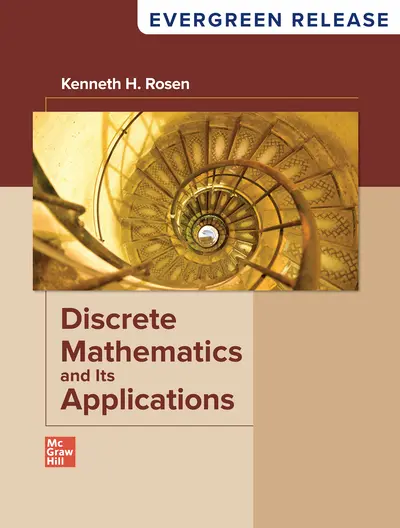

我使用的教材是Kenneth Rosen的*Discrete Mathematics and Its Applications Eighth Edition*

<figure markdown="span">
  { width="300" }
  <figcaption></figcaption>
</figure>

!!! note "目录"
    - [x] [Chapter 1: The Foundations: Logic and Proofs](1.md)
    - [x] [Chapter 2: Basic Structures: Sets, Functions, Sequences, Sums, and Matrices](2.md)
    - [x] [Chapter 3: Algorithms](3.md)
    - [ ] [Chapter 4: Number Theory and Cryptography]()
    - [x] [Chapter 5: Induction and Recursion](5.md)
    - [ ] [Chapter 6: Counting]()
    - [ ] [Chapter 7: Discrete Probability]()
    - [ ] [Chapter 8: Advanced Counting Techniques]()
    - [ ] [Chapter 9: Relations]()
    - [ ] [Chapter 10: Graphs]()
    - [ ] [Chapter 11: Trees]()
    - [ ] [Chapter 12: Boolean Algebra]()