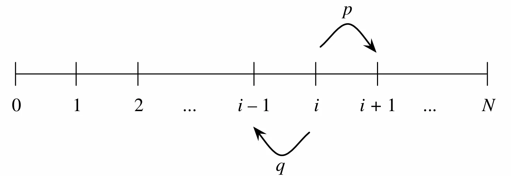

## Conditional Probabilities

$P(A|B)$被称为**在$B$发生的条件下$A$发生的条件概率**.要在$B$发生的条件下让$A$也发生,实际结果必须同时包含在$A$和$B$中,即属于$AB$.同时,既然已经知道$B$发生了,那些$B$未发生的结果就不再可能出现了,因此$B$就成了新的样本空间.
根据上面的描述便可以得到条件概率的定义

如果$P(B)>0$,那么
$$
P(A|B)=\frac{P(A\cap B)}{P(B)}
$$

!!! info "注意"
    1. 需要特别注意那个事件在竖线的前面,即$P(A|B)\ne P(B|A)$.
    2. $P(A|B)$和$P(B|A)$都有意义
    3. $P(A)$被称为**先验概率**(prior),$P(A|B)$被称为**后验概率**(posterior)

将上面的定义稍加变形得到
$$
P(A\cap B)=P(A|B)P(B)=P(A)P(B|A) \tag{1.1}
$$
这个公式在计算事件交集的概率时十分有用.

可以将公式(1.1)推广到$n$个事件
$$
P(E_1E_2\cdots E_n)=P(E_1)P(E_2|E_1)P(E_3|E_1E_2)\cdots P(E_n|E_1E_2\cdots E_{n-1})\tag{1.2}
$$
这个公式被称为**乘法规则**(multiplication rule).

??? tip "证明"
    对等式的右边使用条件概率的定义得到
    $$
    P(E_1)\cdot\frac{P(E_1E_2)}{P(E_1)}\cdot\frac{P(E_1E_2E_3)}{P(E_1E_2)}\cdots\frac{P(E_1E_2\cdots E_n)}{P(E_1E_2\cdots E_{n-1})}=P(E_1E_2\cdots E_n)
    $$

我们可以改变公式(1.2)中事件$A_i$的顺序,从而得到$n!$不同的乘法规则.  
例如,对于三个事件$A_1,A_2,A_3$,我们有
$$
P(A_1\cap A_2\cap A_3)=P(A_1)P(A_2|A_1)P(A_3|A_1, A_2)=P(A_2)P(A_1|A_2)P(A_3|A_1, A_2)
$$
通常需要根据事件的顺序,选择一个$A_i$作为第一个事件,从而得到一个乘法规则.

## Bayes' Rule and the Law of Total Probability

根据公式(1.1)可以得到著名的**贝叶斯公式**(Bayes' rule)
$$
P(A|B)=\frac{P(B|A)P(A)}{P(B)}
$$
另一种定义贝叶斯公式的方法是使用**发生比**(odds)

!!! note "发生比"
    一个事件的发生比为
    $$
    \text{odds}(A)=\frac{P(A)}{P(A^c)}
    $$
    当然,也可以使用发生比来表示事件的概率,即
    $$
    P(A)=\frac{\text{odds}(A)}{1+\text{odds}(A)}
    $$

因此,贝叶斯公式也可以表示为
$$
\frac{P(A|B)}{P(A^c|B)}=\frac{P(B|A)}{P(B|A^c)}\frac{P(A)}{P(A^c)}
$$

!!! info ""
    $\dfrac{P(B|A)}{P(B|A^c)}$ 在统计学中被称为**似然比**(likelihood ratio)

**全概率公式**(law of total probabilitiy, LOTP)将条件概率和非条件概率关联起来,将一个事件分解为多个小事件
令$A_1,\cdots,A_n$是样本空间$S$的一个划分[^1],并且$P(A_i)>0$,那么
$$
P(B)=\sum_{i=1}^nP(B|A_i)P(A_i)
$$

??? tip "证明"
    因为$A_i$是$S$的一个划分,所以
    $$
    \begin{aligned}
    B&=B\cap S\\
    &=B\cap(A_1\cup A_2\cup\cdots\cup A_n)\\
    &=(B\cap A_1)\cup(B\cap A_2)\cup\cdots\cup(B\cap A_n)
    \end{aligned}
    $$
    因为$A_1​,\cdots,A_n​$构成样本空间的一个划分,所以 $B\cap A_1​,\cdots,B\cap A_n$​ 是**两两互斥**的事件.根据概率公理得到:
    $$
    P(B)=P(B\cap A_1​)+P(B\cap A_2​)+\cdots+P(B\cap A_n​)
    $$
    再对每一项应用乘法规则 $P(B\cap A_i​)=P(B|A_i​)P(A_i​)$,即可得到:
    $$
    P(B)=P(B|A_1)P(A_1)+P(B|A_2)P(A_2)+\cdots+P(B|A_n)P(A_n)
    $$
根据全概率公式,可以将样本空间分为不相交的集合$A_i$,找到$B$在每个集合中的条件概率,然后计算出他们的加权和.

## Conditional Probabilities Are Probabilities

条件概率也是一个概率,因此满足概率的所有性质

- 条件概率在0到1之间
- $P(S|E)=1, P(\varnothing|E)=0$
- $A_1,A_2,\cdots,A_n$,$P(\bigcup_{j=1}^{\infty}A_j|E)=\sum_{j=1}^{\infty}P(A_j|E)$
- $P(A^c|E)=1-P(A|E)$

同时,非条件概率也可以看作满足特定条件的条件概率

!!! info ""
    **条件概率是概率,并且所有概率都是有条件的**

除此之外,贝叶斯公式和全概率公式也可以附加更多的条件

**带额外条件的贝叶斯公式**
$$
P(A|B, E)=\frac{P(B|A, E)P(A|E)}{P(B|E)}
$$

**带额外条件的全概率公式**
$$
P(B|E)=\sum_{i=1}^nP(B|A_i, E)P(A_i|E)
$$

## Independence of Events

如果事件$A$和$B$满足
$$
P(A\cap B)=P(A)P(B)
$$
那么事件$A$和事件$B$是**独立事件**(independent)

>如果$P(A)>0$且$P(B)>0$,上述定义可以等价为$P(A|B)=P(A)$或$P(B|A)=P(B)$

独立是一个**对称关系**,即如果事件$A$与事件$B$独立,那么事件$B$与事件$A$独立

>互斥是指 $A \cap B = \varnothing$.如果 $P(A)>0, P(B)>0$，那么**互斥事件绝不独立**因为已知 $A$ 发生,则$B$ 必不发生.

如果$A$与$B$独立,那么$A$与$B^c$独立,$A^c$与$B$独立,$A^c$与$B^c$独立

如果事件$A,B,C$满足
$$
\begin{aligned}
P(A\cap B)&=P(A)P(B)\\\\
P(A\cap C)&=P(A)P(C)\\\\
P(B\cap C)&=P(B)P(C)\\\\
P(A\cap B\cap C)&=P(A)P(B)P(C)
\end{aligned}
$$
那么事件$A,B,C$是独立的.如果只满足前三个,那么事件$A,B,C$是**成对独立**(pairwise independence).

!!! info "注意"
    - 成对独立并不意味着相互独立
    - 仅满足 $P(A \cap B \cap C) = P(A)P(B)P(C)$ 也推不出成对独立.

如果事件$A$和$B$满足
$$
P(A\cap B|E)=P(A|E)P(B|E)
$$
那么事件$A$和事件$B$是**条件独立**(conditionally independent)

> 独立事件与条件独立没有必然联系,两个独立事件可以不是条件独立;两个条件独立事件可以不是独立事件.即不能从$P(AB)=P(A)P(B)$得到$P(A\cap B|E)=P(A|E)P(B|E)$.

## Coherency of Bayes' Rule

贝叶斯公式满足一个重要的性质:**连贯性**(coherency),即当我们获得到多条信息并希望整合这些信息来更新概率时，无论是逐条依次更新概率,还是最后同时结合所有信息更新概率,最终得到的后验概率完全相同.

## Conditioning as a Problem-solving Tool

下面是两种解决概率问题的常用策略:  
**Strategy:Condition on what you wish you knew**   
如果知道某个未知状态/中间变量$E$从而能轻松解题，就对 $E$ 和 $E^c$ 进行条件分解

**Strategy: condition on the first step**  
适用于多阶段/递归结构的问题,通过对第一步可能出现的结果进行条件分解,建立关于目标概率的递归方程.

下面是一个使用第二个策略的例子:

???+ question "Gambler's ruin"
    两个赌徒A和B,进行一系列1$的打赌,其中A获胜的概率是 $p$,B获胜的概率是$q=1-p$.假设A初始有$i$美元,B初始有   $N-i$美元.每次A损失一美元,这一美元就到了B手里,反之亦然.因此,两个人之间的总财富保持不变(即$N$).整个过程如下图所示

    

    **求A获胜的概率**

    设$p_i$为A从$i$美元开始最终获胜的概率,事件$W$为A获胜

    根据全概率公式可以计算出第一回合$p_i$的值
    $$
    \begin{aligned}
    P_i&=P(W|\text{A start at i, wins round 1})p+P(W|\text{A start at i, loses round 1})q \\\\
    &=P(W|\text{A start at i + 1})p + P(W|\text{A start at i - 1})q \\\\
    &= p_{i+1}\cdot p+p_{i-1}\cdot q
    \end{aligned}
    $$

    上面的递推公式的特征方程为$px^2-x+q=0$,解得方程的两个根为$1$和$q/p$,当$p\ne 1/2$时,这两个根不同,可以得到    递推公式的通解为
    $$
    p_i=a+b\left(\frac{q}{p}\right)^i\tag{1.3}
    $$

    通过边界条件$p_0=0$和$p_N=1$得到
    $$
    a=-b=\frac{1}{1-(\frac{q}{p})^N}
    $$

    将$a,b$带入$(1.3)$即可得到结果.  

    当$q=1/2$时,方程有两个相同的根,此时,通解为
    $$
    p_i=a+bi
    $$

    通过边界条件$p_0=0$和$p_N=1$得到
    $$
    a=0\qquad b=\frac 1N
    $$

    综上,可以得到
    $$
    p_i=
    \begin{cases}
    \dfrac{1-\left(\dfrac{q}{p}\right)^i}{1-\left(\dfrac{q}{p}\right)^N},&p\ne1/2 \\\\
    \dfrac{i}{N},&p=1/2
    \end{cases}
    $$

    ??? note "一些补充"
        - 上面这个式子是连续的.因为
        $$
        \begin{aligned}
        \lim_{p\to\frac12}\frac{1-\left(\frac{q}{p}\right)^i}{1-\left(\frac{q}{p}\right)^N}&    \xlongequal {\text{let }x=q/p}
        \lim_{x\to1}\frac{1-x^i}{1-x^N} \\\\
        &\xlongequal{\text{L'Hôpital}}
        \lim_{x\to1}\frac{ix^{i-1}}{Nx^{N-1}} \\\\
        &=\frac iN
        \end{aligned}
        $$

        - 根据对称性,只需要交换p和q即可得到B获胜的概率为 
        $$
        P(\text{B wins}) = 
        \begin{cases} 
        \dfrac{1-\left(\dfrac{p}{q}\right)^{N-i}}{1-\left(\dfrac{p}{q}\right)^N}, & p \neq 1/2 \\
        \dfrac{N-i}{N}, & p = 1/2 
        \end{cases}
        $$

        因为$P(B wins)+p_i=1$,所以这个游戏必将结束.

## Pitfalls and Paradoxes

!!! danger "常见的概率谬误"
    **Prosecutor's fallacy**: 混淆了$P(A|B)$和$P(B|A)$  
    **Defense attorney's fallacy**: 没有将所有的证据作为条件  

### Simpson's paradox

当数据按某个混杂变量分组拆分时，各组内部均表现出某种趋势,但在总体数据聚合后,该趋势却完全反转
例如
事件$A,B,C$满足
$$
P(A|B,C) < P(A|B^c,C) \text{且} P(A|B,C^c) < P(A|B^c,C^c)
$$
但最终
$P(A|B) > P(A|B^c)$

Simpson悖论的本质是因为全概率公式中各组的加权权重存在巨大差异.

[^1]: 即$\bigcup\limits_{i=1}^n A_i = S$