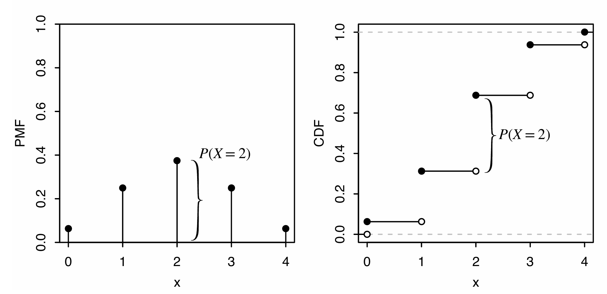
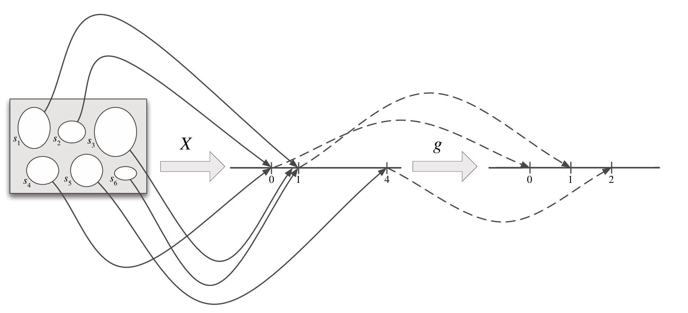

## Random Variables

**随机变量**(random variable)是一个非常有用的概念，它简化了符号表示，并扩展了我们量化不确定性和总结实验结果的能力

对于一个样本空间为 $S$ 的实验，随机变量是一个将样本空间 $S$的事件$s$映射到实数 $\mathbb{R}$ 的函数  
随机变量的随机来源于实验会产生一个随机的结果，但是映射关系本身是确定的

> 随机变量为实验提供了一个数值总结，相较于处理 $S$ 全部的复杂结果，这一事实是一个相当方便的简化

## Distributions and Probability Mass Functions

如果一个随机变量 $X$ 是一个有限值序列 $a_1,a_2,\cdots,a_n$ 或者是一个无限值序列 $a_1,a_2,\cdots$  且满足存在某些值 $a_j$ 使得 $\sum\limits_{j}P(X=a_j)=1$，那么 $X$ 是一个**离散随机变量**(dicrete random variable)  
如果 $X$ 是一个离散随机变量，那么满足 $P(X=x)>0$ 的元素 $x$ 的组成的有限或可数无限**集合**被称为 $X$ 的**支撑**(support)

随机变量的**分布**(distribution)表示与该随机变量相关的事件的概率。描述分布最常见的方法是**概率质量函数**(probability mass functions, PMF)

离散随机变量 $X$ 的概率质量函数 $p_X$ 为 $P_X(x)=P(X=x)$.如果 $x$ 是 $X$ 的支撑那么 $p_x>0$，否则 $p_X=0$ 

!!! info ""
    在使用 $P(X=x)$ 时，$X=x$ 用来表示一个结果为 $x$ 的事件  
    $P(x)$ 是没有意义的，我们只能计算一个事件的概率，而不能计算随机变量的概率

对于支撑为$x_1,x_2,\cdots$的离散随机变量$X$，$X$的 PMF $p_X$必须满足下面两条性质

- 如果$x=x_j$，那么$p_X(x)>0$，否则$p_X(x)=0$
- $\sum\limits^{\infty}_{j=1}P_X(x_j)=1$

??? tip "证明"

    1. **值为正**：根据支撑的定义，其概率为正
    2. **和为1**：事件${X=x_j}$是互斥事件，因此

        $$
        \sum^{\infty}_{j=1}P(X=x_j)=P\left(\bigcup_{j=1}^{\infty}{X=x_j}\right)=1
        $$

**知道一个离散随机变量的 PMF 便可以确定它的分布**

一些常用的随机变量分布有专门的名字，下面是几种常见的分布
## Bernoulli and Binomial

对于一个只有两个取值（即0和1）的离散随机变量$X$，如果 $X$满足$P(X=1)=p$和$P(X=0)=1-p,0<p<1$，那么$X$是一个参数为$p$的**伯努利分布**(Bernoulli distrbution)。记作$X\sim\text{Bern}(p)$

!!! note ""
    所有可能的结果为0和1的随机变量都满足$\text{Bern}(p)$，$p$是随机变量等于1的概率。$\text{Bern}(p)$中的$p$被称为分布的参数，所以不仅仅存在一个伯努利分布，而是一系列伯努利分布

事件$A$的**指示随机变量**(indicator random variable)是一个满足事件发生则为$1$否则为$0$的随机变量。记作$I_A$或者$I(A)$

!!! note ""
    $I\sim\text{Bern}(p)$其中$p=P(A)$

一个要么成功要么失败的实验被称为**伯努利试验**(Bernoulli trial)

进行$n$组独立的伯努利试验，每组成功的概率均为$p$。令$X$为成功的次数，那么$X$满足**二项分布** (Binomial distribution)。记为$X\sim\text{Bin}(n, p)$且$n$为正整数，$0<p<1$.
二项分布$\text{Bin}(n, p)$的 PMF 为
$$
P(X=k)=\binom{n}{k}p^kq^{n-k}
$$
其中$k=0, 1,\cdots,n$，否则$P(X=k)=0$

**定理：**假设$X\sim\text{Bin}(n, p)$且$q=1-p$($q$一般表示失败的概率)，那么$n-X\sim\text{Bin}(n, q)$

??? tip "证明"
    将 $n$次独立伯努利试验看作抛硬币，$X$表示“成功”（正面）的次数。那么 $n-X$ 就表示这 $n$ 次试验中“失败”（反面）的次数。将硬币反面重新定义为新的“成功”，则每次试验成功的概率变为了 $q=1-p$，$n-X$自然服从参数为$n$和$q$的二项分布，即$n-X \sim \text{Bin}(n, q)$。

**推论：**
如果$X\sim\text{Bin}(n, p)$且$p=\dfrac{1}{2},n$为偶数，那么$X$的分布关于$\dfrac{n}{2}$对称。即对于非负整数$j$， 
$$
P(X=\frac n2+j)=P(X=\frac n2-j)
$$

??? tip "证明"
    当 $p = \frac{1}{2}$ 时，$q = 1 - p = \frac{1}{2}$。 由上一结论可知，$n-X \sim \text{Bin}(n, 1/2)$，因此 $X$ 与 $n-X$ 具有完全相同的分布（即具有相同的 PMF）： 
    $$
    P(X = k) = P(n - X = k) = P(X = n - k)
    $$ 
    令 $k = \frac{n}{2} + j$（其中 $j$ 为非负整数），代入上面的等式即可。

## Hypergeometric

从一个有$w$个白球和$b$个黑球的盒子中不放回的拿出$n$个球，令$X$为拿出的白球的数量，那么$X$满足参数为$w,b,n$的 **超几何分布**(hypergeometric distribution)，记为$X\sim\text{HGeom}(w, b, n)$
超几何分布$\text{HGeom}(w, b, n)$的 PMF 为
$$
P(X=k)=\frac{\binom wk\binom{b}{n-k}}{\binom{w+b}{n}}
$$
其中$0\le k\le w$且$0\le n-k \le b$，否则$P(X=k)=0$

超几何分布将物体使用两组标签进行分类，在上面的例子中，每个球可以按颜色分为白色和黑色，也可以按是否被拿分为拿出和未拿出。只少有一组标签是完全随机分配的。因此可以将$X\sim\text{HGeom}(w, b, n)$看作同时满足两个标签的物体

**定理**：如果$X\sim\text{HGeom}(w, b, n)$并且$Y\sim\text{HGeom}(n, w+b-n, w)$，那么$X$和$Y$满足相同的分布
??? tip "证明"
    === "Story"
        沿用上面的例子，可以将超几何分布看作同时满足两个标签的物体，令$X$统计的是**既是白色又是被抽中**的球的数量。现在考虑另一组标签，即将“被抽中”看作总体特征（总体共有 $n$ 个“被抽中的球”与 $w+b-n$ 个“未被抽中的球”），从中随机“选择” $w$ 个球（即所有的白球），设 $Y$ 为选中的球中属于“被抽中”的球的数量。 由于 $X$ 和 $Y$ 统计的都是**既是白球又被抽中**的同一个交集物体数量，因此 $X$ 和 $Y$ 必定具有完全相同的分布
    === "代数计算"
        分别写出 $X$ 和 $Y$ 的 PMF：
        $$
        P(X = k) = \frac{\binom{w}{k}\binom{b}{n-k}}{\binom{w+b}{n}} = \frac{\frac{w!}{k!(w-k)!} \cdot  \frac{b!}{(n-k)!(b-n+k)!}}{\frac{(w+b)!}{n!(w+b-n)!}} = \frac{w! , b! , n! , (w+b-n)!}{k! ,  (w-k)! , (n-k)! , (b-n+k)! , (w+b)!}
        $$ 
        $$P(Y = k) = \frac{\binom{n}{k}\binom{w+b-n}{w-k}}{\binom{w+b}{w}} = \frac{\frac{n!}{k!(n-k)!}  \cdot \frac{(w+b-n)!}{(w-k)!(b-n+k)!}}{\frac{(w+b)!}{w!b!}} = \frac{w! , b! , n! , (w+b-n)!} {k! , (w-k)! , (n-k)! , (b-n+k)! , (w+b)!}
        $$
        因此 $X$ 和 $Y$ 具有完全相同的分布。

!!! info "二项分布与超几何分布的区别"
    二项分布和超几何分布都可以看作是一系列伯努利试验，区别在于，二项分布的伯努利试验是**独立的**，而超几何分布**不是独立的**

## Discrete Uniform

从一个有限的非空数集$C$中随机且均匀的选择一个数字，并将这个数字记为$X$，那么$X$满足参数为$C$的**离散均匀分布**(discrete uniform distribution)，记为$X\sim\text{DUnif}(C)$
离散均匀分布$X\sim\text{DUnif}(C)$的 PMF 为
$$
P(X=x)=\frac1{|C|}
$$
如果$x\not\in C$，那么为0

如果$X\sim\text{DUnif}(C)$，那么对于$C$的子集 $A$有
$$
P(x\in A)=\frac{|A|}{|C|}
$$

## Cumulative Distribution Function

除了 PMF 之外，还有一种表示分布的方法，被称为**累计分布函数**(cumulative distribution function, CDF)

离散随机变量 $X$ 的累计分布函数 $F_X$ 为 $F_X(x)=P(X\le x)$.在不会产生歧义时记为$F$

CDF 满足以下三点性质

- **递增**：如果$x_1\le x_2$，那么$F_X(x_1)\le F_X(x_2)$
- **右连续**：在遇到边界时，满足
$$
F(a)=\lim_{x\to a^+}F(x)
$$
- **极限从0到1**：
$$
\lim_{x\to-\infty}F(x)=0\quad\text{and}\quad\lim_{x\to+\infty}F(x)=1
$$

下图为$X\sim\text{Bin}(4, 1/2)$的 PMF 和 CDF 

**离散随机变量的PMF和CDF的互相转换**

- 要从 PMF 得到 CDF，本质上是一个**求和**的过程。根据CDF 的定义，在任意实数 $x$ 处的值 $F(x) = P(X \le x)$，即等于所有小于等于 $x$ 的支撑集的 PMF 值之和：
$$
F(x) = \sum_{k \le x} P(X = k) = \sum_{k \le x} p_X(k)
$$
在 PMF 的柱状图中，CDF 在 $x$ 处的值就是所有位于 $x$ 左侧（包括 $x$ ）的**垂直柱子高度的总和**

- 要从 CDF 得到 PMF，本质上是一个**寻找跳跃点并计算高度差**的过程。离散随机变量的 CDF 图像由平坦区域和跳跃点组成。在跳跃点 $x$ 处，CDF 图像会发生垂直向上的断层式跳跃。该跳跃的高度即为随机变量在该点处的 PMF 值： 
$$
P(X = x) = F(x) - \lim_{t \to x^-} F(t)
$$
而在平坦区域：CDF 的斜率为 0，这些区间对应的数值在 $X$ 的支撑集之外，因此对应的 PMF 值为 $0$

## Functions of Random Variables

**随机变量的函数仍是随机变量**

对于一个样本空间为$S$的实验和随机变量$X$，函数$g(X):\mathbb{R}\to\mathbb{R}$是一个将样本空间中的事件$s$映射到$g(X)$的**随机变量**（如下图所示）

对于一个已知其 PMF 的随机变量$X$，$Y=g(X)$，如果$g$是一个单射函数，那么可以将$Y$直接带入
$$
P(Y=g(x))=P(g(X)=g(x))=P(X=x)
$$
从而得到$Y$的 PMF

因此，在求一个不熟悉的随机变量的 PMF 时，可以尝试将它表示为一个熟悉的分布的单射函数

如果$g$不是单射函数，将会存在多个$x$满足$g(x)=y$，为了计算$P(g(X)=y)$，需要将所有候选的$x$对应的概率加起来，即
$$
P(g(X)=y)=\sum_{x:g(x)=y}P(X=x)
$$

对于一个样本空间为$S$的实验，随机变量$X$和$Y$分别将事件$s\in S$映射到$X(s)$和$Y(S)$，那么 $g(X, Y)$是将$s$映射到$g(X(s),Y(s))$的随机变量

!!! info "样本空间的构造"
    通常假设$X$和$Y$定义在同一个样本空间$S$上，因此可以选择一个足够包含 $X$和$Y$的样本空间。比如$S_1=\{H, T\}$，而$S_2=\{1, 2, 3, 4, 5, 6\}$，那么可以令$S=S_1\times S_2=\{(s_1,s_2)|s_1\in S_1,s_2\in S_2\}$

!!! danger "常见的错误"
    - **分类错误**(category errors)如果混淆分布、随机变量、事件和数字
    - **sympathetic magic**：混淆了随机变量和它的分布  
    为了避免上面的问题，在回答问题时应该总是思考答案的类别

## Independence of Random Variables

当$x, y\in\mathbb{R}$时，如果随机变量$X$和$Y$满足
$$
P(X\le x,Y\le y)=P(X\le x)P(Y\le y)
$$
那么$X$和$Y$是**独立**的
对于离散随机变量，也可以等价的描述为
$$
P(X=x,Y=y)=P(X=x)P(Y=y)
$$

对于超过两个的随机变量独立的定义类似于上面
当$x_1,x_2,\cdots,x_n\in\mathbb{R}$时,如果随机变量$X_1,\cdots,X_n$满足
$$
P(X_1\le x_1,\cdots,X_n\le x_n)=P(X_1\le x_1)\cdots P(X_n\le x_n)
$$
那么 $X_1,\cdots,X_n$是独立的。
对于无限个随机变量，如果它们的每一个有限的子集都是独立的，那么它们是独立的

> 如果$X_1,\cdots,X_n$是独立的，那么它们也是成对独立

如果$X$和$Y$是独立的随机变量，那么$X$的任意函数与$Y$的任意函数也是独立的

如果两个随机变量既独立又具有相同的分布，那么称其为**独立且同分布**(independent and identically distributed, i.i.d)

独立和同分布是两个易混淆但完全不同的概念，独立指的是两个随机变量不会互相为对方提供信息；同分布则是指两个随机变量的分布具有相同的 PMF（或 CDF）。两个随机变量是否独立与是否同分布没有关系

如果 $X\sim\text{Bin}(n,p)$，可以令$X=X_1+\cdots+X_n$，将其看作 一系列独立且同分布的随机变量$X_i\sim\text{Bern}(p), x=1,\cdots n$

**定理**：如果 $X\sim\text{Bin}(n,p)$并且$X\sim\text{Bin}(m,p)$，同时$X$和$Y$是独立的，那么
$$
X\sim\text{Bin}(n+m,p)
$$

---

当$x, y\in\mathbb{R},z\text{是}Z$的任意支撑时，在随机变量$Z$的条件，如果随机变量$X$和$Y$满足
$$
P(X\le x,Y\le y|Z=z)=P(X\le x|Z=z)P(Y\le y|Z=z)
$$
那么$X$和$Y$是**条件独立**的
对于离散随机变量，也可以等价的描述为
$$
P(X=x,Y=y|Z=z)=P(X=x|Z=z)P(Y=y|Z=z)
$$
对于离散随机变量$X$和$Z$，当将函数$P(X=x|Z=z)$看作一个固定$Z$的关于$X$的函数时，这个函数被称为$Z=z$的条件下，$X$的条件 PMF

## Connections between Binomial and Hypergeometric

**定理**：如果 $X\sim\text{Bin}(n,p)$并且$X\sim\text{Bin}(m,p)$，$X$和$Y$是独立的，那么在给定$X+Y=r$的条件下$X$的分布是$\text{HGeom}(n,m,r)$

**定理**：如果$X\sim\text{HGeom}(w,b,n)$并且$N=w+b\to\infty$，同时保持$p=w/(w+b)$不变,那么$X$的 PMF 为 $\text{Bin}(n,p)$