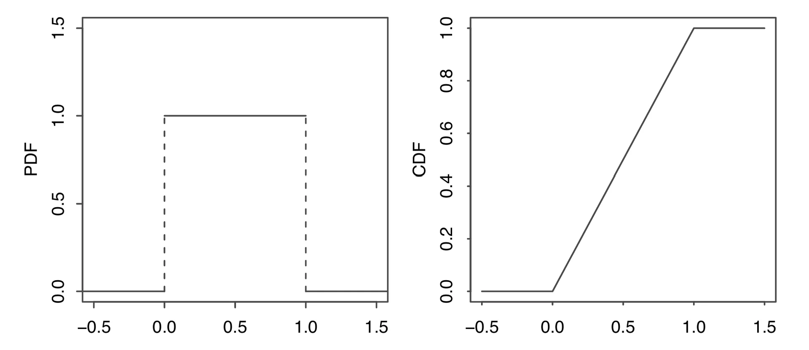

## Probability Density Function

如果一个随机变量的 CDF 是可导的，那么这个随机变量服从一个连续的分布。**连续随机变量**(continuous random variable)是有着连续分布的随机变量。

> 上面可导的定义允许有有限个不可导但连续的端点

对于一个 CDF 为$F$的连续随机变量$X$,它的**概率密度函数**(probability density function, PDF) $f$是 CDF 的导数，即
$$
f(x)=F'(x)
$$
$X$的支撑是所有满足$f(x) > 0$ 的$x$的集合。

**定理：合法的 CDF**  
连续随机变量的 CDF $f$ 必须满足下面两条性质

1. **非负**:$f(x)\ge0$
2. **积分为1**:$\int_{-\infty}^{\infty}f(x)dx=1$

!!! note ""
    对于连续随机变量$X$的支撑集中所有的元素 $x, P(X=x)=0$。因为$P(X=x)=F(x)-\lim_{t\to x^-}F(t)$，而连续随机变量的 CDF 是连续的，所以 $\lim_{t\to x^-}F(t)=F(x)$。

PDF 的值$f(x)$不是一个概率，对于某些$x$可能会出现$f(x)>1$的情况。为了得到对应的概率，需要对 PDF 做**积分**。下面是将 PDF 转换为 CDF 的方法

**命题：将 PDF 转换为 CDF**  
如果$X$是 PDF 为$f$的连续随机变量，那么$X$的 CDF 为
$$
F(X)=\int_{-\infty}^{x}f(t)dt
$$

??? tip "证明"
    通过 CDF 的定义和积分的基本性质，可以得到
    $$
    P(a<x\le b)=F(b)-F(a)=\int_{a}^{b}f(x)dx
    $$

端点处的值不影响概率，即
$$
P(a\le X\le b)=P(a<X\le b)=P(a\le X<b)=P(a<X<b)
$$

!!! danger ""
    离散随机变量没有这样的性质，需要特别注意端点处的情况

!!! info "总结"
    **对 PDF 的适当区域进行积分便可以得到想要的概率**, 积分的上下限可以根据区域调整，其结果就是对应的概率

连续随机变量的期望与离散随机变量的定义类似，只需要将对 CDF 进行求和替换为对 PDF 进行积分即可
 PDF 为$f$的连续随机变量$X$的期望为
$$
E(X)=\int_{-\infty}^{\infty}xf(x)dx
$$
连续随机变量的期望同样满足**线性**(linearity)

**定理：LOTUS**  
 $X$是PDF 为$f$的连续随机变量，$g$是一个$\mathbb{R}\to\mathbb{R}$的函数，那么
 $$
E(X)=\int_{-\infty}^{\infty}g(x)f(x)dx
$$
## Uniform

一个在区间$(a,b)$上服从**均匀分布**(uniform distribution)的连续随机变量$U$的 PDF 为
$$
f(x)=
\begin{cases}
\dfrac{1}{b-a} &\text{if }a<x<b  \\\\
0 &\text{  otehrwise}
\end{cases}
$$
记为$U\sim\text{Unif}(a,b)$

均匀分布的 CDF 是将其 PDF 的面积累加起来
$$
F(X)=
\begin{cases}
0 &\text{if }x\le a\\\\
\dfrac{x-a}{b-a}&\text{if }a<x<b\\\\
1&\text{if }x\ge b
\end{cases}
$$

**命题：对于均匀分布，概率与长度成比例**  
令$U\sim\text{Unif}(a, b)$,$(c,d)$是$(a,b)$的一个子区间，其长度为$l=d-c$.那么$U$的值在区间$(c,d)$的概率与$l$成比例

???+ tip "证明"
    因为 U 的 PDF 是常数$\frac{1}{b-a}$,而从$c$的$d$的区域是$\frac{l}{b-a}$

**命题**  
令$U\sim\text{Unif}(a, b)$,$(c,d)$是$(a,b)$的一个子区间，其长度为$l=d-c$.那么在$U\in(c,d)$的条件下，$U$的条件分布为$U\sim\text{Unif}(c, d)$

??? tip "证明"
    根据条件概率的定义，得到
    $$
    P(U\le u|U\in(c,d))=\frac{P(U\le u, c<U<d)}{P(U\in(c,d))}=\frac{P(U\in(c,u])}{P(U\in(c,d))}=\frac{u-c}{d-c}
    $$

---

$\text{Unif}(0,1)$是最常用的均匀分布，被称为**标准均匀分布**(standard Uniform).它的 PDF 为$f(x)=1,0<x<1$;CDF 为$F(x)=x,0<x<1$,如下图所示

标准均匀分布的期望为$\dfrac{1}{2}$,方差为$\dfrac{1}{12}$

可以使用 **位置-尺度变换**(location-scale transformation)从原来的均匀分布中产生新的均匀分布。令$X$为随机变量，$Y=\sigma X+\mu, \sigma>0$,那么称$Y$为$X$的一个位置-尺度变换。
这里$\mu$控制位置如何改变，而$\sigma$控制尺度如何改变

位置-尺度变换适用于所有经过变换之后分布类型保持不变的分布。不能将其用于离散随机变量

> 对于均匀分布的连续随机变量$X$,如果$Y$不是$X$的线性变换，那么$Y$通常不服从均匀分布

均匀分布的期望为
$$
E(U)=\int_{a}^{b}x\cdot\frac{1}{b-a}dx=\frac1{b-a}\left(\frac{b^2}{2}-\frac{a^2}{2} \right)=\frac{a+b}{2}
$$
而它的方差为$\dfrac{(b-a)^2}{12}$

???+ tip "证明"
    === "定义"
        首先用 LOTUS 算出 $E(U^2)$为
        $$
        E(U^2)=\int_{a}^{b}x^2\frac{1}{b-a}=\frac{1}{3}\frac{b^3-a^3}{b-a}
        $$
        然后带入方差的公式得到
        $$
        \begin{aligned}
        Var(U)&=E(U^2)-(EU)^2\\\\
        &=\frac{1}{3}\frac{b^3-a^3}{b-a}-\left(\frac{a+b}{2}\right)^2 \\\\
        &=\frac{1}{3}\frac{(b-a)(a^2+ab+b^2)}{b-a}-\left(\frac{a+b}{2}\right)^2\\\\
        &=\dfrac{(b-a)^2}{12}
        \end{aligned}
        $$

    === "位置-尺度变换"
        假设$U\sim\text{Unif}(0,1)$,根据 Location-scale transformation 得到
        $$
        \tilde{U}=a+(b-a)U
        $$
        即$\tilde{U}\sim\text{Unif}(a,b)$
        那么
        $$
        \begin{aligned}
        E(\tilde{U})=E(a+(b-a)U)=a+(b-a)E(U)=a+\frac{b-a}{2}=\frac{a+b}{2}\\\\
        Var(\tilde{U})=Var(a+(b-a)U)=(b-a)^2Var(U)=\frac{(b-a)^2}{12}
        \end{aligned}
        $$

## Universality of the Uniform

**定理：均匀分布的通用性**  
令$F$是一个连续随机变量的 CDF，它是严格递增且连续的函数。如果$U\sim\text{Unif}(0,1)$，那么随机变量$F^{-1}(U)$的 CDF 为$F$。即
$$
P(F^{-1}(U)\le x)=F(x)
$$

??? tip "证明"
    因为$F$是严格递增的，所以$F^{-1}$也是严格递增的，于是事件$\{F^{-1}(U)\le x\}$等价于事件$\{U\le F(x)\}$
    $$
    P(F^{-1}(U)\le x)=P(U\le F(x))
    $$
    由于$U\sim\text{Unif}(0,1)$，其 CDF 为$P(U\le u)=u,0<u<1$，因此
    $$
    P(U\le F(x))=F(x)
    $$
    即$F^{-1}(U)$的 CDF 恰好是$F$

**推论**：对于任何连续分布，可以通过将标准均匀随机变量逆变换为其对应的分位数函数（CDF 的反函数）来生成该分布的随机变量

这一结论在计算机模拟中非常重要：只需要一个能够生成标准均匀分布的程序，就可以通过逆变换法生成服从任意连续分布的随机数

> 即使$F$不是严格递增的，定义广义反函数$F^{-1}(u)=\inf\{x:F(x)\ge u\}$，上述结论依然成立

---

利用逆CDF方法也可以从一种已知分布出发推导出另一种相关分布的参数统计量，这是逆CDF技巧的另一层含义

!!! info "总结"
    **标准均匀分布是概率论中最基础的工具之一**。所有连续分布都可以看作是通过某个单调递增的变换作用于标准均匀分布而得到的

## Normal

**正态分布**(normal distribution)，又称高斯分布，是概率论与统计学中最重要的一种连续分布

如果连续随机变量$X$服从参数为$\mu\in\mathbb{R}$和$\sigma^2>0$的正态分布，记为$X\sim N(\mu,\sigma^2)$，其 PDF 为
$$
f(x)=\frac{1}{\sqrt{2\pi}\sigma}e^{-\frac{(x-\mu)^2}{2\sigma^2}}
$$
其中$\mu$为位置参数（均值），$\sigma$为尺度参数（标准差）

当$\mu=0,\sigma=1$时，称为**标准正态分布**(standard normal distribution)，记为$Z\sim N(0,1)$，其 PDF 为
$$
\phi(z)=\frac{1}{\sqrt{2\pi}}e^{-\frac{z^2}{2}}
$$
相应的 CDF 通常记为大写的$\Phi$
$$
\Phi(z)=\int_{-\infty}^{z}\frac{1}{\sqrt{2\pi}}e^{-\frac{t^2}{2}}dt
$$

> $\phi$是小写希腊字母 phi，对应标准正态的 PDF；$\Phi$是大写 Phi，对应标准正态的 CDF。普通正态分布没有单独的特殊符号

任何一个正态随机变量都可以通过**标准化**(standardization)转化为标准正态随机变量。令$X\sim N(\mu,\sigma^2)$，则
$$
Z=\frac{X-\mu}{\sigma}\sim N(0,1)
$$
反过来，如果$Z\sim N(0,1)$，那么
$$
X=\sigma Z+\mu\sim N(\mu,\sigma^2)
$$
这也是一种位置-尺度变换的关系

**命题：标准正态的性质**  

1. 对称性：$\phi(-z)=\phi(z)$，且$\Phi(-z)=1-\Phi(z)$
2. 期望：$E(Z)=0$
3. 方差：$Var(Z)=1$

???+ tip "证明"
    === "对称性"
        PDF $\phi(z)$中只含有$z^2$项，所以$\phi(-z)=\phi(z)$，图形关于纵轴对称
        
        由对称性可以推出$\Phi(-z)=1-\Phi(z)$：整个曲线下方面积为1，左侧的面积等于右侧面积

    === "期望"
        $$
        E(Z)=\int_{-\infty}^{\infty}z\cdot\frac{1}{\sqrt{2\pi}}e^{-\frac{z^2}{2}}dz
        $$
        被积函数是关于$z$的奇函数，在对称区间上积分为0，即$E(Z)=0$

    === "方差"
        $$
        Var(Z)=E(Z^2)=(EZ)^2=E(Z^2)-0=E(Z^2)
        $$
        使用分部积分法计算$E(Z^2)$：
        $$
        \begin{aligned}
        E(Z^2)&=\int_{-\infty}^{\infty}z^2\cdot\frac{1}{\sqrt{2\pi}}e^{-\frac{z^2}{2}}dz\\\\
        &=-\int_{-\infty}^{\infty}z\cdot\left(-z e^{-\frac{z^2}{2}}\right)\frac{1}{\sqrt{2\pi}}dz\\\\
        &=\left[-z\cdot\frac{-e^{-\frac{z^2}{2}}}{\sqrt{2\pi}}\right]_{-\infty}^{\infty}-\int_{-\infty}^{\infty}\frac{e^{-\frac{z^2}{2}}}{\sqrt{2\pi}}dz\\\\
        &=0-(-1)=1
        \end{aligned}
        $$
        第一项边界值为0（指数衰减远快于线性增长），第二项为标准正态PDF在全实数域上的积分，结果为1

根据位置-尺度变换的性质可以直接得到一般正态分布的数字特征

**命题：正态分布的期望与方差**  
如果$X\sim N(\mu,\sigma^2)$，那么
$$
E(X)=\mu,\quad Var(X)=\sigma^2
$$

### Quantiles

对于一个分布和其 CDF $F$以及$p\in(0,1)$，令$q_p$为$F(q_p)=p$的解，称$q_p$为该分布的**第$p分位点**(quantile)
对于标准正态分布，常使用的分位点记作$z_p$，满足$\Phi(z_p)=p$

常用的标准正态分位点（近似值）如下表所示

| $p$ | 0.90 | 0.95 | 0.975 | 0.99 | 0.995 |
| --- | :--: | :--: | :---: | :--: | :---: |
| $z_p$ | 1.28 | 1.645 | 1.96 | 2.33 | 2.58 |

> 由对称性可知，$z_{1-p}=-z_p$。例如$z_{0.025}=-1.96$

分位点在置信区间和假设检验中有广泛的应用：对于标准正态分布，约$95\%$的概率质量落在区间$(-1.96, 1.96)$内

### Linear Combination of Independent Normals

**定理**  
如果$X_1\sim N(\mu_1,\sigma_1^2),\cdots,X_n\sim N(\mu_n,\sigma_n^2)$且相互独立，那么它们的线性组合也服从正态分布：
$$
a_1X_1+a_2X_2+\cdots+a_nX_n\sim N\left(\sum_{i=1}^na_i\mu_i,\;\sum_{i=1}^na_i^2\sigma_i^2\right)
$$
特别地，两个独立正态随机变量之和仍然服从正态分布

???+ tip "证明概要"
    利用矩母函数(MGF)可以简洁地证明。$X\sim N(\mu,\sigma^2)$的MGF为$M_X(t)=e^{\mu t+\frac{1}{2}\sigma^2t^2}$
    
    由于独立性，线性组合$Y=\sum a_iX_i$的MGF为各个MGF的乘积
    $$
    M_Y(t)=\prod_{i=1}^n M_{a_iX_i}(t)=\prod_{i=1}^n e^{a_i\mu_i t+\frac{1}{2}a_i^2\sigma_i^2t^2}=e^{\left(\sum a_i\mu_i\right)t+\frac{1}{2}\left(\sum a_i^2\sigma_i^2\right)t^2}
    $$
    这正是均值为$\sum a_i\mu_i$、方差为$\sum a_i^2\sigma_i^2$的正态分布的MGF

!!! danger ""
    独立正态随机变量的线性组合仍然是正态的这一性质是正态分布独有的。**不独立的**正态随机变量之和不一定服从正态分布，这一点与离散情况不同

## Exponential

**指数分布**(exponential distribution)是描述等待时间的最常用连续分布

如果连续随机变量$T$服从参数为$\lambda>0$的指数分布，记为$T\sim\text{Exp}(\lambda)$，其 PDF 为
$$
f(t)=\begin{cases}\lambda e^{-\lambda t}&\text{if }t>0\\\\0&\text{otherwise}\end{cases}
$$
相应的 CDF 为
$$
F(t)=\begin{cases}1-e^{-\lambda t}&\text{if }t>0\\\\0&\text{otherwise}\end{cases}
$$

> $\lambda$被称为**率参数**(rate parameter)，它表示单位时间内的平均事件发生率。其倒数$1/\lambda$则是平均等待时间

??? tip "推导 CDF"
    对 PDF 进行积分可以得到 CDF
    $$
    F(t)=\int_{0}^{t}\lambda e^{-\lambda s}ds=\left.-e^{-\lambda s}\right|_{0}^{t}=1-e^{-\lambda t}
    $$

**命题：指数分布的期望与方差**  
如果$T\sim\text{Exp}(\lambda)$，那么
$$
E(T)=\frac{1}{\lambda},\quad Var(T)=\frac{1}{\lambda^2}
$$

???+ tip "证明"
    === "期望"
        使用分部积分法
        $$
        \begin{aligned}
        E(T)&=\int_{0}^{\infty}t\cdot\lambda e^{-\lambda t}dt\\\\
        &=\left.t\cdot\frac{-e^{-\lambda t}}{}\right|_{0}^{\infty}-\int_{0}^{\infty}\frac{-e^{-\lambda t}}{}dt\\\\
        &=0+\left.\frac{e^{-\lambda t}}{\lambda}\right|_0^\infty\\\\
        &=\frac{1}{\lambda}
        \end{aligned}
        $$

    === "方差"
        首先使用 LOTUS 计算$E(T^2)$
        $$
        \begin{aligned}
        E(T^2)&=\int_{0}^{\infty}t^2\lambda e^{-\lambda t}dt\\\\
        &=\left.t^2\cdot\frac{-e^{-\lambda t}}{}\right|_{0}^{\infty}-\int_{0}^{\infty}2t\cdot\frac{-e^{-\lambda t}}{}dt\\\\
        &=0+\frac{2}{\lambda}\int_{0}^{\infty}te^{-\lambda t}dt\\\\
        &=\frac{2}{\lambda}\cdot\frac{1}{\lambda}=\frac{2}{\lambda^2}
        \end{aligned}
        $$
        然后代入方差公式
        $$
        Var(T)=E(T^2)-(ET)^2=\frac{2}{\lambda^2}-\frac{1}{\lambda^2}=\frac{1}{\lambda^2}
        $$

### Relationship between Geometric and Exponential

几何分布是离散情形下的等待时间模型，指数分布则是其在连续情形的对应物

**联系**：
- **几何分布**$Geom(p)$：以固定的步长（每次试验）为单位，等待第一次成功
- **指数分布**$\text{Exp}(\lambda)$：在连续时间内，以恒定速率$\lambda$等待下一次事件的发生

两者本质上都是对"恒定风险下首次到达"这一过程的建模，只是时间维度不同

### Memorylessness

**命题：无记忆性(memoryless)**  
如果$T\sim\text{Exp}(\lambda)$，那么对于任意的$s,t>0$，有
$$
P(T>s+t|T>s)=P(T>t)
$$

???+ tip "证明"
    根据条件概率的定义
    $$
    \begin{aligned}
    P(T>s+t|T>s)&=\frac{P(T>s+t)}{P(T>s)}\\\\
    &=\frac{e^{-\lambda(s+t)}}{e^{-\lambda s}}\\\\
    &=e^{-\lambda t}\\\\
    &=P(T>t)
    \end{aligned}
    $$

> 无记忆性的直观解释是：已经等待了时间$s$之后，再继续等待超过额外时间$t$的概率，等同于从头开始等待超过时间$t$的概率。过去的等待不会减少未来的等待时间——就像抛硬币，无论之前失败了多少次，下次成功的概率依然是$p$

**唯一性**：在所有连续分布中，只有指数分布具有无记忆性。类似地，在所有离散分布中，只有几何分布具有无记忆性

### Sum of Independent Exponentials

**定理**  
如果$T_1\sim\text{Exp}(\lambda_1)$和$T_2\sim\text{Exp}(\lambda_2)$相互独立，那么最小值$\min(T_1,T_2)$服从参数为$\lambda_1+\lambda_2$的指数分布：
$$
\min(T_1,T_2)\sim\text{Exp}(\lambda_1+\lambda_2)
$$

???+ tip "证明"
    考虑生存函数（Survival function）$G(t)=P(T>t)=1-F(t)=e^{-\lambda t}$
    $$
    \begin{aligned}
    P(\min(T_1,T_2)>t)&=P(T_1>t,T_2>t)\\\\
    &=P(T_1>t)P(T_2>t)\quad\text{(独立性)}\\\\
    &=e^{-\lambda_1 t}e^{-\lambda_2 t}\\\\
    &=e^{-(\lambda_1+\lambda_2)t}
    \end{aligned}
    $$
    这正是参数为$\lambda_1+\lambda_2$的指数分布的生存函数

**推论**：如果有$n$个独立的指数随机变量$T_i\sim\text{Exp}(\lambda_i)$，那么
$$
\min(T_1,\cdots,T_n)\sim\text{Exp}\left(\sum_{i=1}^n\lambda_i\right)
$$

**定理**：在上面的设定下，最小的那个随机变量恰好是$T_j$的概率为
$$
P(\text{argmin}_i T_i=j)=\frac{\lambda_j}{\sum_{i=1}^n\lambda_i}
$$

> 这意味着率参数越大的指数变量更可能成为最小值——事件发生越快的那个过程越有可能最先触发

**定理**  
如果$T_1,\cdots,T_n$独立同分布于$\text{Exp}(\lambda)$，它们的和服从**伽马分布**(Gamma distribution)：
$$
T_1+\cdots+T_n\sim\text{Gamma}(n,\lambda)
$$
伽马分布$\text{Gamma}(k,\lambda)$的 PDF 为
$$
f(x)=\frac{\lambda^k x^{k-1}e^{-\lambda x}}{(k-1)!},\quad x>0,k\in\mathbb{N}^+
$$
当$k$为正整数时也称为**爱尔朗分布**(Erlang distribution)

??? tip "直觉理解"
    $T_1+\cdots+T_n$表示等待第$n$次事件发生的总时间，其中每次事件的间隔服从$\text{Exp}(\lambda)$。这正是泊松过程中第$n$次到达的时间

## Poisson Processes

**泊松过程**(Poisson process)是描述随机事件在连续时间中发生的数学模型。它是最基本的计数过程之一

在一个率为$\lambda$的泊松过程中：
- 令$T_i$表示第$i-1$次事件和第$i$次事件之间的时间间隔（**间隔时间**, interarrival time），则$T_i\overset{i.i.d}{\sim}\text{Exp}(\lambda)$
- 令$N(t)$表示时间段$(0,t]$内发生的事件总数，则
$$
N(t)\sim\text{Pois}(\lambda t)
$$

> 泊松过程中的计数服从泊松分布，间隔时间服从指数分布。这两者之间存在内在的联系，反映了同一过程的不同视角

**泊松过程的三大特性**：

1. **平稳增量(stationary increments)**：在长度为$t$的区间内发生的事件数与区间的起始位置无关，始终服从$\text{Pois}(\lambda t)$
2. **独立增量(independent increments)**：不相交的时间区间内发生的事件数是互相独立的
3. **稀疏性(rarity)**：在非常短的时间间隔$h$内，最多只有一个事件发生的概率趋于1：
   - $P(N(h)=1)=\lambda h+o(h)$
   - $P(N(h)\ge2)=o(h)$

**定理：泊松过程与指数分布的关系**  
在一个率为$\lambda$的泊松过程中，以下三个陈述是等价的

1. 计数过程：对所有$t>0$，$N(t)\sim\text{Pois}(\lambda t)$
2. 间隔时间为独立同分布的指数变量：$T_i\overset{i.i.d}{\sim}\text{Exp}(\lambda)$
3. 在很短的间隔$h$内，上述的稀疏性条件成立

**定理：泊松过程的分解(Splitting)**  
将一个率为$\lambda$的泊松过程中的每个事件独立地以概率$p$标记为类型A、以概率$q=1-p$标记为类型B。那么

- 类型A的事件构成一个率为$\lambda p$的泊松过程
- 类型B的事件构成一个率为$\lambda q$的泊松过程
- 这两个过程是相互独立的

> 这类似于二项分布的条件分解思想，但在连续时间框架下进行

**定理：泊松过程的叠加(Superposition)**  
两个独立的泊松过程，分别为$\text{PP}(\lambda_1)$和$\text{PP}(\lambda_2)$，将它们的所有事件合并在一起形成一个新的过程。这个新的过程仍为一个泊松过程，其率为两过程之和：
$$
\text{PP}(\lambda_1)+\text{PP}(\lambda_2)=\text{PP}(\lambda_1+\lambda_2)
$$

???+ tip "证明概要"
    设$N_1(t)\sim\text{Pois}(\lambda_1 t)$和$N_2(t)\sim\text{Pois}(\lambda_2 t)$是两个独立计数过程
    
    它们的和$N(t)=N_1(t)+N_2(t)$的概率为卷积：
    $$
    \begin{aligned}
    P(N(t)=k)&=\sum_{j=0}^kP(N_1(t)=j)P(N_2(t)=k-j)\\\\
    &=\sum_{j=0}^k\frac{e^{-\lambda_1 t}(\lambda_1 t)^j}{j!}\frac{e^{-\lambda_2 t}(\lambda_2 t)^{k-j}}{(k-j)!}\\\\
    &=\frac{e^{-(\lambda_1+\lambda_2)t}}{k!}\sum_{j=0}^k\binom{k}{j}(\lambda_1 t)^j(\lambda_2 t)^{k-j}\\\\
    &=\frac{e^{-(\lambda_1+\lambda_2)t}((\lambda_1+\lambda_2)t)^k}{k!}
    \end{aligned}
    $$
    即$N(t)\sim\text{Pois}((\lambda_1+\lambda_2)t)$

## Symmetry of i.i.d Continuous r.v.s

独立同分布的连续随机变量具有一系列基于对称性的重要结论，这些结论可以不借助具体分布的形式直接得出

**定理：排序的等可能性**  
令$X_1,X_2,\cdots,X_n$为独立同分布的连续随机变量。那么在所有可能的全排列中，每一种排列顺序出现的概率相等：
$$
P(X_{i_1}<X_{i_2}<\cdots<X_{i_n})=\frac{1}{n!}
$$
其中$(i_1,i_2,\cdots,i_n)$是$\{1,2,\cdots,n\}$的一个排列

> 因为$X_i$是连续的，所以不存在取到相同值的概率（$P(X_i=X_j)=0$）。又因为它们独立同分布，没有任何一个索引比另一个更有优势排在前面

**推论：最大值和最小值的位置**  
对于$n$个独立同分布的连续随机变量$X_1,\cdots,X_n$，每一个$X_i$等可能是最大值或最小值：
$$
P(X_i=\max\{X_1,\cdots,X_n\})=\frac{1}{n}
$$
$$
P(X_i=\min\{X_1,\cdots,X_n\})=\frac{1}{n}
$$

**定理：次序统计量的排名**  
对于$n$个独立同分布的连续随机变量，按照从小到大排列为次序统计量$X_{(1)}<X_{(2)}<\cdots<X_{(n)}$，每一个原始观测$X_i$都有相同的概率成为第$j$小的次序统计量：
$$
P(X_i=X_{(j)})=\frac{1}{n}
$$

**定理：独立同分布指数变量的比例**  
令$T_1,\cdots,T_n$为独立同分布于$\text{Exp}(\lambda)$的随机变量，并记$S=T_1+\cdots+T_n$。那么对于每一个$i$，比值$T_i/S$的分布与$\lambda$无关，且
$$
\frac{T_i}{S}\sim\text{Beta}(1,n-1)
$$
更一般地，向量$\left(\frac{T_1}{S},\frac{T_2}{S},\cdots,\frac{T_n}{S}\right)$在$n$维单纯形上均匀分布

**推论**：由于对称性，对于任意$i,j\neq i$
$$
E\left(\frac{T_i}{S}\right)=\frac{1}{n}
$$

> 指数分布的比例性质在无记忆性和泊松过程中扮演着核心角色，是推导许多结果的关键工具

## Summary

下面是本章介绍的几种主要连续分布的汇总

| 分布 | PDF / 关键表达式 | 期望 $E(X)$ | 方差 $Var(X)$ |
| --- | --- | --- | --- |
| **均匀分布** $\text{Unif}(a,b)$ | $f(x)=\dfrac{1}{b-a},a<x<b$ | $\dfrac{a+b}{2}$ | $\dfrac{(b-a)^2}{12}$ |
| **正态分布** $N(\mu,\sigma^2)$ | $f(x)=\dfrac{1}{\sqrt{2\pi}\sigma}e^{-\frac{(x-\mu)^2}{2\sigma^2}}$ | $\mu$ | $\sigma^2$ |
| **标准正态分布** $N(0,1)$ | $\phi(z)=\dfrac{1}{\sqrt{2\pi}}e^{-\frac{z^2}{2}}$ | $0$ | $1$ |
| **指数分布** $\text{Exp}(\lambda)$ | $f(t)=\lambda e^{-\lambda t},t>0$ | $\dfrac{1}{\lambda}$ | $\dfrac{1}{\lambda^2}$ |
| **伽马分布** $\text{Gamma}(k,\lambda)$ | $f(x)=\dfrac{\lambda^k x^{k-1}e^{-\lambda x}}{(k-1)!},x>0$ | $\dfrac{k}{\lambda}$ | $\dfrac{k}{\lambda^2}$ |
