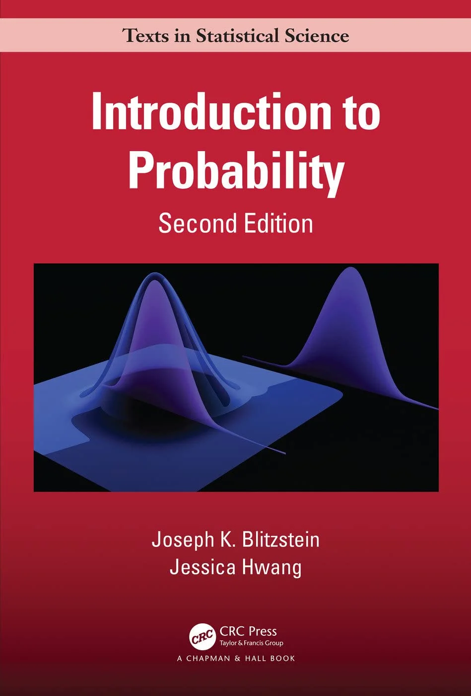

我使用的教材是Joseph K. Blitzstein和Jessica Hwang的*Introduction to Probability second edition*

<figure markdown="span">
  { width="300" }
  <figcaption></figcaption>
</figure>

!!! note "目录"
    - [x] [Chapter 1: Probability and Counting](1.md)
    - [x] [Chapter 2: Conditional Probability](2.md)
    - [x] [Chapter 3: Random Variables and their Distributions](3.md)
    - [ ] [Chapter 4: Expectation]()
    - [ ] [Chapter 5: Continuous Random Variables]()
    - [ ] [Chapter 6: Moments]()
    - [ ] [Chapter 7: Joint Distributions]()
    - [ ] [Chapter 8: Transformations]()
    - [ ] [Chapter 9: Conditional Expectation]()
    - [ ] [Chapter 10: Inequalities and Limit Theorems]()
    - [ ] [Chapter 11: Markov Chains]()
    - [ ] [Chapter 12: Markov Chain and Monte Carlo]()
    - [ ] [Chapter 13: Poisson Processes]()