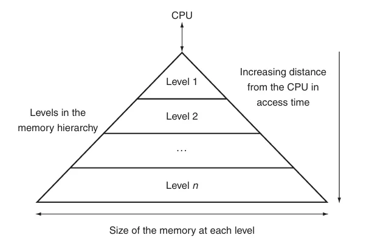
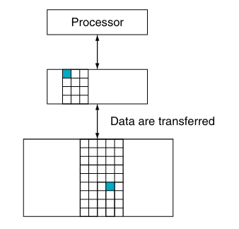
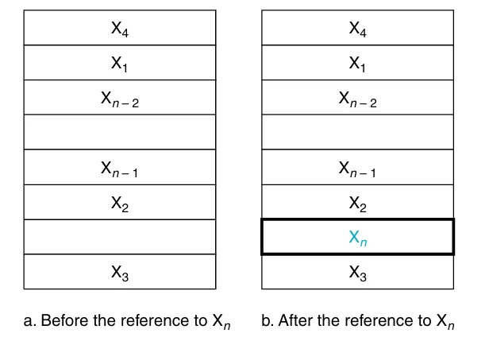
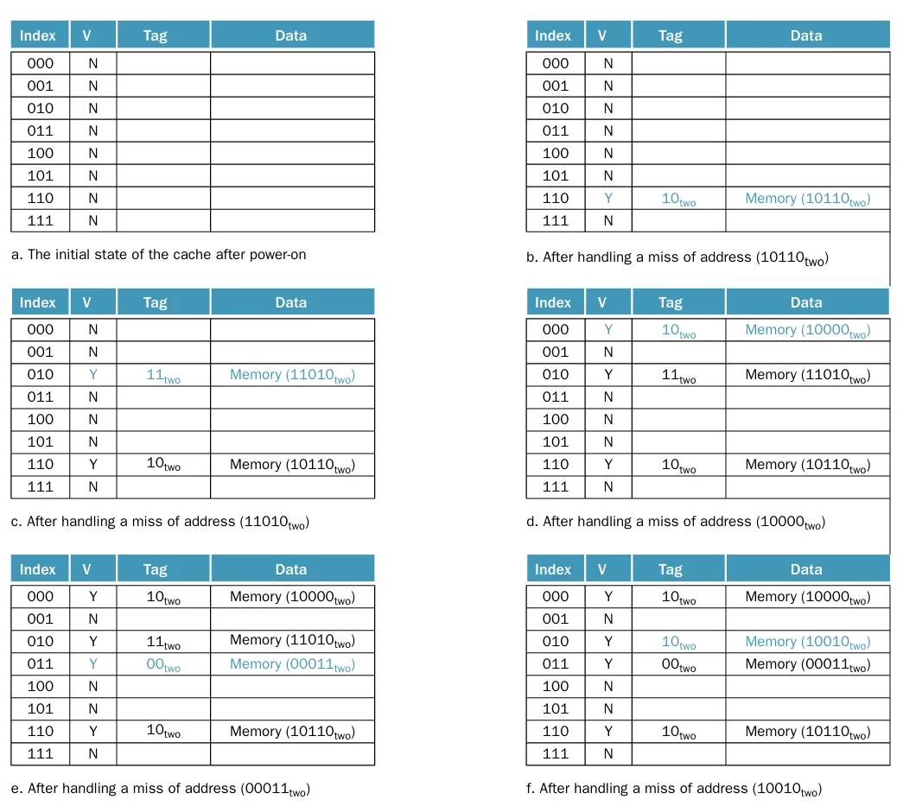
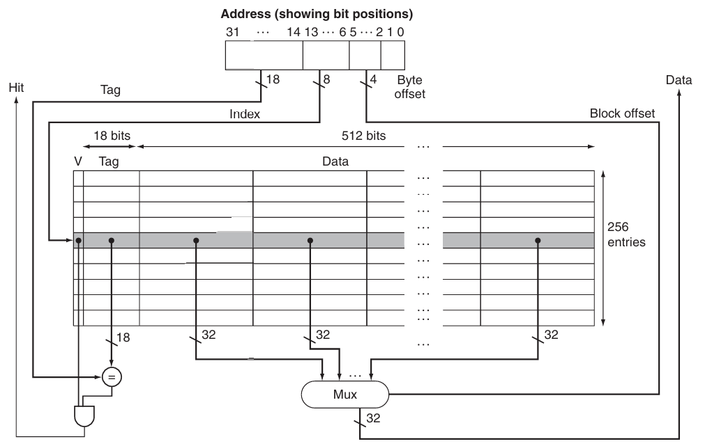
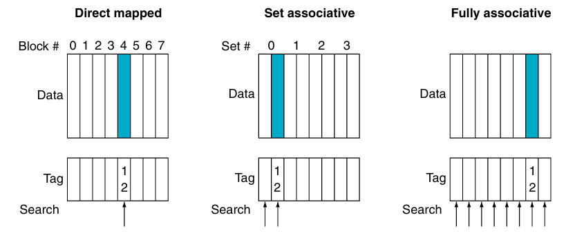
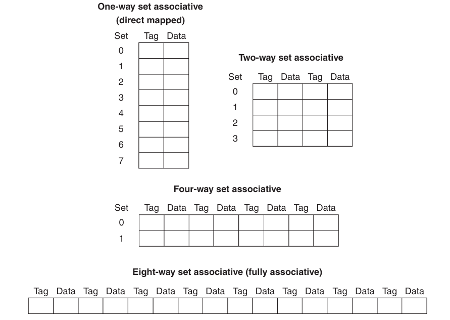
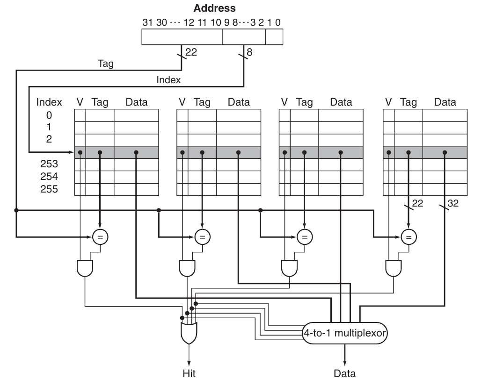

## Introduction
因为程序不会以相同的概率访问它的全部代码或数据，因此可以创造一种程序拥有无限快速内存的假象。**局部性原理**(principle of locality)为实现这种假象提供了可能，局部性分为两类：

- **时间局部性**(temporal locality):如果内存中的某个地址被访问，那么在**短时间内**很有可能在下一次再次被访问
- **空间局部性**(spatial locality):如果内存中的某个地址被访问，那么与它**相邻的地址**很有可能在下一次被访问

可以通过将计算机的内存实现为**内存层级**(memory hierarchy)的方式来利用局部性原理，从而加速对数据的访问。内存层级由多个速度与大小不同的内存等级组成，如下图  
距离 CPU 越近，访问速度越快，存储空间越小，每一位的成本越高

各个层级上的数据也是层次化的：离 CPU 更近的层级上的数据通常是更远层级的子集，最下方的层级保存着所有的数据，且数据每次只能在两个**相邻的层级**之间传递

在两个内存层级之间传递的最小的信息单元称为**块或行**(block/line)(下图中的蓝色部分)

**命中**(hit)指的是处理器请求的数据位于上层内存 

- **命中率**(hit rate):请求的数据位于上层内存的比例
- **命中时间**(hit time):访问上层内存所需的时间，包括判断是否命中所需的时间

> 命中率常用于衡量内存层级的性能

**失效**(miss)指的是处理器请求的数据没有位于上层内存

- **失效率**(miss rate):请求的数据不在上层内存的比例($1-\text{hit rate}$)
- **失效惩罚**(miss penalty):将上层的数据块与对应的下层的数据块进行交换的时间，再加上将这个块发送给处理器的时间

因为所有程序都需要大量时间访问内存，因此内存系统是决定性能的重要因素。为了提高内存系统的性能，计算机设计师提出了许多复杂的机制。

## Memory Technologies

如今的内存系统主要使用4种内存技术：DRAM,SRAM,闪存和机械硬盘

### SRAM

**SRAM**(static random access memory)是**只有一个端口用于读写**的简单集成电路，通常使用6-8个晶体管来保存一位的信息，而且功耗较低。除此之外，它还有以下的特点：

- 虽然读写的访问时间不同，但访问任何数据所需的时间是固定的
- 不需要刷新，访问时间非常接近时钟周期

SRAM 常用作处理器的**缓存**(cache)

### DRAM

**DRAM**(dynamic random access memory)是一个由单个晶体管控制读写的电容。  
由于 DRAM 每一位只需要一个晶体管进行控制，因此成本低于 SRAM  
储存在 DRAM 中的数据需要周期性的进行刷新，即将数据读取后再写回。DRAM 使用**双层解码结构**(tow-level decode structure)一次刷新一整行的数据，这样有助于提升性能

如上图，DRAM 内部被划分为多个**存储体**(memory bank)，每个存储体都有一些**行缓冲器**(row buffer)，从而实现对同一地址的同步访问
假如有 $n$ 个存储体，在一个访问时间内便能轮换访问 $n$ 个存储体，使得带宽提升了 $n$ 倍，这种轮换访问方法被称为**地址交错**(address interleaving)

!!! info "DRAM的类型"
    - **SDRAM**（同步 DRAM）：通过一个时钟来消除同步内存和寄存器所需的时间
    - **DDR SDRAM**(double data rate SDRAM) ：能在时钟的上升沿和下降沿中进行数据传输，从而提升了一倍的**带宽**(bandwidth)
    - **双内联内存模块** (dual inline memory module)

DRAM 主要用于构建**主存**(main memory)

### Flash Memory

**闪存**(flash memory)是一种电子可擦除可编程只读存储器 (EEPROM).

写操作会损耗闪存的存储位，通过名为**磨损均衡**(wear leveling)的方法将需要写的块重新映射到写入次数较少的块，从而延长闪存的寿命

### Disk

**磁盘**(disk)由一组绕轴旋转的**金属盘片** (platter) 构成，盘片上覆有磁记录材料，通过一个**读写头** (read-write head) 来读写信息，整个驱动器被密封在磁盘内部

磁盘由下面几个部分组成：

- **迹** (track)：磁盘表面上的同心圆
- **区**(sector)：构成迹的某个片段，是能够被读写的最小单位的信息，包括：区 ID、数据以及纠错码 (ECC)，计量单位为 bit 或 byte
- **柱面** (cylinder)：读写头下所有的迹（形成一个柱面）

!!! note "访问磁盘某个区的时间"
    访问磁盘某个区的时间由以下几部分构成:
    
    - **寻找时间**(seek time)：定位读写头到要被访问的迹
    - **旋转时延**(rotation latency)：将要访问的区旋转至读写头下所需的时间，通常假设为旋转时间的一半
    - **数据传输**(data transfer) = 区的大小 / 传输速率 (transfer rate)
    - **控制器开销**(controller overhead)

??? tip  "Stream Benchmark"
    Stream Benchmark 是一种测试内存性能的方法，它利用没有空间局部性和比缓存更大的向量操作来衡量性能

## The Basics of Caches

**缓存**(cache)最早指内存层级中处理器和主存之间的部分，现在也泛指利用局部性访问的储存器

> [第四章](4.md)介绍的处理器中的 Memory 可以直接替换为缓存

首先考虑一个处理器一次只读取一个字的简单情况，在读取之前，缓存中的最近被访问的数据包括 $X_1,X_2,\cdots,X_{n-1}$，而处理器需要读取的数据 $X_n$ 不在缓存中，这会导致一次失效。因此，内存系统会读取底层级内存中的数据并将其加入到缓存中，如下图所示

在上面的例子中，有两个问题需要考虑：

!!! question ""
    我们如何知道一个数据是否在缓存中以及我们如何找到它？

如果每个字都在缓存中有一个准确的位置，那么想要找到它就很简单。为内存中的每个字分配缓存位置最简单的方法是根据字在内存中的地址来分配，这种方法被称为**直接映射**(direct mapped),可以使用下面的公式计算字在缓存中的位置（即**索引**）
$$
\text{(Block Adress) module (Number of the blocks in the cache)}
$$
>  如果缓存的块数是2的幂，只需要取地址的低N位即可。其中 $N=\log2\text{缓存的块数}$

因为同一个缓存中的位置可能会被多个内存地址映射，因此为缓存添加一组**标签**(tags)来判断缓存中的字是否为要读取的字。标签只需要包含地址中未用于缓存的位置的部分，如下图

在上图中，因为缓存的块数是8,所以索引需要低3位，标签就是地址中剩下的高2位

除此之外，还需要增加一个**有效位**(valid bit)表示高速缓存块内是否有合法的数据，若有则将其设为 1，否则为 0

??? example "例子"
    对一个缓存块数为8, 初始为空的缓存进行如下的访问

    

    各操作后缓存的变化如下

    

    从图中不难发现，第2次访问（$26=11010_\text{two}$）和第8次访问（$18=10010_\text{two}$）被映射到了同一个缓存块内，在这种情况下，最近访问的数据将会替换原本的数据，这体现了[**时间局部性**](#introduction)

上图展示了一个32位内存地址与缓存的关系，如图所示，可以将一个缓存块分为：

- 标签字段：用于与缓存的标签字段的值进行比较
- 缓存索引：用于选择缓存块
- 数据字段：用于存储实际的数据
标签字段和缓存索引唯一确定了缓存块中的内存地址
因为一个地址表示一个字节，并且在缓存中的数据以**字**（即4 字节）为单位，如果字在内存中是对齐的，地址的低 2 位通常可以被忽略（都是00）

!!! note "缓存的大小"
    假设满足下面这些条件：

    - 32位地址
    - 缓存地址直接映射
    - 缓存大小为 $2^n$ 个块，所以 $n$ 位地址用于表示索引
    - 块大小为 $2^m$ 个字（$2^{m+2}$ 字节), 因此 $m$ 位地址用于表示字

    标签字段的大小为
    $$
    32-(n+m+2)
    $$
    直接映射的缓存所需的位数为
    $$
    \begin{aligned}
    &2^n\times(\text{block size + tag size + valid filed size})\\\\
    &=2^n\times(2^m\times32+(32-n-m-2)+1)\\\\
    &=2^n\times(2^m\times32+31-n-m)
    \end{aligned}
    $$

!!! tip "缓存的命名"
    在给缓存命名时只需要考虑 data 字段的大小，忽略标签字段与有效位。例如上面图中的缓存被命名4KiB 缓存

### Handling Cache Misses

控制单元需要检测缓存是否命中，如果失效，需要通过从内存中读取所需的数据来处理失效，这将会导致流水线停顿；如果命中，处理器将继续使用数据就像无事发生

缓存失效可以分为**指令失效**和**数据失效**，指令失效可以通过完成以下步骤来解决：

1. 将原本的 PC 值存入内存
2. 从主存中读取数据并等待完成
3. 将数据写入缓存并设置标签，有效位等内容
4. 重新开始执行原本的 PC 处的指令

### Handling Writes

在执行一个存储指令时，我们只把数据写入了数据缓存（没有改变主存）；那么，在写入缓存之后，主存的值就会和缓存中的值**不一致**(inconsistent).解决这个问题最简单有下面几种方法：

- **写穿透**(write through)：在执行写操作时同时更新缓存和下一级存储，保证两者之间的数据一致
- **写返回**(write-back)：在产生写操作时只间数据写入缓存，当缓存被替换时将数据写入下一级存储

!!! info "写缓冲"
    虽然写穿透可以很简单的处理写操作，但会带来一些性能问题。解决方案是引入一个**写缓冲**(write buffer),将需要写回主存的数据暂存在写缓冲中。当写入主存的操作完成后，写缓冲中的表项将被释放。如果写缓冲满了，处理器必须停顿流水线直到写缓冲中出现空闲表项。但是，如果主存写操作的速率小于处理器产生写操作的速率，多大容量的缓冲都无济于事。因为写操作的产生速度远远快于主存系统的处理速度。

## Measuring and Improving Cache Performance

CPU 时间可以分为运行程序所花费的时钟周期和等待内存系统所花费的时钟周期：
$$
\text{CPU time}=(\text{CPU execution clock cycles}+\text{Memory-stall clock cycles})\times\text{Clock cycle time}
$$

内存停顿时钟周期主要是因为缓存失效，可以将其分为**读失效**和**写失效**
$$
\text{Memory-stall clock cycles}=\text{Read-stall clock cycles}+\text{Write-stall clock cycles}
$$

读失效造成的停顿可以定义为
$$
\text{Read-stall clock cycles}=\frac{\text{Reads}}{\text{Program}}\times\text{Read miss rate}\times\text{Read miss penalty}
$$

写失效的情况更为复杂，对于写穿透，停顿只要来自两个方面：

1. 写失效：在连续写之前需要将数据块取回
2. 写缓冲停顿：在写缓冲满时进行写操作会引发该停顿

因此，写操作造成的停顿等于二者之和
$$
\text{Write-stall clock cycles}=\left(\frac{\text{Writes}}{\text{Program}}\times\text{Write miss rate}\times\text{Write miss penalty}\right)+\text{Write buffer stalls}
$$

大多数写穿透缓存的结构中，读和写的失效代价是相同的，如果写缓冲停顿可以忽略不计，那么就可以使用失效率和失效代价来同时刻画读操作和写操作：
$$
\text{Memory-stall clock cycles}= \frac{\text{Memory accesses}}{\text{Program}} \times\text{Miss rate}\times\text{Miss penalty}
$$

也可以写为
$$
\text{Memory-stall clock cycles}= \frac{\text{Instructions}}{\text{Program}} \times\frac{\text{Misses}}{\text{Instruction}}\times\text{Miss penalty}
$$

??? example "计算缓存性能"
    假设指令cache的失效率为2%，数据cache的失效率为4%。如果处理器的CPI为2，没有任何的访存停顿；对于所有的失效，失效代价都为100个时钟周期。如果配置了一个从不失效的完美缓存，那么处理器的性能会提高多少？假设load和store指令占所有指令的36%

硬件设计师们还会用**平均内存访问时间**(average memory access time, AMAT) 这一指标来衡量高速缓存性能，因为它能同时反映命中和失效的情况，公式如下：
$$
\text{AMAT}=\text{Time for a hit}+\text{Miss rate}\times\text{Miss penalty}
$$

### Flexible Placement of Blocks

前面的已经介绍了一种被称为直接映射的策略，它将主存中的任意数据块地址直接映射到上层存储的一个准确位置。除了直接映射之外，还有两种方法

- **全相联**(full associative)中的数据块可以放在缓存的**任何位置**  
为了寻找一个特定的块，需要搜索缓存中的所有块，为提升性能，每个缓存表项都有一个比较器可以并行地进行比较，这些比较器极大增加了硬件成本，因此全相连策略只能用于容量较小的缓存

- **组相联**(set associative)中每个块有可以放在**一个组内的任意位置**  
将缓存划分为一定数量的包含 $n$ 个块的组，这样的缓存被称为 **n路组相联**($n$-way set associative),内存中的一个块会被映射到唯一的一个组，并且可以被放在**该组内的任何位置**

组相联结合了直接映射和全相联：一个块被直接映射到一个组，在组内则是全相联。可以使用下面的公式计算数据块被映射的组
$$
\text{(Block Adress) module (Number of the sets in the cache)}
$$
为了寻找一个特定的块，需要搜索组中的所有块

下图展示了三种策略：

我们也可以将所有块放置策略看作是组相联的变体，对于一个8个块的缓存，直接映射计算单路组相联，全相联则是8路组相联，如下图

> 如果缓存大小固定，增加相联度将会减少组数

!!! note ""
    增加相联度的优点是降低失效率，缺点则是增加命中时间

现在考虑在组相联缓存中寻找一个特定的块，和直接映射类似，可以将组相联的地址分为三个部分

- **索引**(index):用来选择一个组
- **标签**(tag):用来在已选定的组中通过比较来选择一个块
- **块偏移**(block offset):所需的数据在块中的地址

>  因为全相联缓存只有一个组，因此没有索引

组相联通过多个比较器实现并行查找， $n$ 路组相联需要 $n$ 个比较器和一个 $n$-to-1选择器

下图为一个4路组相联缓存的示意图

选择直接映射、组相联或全相联主要取决于未命中的成本与实现关联性所需的成本，这包括时间和额外硬件

## Replace Blocks

当缓存发生缺失时，需要将对应的数据块加入到缓存中，如果该数据块对应的缓存组已满，就需要替换数据块。

- 对于直接映射，因为每个数据块都在缓存中有唯一的位置，所以直接替换对应的数据块即可
- 对于组相联，数据块可以放在组内的任意一个位置，LRU(least recently used)是最常见的方法，它会选择未访问时间最长的数据块进行替换
实现 LRU 的方法是记录同一个组内的数据块的相对使用时间，例如对于一个2路组相联，可以使用1个编程位来记录两个数据块的先后顺序
- 对于全相联，数据块可以放在缓存的任意一个位置

## Multilevel Cache

为了缩小处理器和访问内存之间巨大的性能差距，现代处理器引入了**多级缓存**(multilevel cache),即在 **处理器核心与主存**之间设置多个不同容量和速度的缓存层级。以二级缓存为例，当一级缓存发生缺失时，会先在第二级缓存中寻找需要的值，如果二级缓存命中，将显著降低缺失惩罚

一级和二级缓存的设计目标不同，对于一级缓存，主要关注的是**降低命中时间**从而缩短时钟周期数或减少流水线阶段。因此一级缓存**容量更小**，同时采用**更小的块大小**，来降低缺失惩罚；而二级缓存主要关注**缺失率**，从而降低内存访问带来的缺失惩罚。相对来说空间会更大，且采用更高度的相联置放，以降低失效率

# Dependable  Memory Hierarchy

