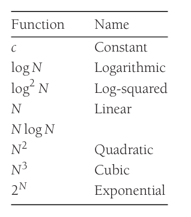

## Mathematical Background

首先来看四个数学定义

- 如果存在正常数 $c$ 和 $n_0$ 满足当 $N\ge n_0$ 时，$T(N)\le cf(N)$,那么 $T(N)=O(f(N))$
- 如果存在正常数 $c$ 和 $n_0$ 满足当 $N\ge n_0$ 时，$T(N)\ge cg(N)$,那么 $T(N)=\Omega(g(N))$
- 当且仅当 $T(N)=O(h(N))$ 并且 $T(N)=\Omega(h(N))$ 时，$T(N)=\Theta(h(N))$
- 如果对任意正常数 $c$，存在正常数 $n_0$ 使得当 $N\ge n_0$ 时，$T(N)< cp(N)$,那么 $T(N)=o(p(N))$

这些定义建立了函数之间的**相对关系**

如果 $T(N)=O(f(N))$,那么 $T(N)$ 的增长速度不大于 $f(N)$.因此，$f(N)$ 是 $T(N)$ 的一个**上界**(upper bound);同时，这意味着 $f(N)=\Omega(T(N))$，即 $T(N)$ 是 $f(N)$ 的一个**下界**(lower bound)


!!! info "常用结论"
    1. 如果 $T_1(N)=O(f(N))$, $T_2(N)=O(g(N))$ ，那么  
        $T_1(N)+T_2(N)=O(f(N)+g(N))$  
        $T_1(N)*T_2(N)=O(f(N)*g(N))$
    2. 如果 $T(N)$ 是一个 $k$ 阶多项式，那么 $T(N)=O(n^k)$
    3. 对于任意实数 $k$,都有 $log^kN=O(N)$ 

也可以通过**洛必达法则**计算两个函数比值的极限，从而得到它们的相对关系，即对于 $f(N)$ 和 $g(N)$,计算
$$
\lim_{N\to\infty}\frac{f(N)}{g(N)}
$$

- 如果极限为0,那么 $f(N)=o(g(N))$
- 如果极限是不为0的常数,那么 $f(N)=\Theta(g(N))$
- 如果极限为 $\infty$,那么 $g(N)=o(f(N))$
- 如果极限不存在，那么两个函数没有相对关系

下面是一些常见的函数增长速率



## What to Analyse

我们需要分析的最重要的内容一般是**运行时间**，有许多因素都会影响程序的运行时间，例如所使用的编译器和计算机，虽然它们很重要，但不是现在的重点。我们主要考虑的影响因素是输入的大小，对输入大小为 $N$ 的算法定义如下两个函数：

- $T_{avg}(N)$ : 表示平均运行时间
- $T_{worst}(N)$:表示最差运行时间

显然，$T_{avg}(N)\le T_{worst}(N)$

通常不考虑最优情况下算法的性能，因为它不能反映该算法的一般情况；平均性能通常能反映算法的一般情况，而最坏情况下的性能反映任何可能输入的性能。
如果没有特殊说明，**通常只需要分析最差性能**

## Running-Time Calculations

先来看一个例子

```cpp hl_lines="6"
int sum(int n)
{
	int partialSum = 0;
	
	for (int i = 0; i <= n; ++i)
		partialSum += i * i * i;
	
	return partialSum;
}
```

第3行需要一个单位时间，第6行每次执行需要四个单位时间（两个乘法，一个加法和一个赋值），并且执行 $N+1$ 次，总计 $4N+4$ 个单位时间。第5行有初始化 `i`、测试 `i<=N` 和 `i` 递增的隐性成本，总成本是初始化1次，测试 $N+1$ 次，递增 $N+1$ 次，总共是 $2N+3$。第8行的 `return` 需要一个单位时间。忽略调用函数的成本，总计 $6N+9$。因此，这个函数的复杂度是 $O(N)$

由于我们是用大 O 表示法来给出答案，所以有很多不会影响最终结果的捷径可以走。例如，第6行显然是一个 O(1) 语句（每次执行一次），所以去精确计算它是两次、三次还是四次执行是没有意义的；第3行与 for 循环相比显然微不足道，所以在这里浪费时间也没必要。因此可以得到下面这些通用规则

**Rule 1: for 循环**  
for 循环的运行时间是循环内运行**时间最长的语句**乘上循环次数
 
**Rule 2: 嵌套循环**  
嵌套循环的运行时间是循环内语句的运行时间乘上总的循环次数

**Rule 3:连续的语句**  
连续语句的总运行时间等于各语句运行时间之和（最终结果取最高阶项）

**Rule 4:if/else 语句**  
对于下面的代码片段
```cpp
if (condition)
	S1
else
	S2
```
运行时间为测试条件是否为真的时间再加上 S1和 S2中运行时间**最长**的

### Maximum Subsequence Sum Problem

!!! question "Maximum Subsequence Sum Problem"
	假设有一个整数(可能为负)序列 $A_1, A_2, ..., A_n$，我们要找到 $\sum\limits_{k=i}^j A_k$ 的最大值

下面给出4种不同时间复杂度的算法来解决这个问题

=== "Cubic Time"
	```cpp
	int maxSubSum1(const vector<int>& a)
	{
	    int maxSum = 0;

	    for (int i = 0;i < a.size();++i)
	    {
	        for (int j = i;j < a.size();++j)
	        {
	            int thisSum = 0;

	            for (int k = i; k <= j; ++k)
	                thisSum += a[k];

				if (thisSum > maxSum)
	                maxSum = thisSum;
				}
	    }
	    return maxSum;
	}
	```

	三重嵌套循环，内层求和最长执行 $N$ 次，总运行时间为 $\sum_{i=0}^{N-1}\sum_{j=i}^{N-1}(j-i+1)=\Theta(N^3)$，即 $O(N^3)$

=== "Square Time"
	```cpp
	int maxSubSum2(const vector<int>& a)
	{
	    int maxSum = 0;

	    for (int i = 0;i < a.size();++i)
	    {
			int thisSum = 0;
	        for (int j = i;j < a.size();++j)
	        {
	            thisSum += a[j];

	            if (thisSum > maxSum)
	                maxSum = thisSum;
	        }
	    }
	    return maxSum;
	}
	```

	消除最内层循环，利用 $a_i+\cdots+a_j=(a_i+\cdots+a_{j-1})+a_j$ 递推累加，二重循环，复杂度 $O(N^2)$

=== "Linearithmic Time"
	```cpp
	int maxSumRec(const vector<int>& a, int left, int right)
	{
	    if (left == right)  // Base case
	        if (a[left] > 0)
	            return a[left];
	        else
	            return 0;

		int center = (left + right) / 2;
		int maxLeftSum = maxSumRec(a, left, center);
		int maxRightSum = maxSumRec(a, center + 1, right);

		int maxLeftBorderSum = 0, leftBorderSum = 0;
		for (int i = center; i >= left; --i)
		{
			leftBorderSum += a[i];
			if (leftBorderSum > maxLeftBorderSum)
				maxLeftBorderSum = leftBorderSum;
		}
		int maxRightBorderSum = 0, rightBorderSum = 0;
		for (int i = center + 1; i <= right; ++i)
		{
			rightBorderSum += a[i];
			if (rightBorderSum > maxRightBorderSum)
				maxRightBorderSum = rightBorderSum;
		}
		int maxCrossingSum = maxLeftBorderSum + maxRightBorderSum;
		return max(maxLeftSum, max(maxRightSum, maxCrossingSum));
	}

	int maxSubSum3(const vector<int>& a)
	{
	    return maxSumRec(a, 0, a.size() - 1);
	}
	```

	使用分治法，将序列分成两半，最大子段和要么在左半、要么在右半、要么跨越中点（前缀和与后缀和的最大值之和，线性时间可求）。得到递推式

  	$$
	T(N)=2T(N/2)+O(N),\quad T(1)=O(1)
	$$

  	每层递归合并代价为 $O(N)$，共 $\log N$ 层，故 $T(N)=O(N\log N)$


=== "Linear Time"
	```cpp
	int maxSubSum4(const vector<int>& a)
	{
	    int maxSum = 0, thisSum = 0;

	    for (int i = 0;i < a.size();++i)
	    {
	        thisSum += a[i];
	        if (thisSum > maxSum)
	            maxSum = thisSum;
	        else if (thisSum < 0)
	            thisSum = 0;
	    }
	    return maxSum;
	}
	```
	
    在线扫描。若某前缀 $a_i+\cdots+a_j<0$，则它不可能是任何最优子序列 $a_p+\cdots+a_q\ (p\le i,\ j<q\le N)$ 的一部分（加上它只会让和变小），因此可安全地将 `thisSum` 重置为 0 并从下一位置重新开始。每个元素只处理一次，复杂度 $O(N)$


### Logarithms in Running Time

在上面的例子中，第三个算法使用了分治法，它的时间复杂度为 $O(N\log N)$;除了分治法，大部分复杂度为对数的算法都满足：若算法能在常数时间内将问题规模缩小为原来的常数倍，则其复杂度为 $O(\log N)$。由于换底公式只相差一个常数因子，大 O 意义下对数的底数不影响结果

>  当讨论一个算法的时间复杂度为 $O(\log N)$ 时，通常假设输入已经存放在数组中，访问其任意部分只需 $O(1)$ 时间

下面来看三个例子

**Binary Search**

假设在一个有序且在内存中的整数序列 $A_0, A_1, ..., A_{N-1}$ 寻找一个整数 $X$ ，返回满足 $A_i=X$ 的下标 $i$ ，如果没有找到就返回-1

利用数组已经有序的特性，首先判断 $X$ 与中间元素是否相等，如果相等，直接返回即可；如果小于中间元素，我们对左边到中间的子数组使用相同的策略；如果大于中间元素，我们对中间到右边的子数组使用相同的策略

下面是对应的C++实现

```cpp
template<typename T>
int binarySearch(const std::vector<T>& a, const T& x)
{
	int low = 0, high = a.size() - 1;
	while (low <= high)
	{
		int mid = (low + high) / 2;
		if (x < a[mid])
			high = mid - 1;
		else if (x > a[mid])
			low = mid + 1;
		else
			return mid;
	}
	return NOT_FOUND; // NOT_FOUND is -1
}
```

循环内的所有语句的时间复杂度为 $O(1)$ ，所以我们只需要分析循环的次数。循环开始时 `high`-`low`$=N-1$ 结束时 `high`-`low`$\le-1$ .每循环一次，`high`-`low` 的值会比之前减少一半。因此，循环最多进行 $\lceil\log(N-1)\rceil+2$ 次


**Euclid's Algorithm**

欧几里得算法主要用于计算两个整数的**最大公因数**(greatest common divisor, gcd),实现如下,在这里假设 $M\ge N$

=== "迭代"
	```cpp 
	long long gcd(long long m, long long n)
	{
		while (n != 0)
		{
			long long rem = m % n;
			m = n;
			n = rem;
		}

		return m;
	}
	```

=== "递归"
	```cpp
	long long gcd(long long m, long long n)
	{
		return n == 0 ? m : gcd(n, m % n);
	}
	```

为了说明这个算法的时间复杂度，需要引入下面这个定理

!!! info "定理"
	如果 $M>N$ ，那么 $M\mod{N}<M/2$

	**证明**: 分为两种情况来证明
	
	当 $N\le M/2$ 时，因为 $M\mod{N}<N\le M/2$， 定理成立  
	当 $N>M/2$ 时，因为 $M\mod{N}=M-N < M/2$，定理成立

因为每两次迭代都会将较大的数减半，迭代次数为 $O(\log M)$；更精细的分析（Lamé 定理，与斐波那契数相关）可以证明迭代次数实际上是 $O(\log N)$

**Exponentiation**

最后这个例子需要计算 $X^N$ ，其中 $X$ 和 $N$ 都是整数。最显而易见的方法是进行 $N-1$ 次乘法，但是使用一个递归算法可以得到更好的时间复杂度：

如果 $N$ 是偶数，那么 $X^N=X^{N/2}\cdot X^{N/2}$ ；如果 $N$ 是奇数，那么 $X^N=X^{(N-1)/2}\cdot X^{(N-1)/2}\cdot X$

这个算法所需要的乘法次数最多为 $2\log N$ 次，因为每层递归最多用两次乘法就能将问题规模减半

```cpp
long long pow(long long x, int n)
{
	if (n == 0)
		return 1;
	if (n == 1)
		return x;
	if (isEven(n))
		return pow(x * x, n / 2)
	else
		return pow(x * x, n / 2) * x;
}
```