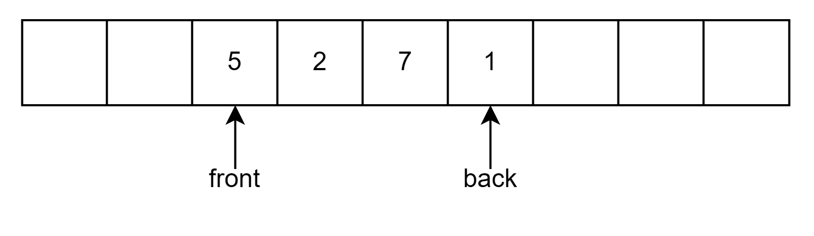

## Abstract Data Types

**抽象数据类型**(abstract data types)是带有一组操作的对象的集合，ADT本身不包含操作的实现，可以将其看作是模块化的一种延伸

## The List ADT

对于形式为 $A_0, A_1, A_2,\cdots,A_{n-1}$ 的**线性表**(linear list)，它的大小为 $N$

>  大小为 0 的线性表被称为**空列表**(empty list)

除空列表以外的任意线性表，$A_i$ 都在 $A_{i-1}(i<N)$ 的后面（后继，succeeds）,而 $A_{i-1}$ 在 $A_{i}$ 的前面（前驱，precedes）.而 $A_0$ 的前驱和 $A_{n-1}$ 的后继是没有定义的
线性表中的元素 $A_i$ 的位置为 $i$

线性表主要包括以下这些操作：

- `printList`:打印线性表中的所有元素
- `makeEmpty`:将线性表变为空线性表
- `find`:返回元素第一次出现的位置
- `insert`:将元素插入到指定的位置
- `remove`:删除指定的位置的元素
- `next`:返回指定位置的元素的后继
- `previous`:返回指定位置的元素的前驱

### Simple Array Implementation of List

使用**数组**就可以实现上面的所有操作

其中，`printList` 需要线性时间，`insert` 和 `remove` 取决于元素的位置，最差的情况为 $O(N)$

数组的大小是固定的，但 C++标准库提供了一个可以动态调整大小的类模板 `vector`

下面是它简化后的实现[^1]为了不与标准库的 `vector` 混淆，这里将其命名为 `Vector`

??? code  "Vector的实现"
    ```cpp
    template<typename T>
    class Vector
    {
    private:
        int theSize;
        int theCapacity;
        T* elems;
    public:
        static const int SPACECAPACITY = 16;

        explicit Vector(int size = 0) : theSize(size), theCapacity(size + SPACECAPACITY)
        {
            elems = new T[theCapacity];
        }

        ~Vector()
        {
            delete[] elems;
        }

        void resize(int newSize)
        {
            if (newSize > theCapacity)
                reverse(theCapacity * 2);

            theSize = newSize;
        }
        
        void reverse(int newCapacity)
        {
            if (newCapacity < theSize)
                return;

            T* newElems = new T[newCapacity];
            for (int i = 0; i < theSize; ++i)
            {
                newElems[i] = std::move(elems[i]);
            }

            theCapacity = newCapacity;
            std::swap(elems, newElems);
            delete[] newElems;
        }

        T operator[](int index)
        {
            return elems[index];
        }

        bool empty()
        {
            return theSize == 0;
        }

        void clear()
        {
            theSize = 0;
        }

        void push_back(T& elem)
        {
            if (theSize == theCapacity)
                reverse(theCapacity* 2 + 1);

            elems[theSize++] = elem;
        }

        void pop_back()
        {
            theSize--;
        }
    };
    ```

如果需要频繁的进行**插入和删除**，那么数组实现的性能将不容乐观。因此我们引入了**链表**(linked list)

### Simple Linked Lists

链表由一系列包含元素和后继节点链接的节点组成，这些节点在内存中不一定相邻。我们将这个指向后继元素的链接称为 `next`,最后一个元素的 `next` 指向 `nullptr`.如下图所示


虽然上面的描述已经能够完成所有的操作，但是这会出现三个问题：

1. 没有一个足够明确的方式在链表前面插入元素
2. 删除链表的第一个元素是一个特殊情况，因为需要改变链表的起始
3. 删除算法需要我们跟踪要删除的那个元素之前的元素

只需要在链表的最前面增加一个**哨兵节点**就可以解决这三个问题，如下图所示


我们将链表的节点定义如下
```cpp
template<typename T>
struct Node
{
	T element;
	Node* next;
	
	Node() = default;
	Node(T elem) : element(elem), next(nullptr) { }
};

template<typename T>
using PtrToNode = Node<T>*;
```

链表的 ADT 定义为
```cpp
template<typename T>
class List
{
private:
    PtrToNode<T> header;
    int size = 0;
public:
    List();
    ~List() { makeEmpty(); delete header; }
    void insert(int pos, const T& val);
    void remove(int pos);
    int  find(const T& val) const;
    void makeEmpty();
    void printList() const;
    int getSize() const { return size; }
    bool empty() const { return size == 0; }
};
```

接下来来看这些的操作的实现细节

=== "初始化"

    只需要将哨兵节点的 `next` 指向 `nullptr` 即可,如下图所示

    {width="280px"}

    ```cpp
    template<typename T>
    List<T>::List()
    {
        header = new Node<T>();
        header->next = nullptr;
    }
    ```
=== "删除操作"
    只需要沿 `next` 链接找到要删除的元素之前的元素，将它的 `next` 指向要删除的元素的后继节点，再释放被删除的节点即可,如下图所示

      

    ```cpp
    template<typename T>
    void List<T>::remove(int pos)
    {
        if (pos < 0 || pos >= size)
            throw std::out_of_range("List::remove: pos out of range");

        PtrToNode<T> curr = header;
        for (int i = 0; i < pos; ++i)
            curr = curr->next;

        PtrToNode<T> victim = curr->next;
        curr->next = victim->next;
        delete victim;
        --size;
    }
    ```
=== "插入操作"
    有了哨兵节点，在链表最前面插入元素也不再是特殊情况：`insert` 将元素插入到位置 `pos`，只需要先找到位置 `pos-1` 的节点（`pos` 为 0 时即哨兵节点），再把它的新后继指向原来的后继即可，如下图所示

      

    ```cpp
    template<typename T>
    void List<T>::insert(int pos, const T& val)
    {
        if (pos < 0 || pos > size)
            throw std::out_of_range("List::insert: pos out of range");

        PtrToNode<T> curr = header;
        for (int i = 0; i < pos; ++i)
            curr = curr->next;

        PtrToNode<T> node = new Node<T>(val);
        node->next = curr->next;
        curr->next = node;
        ++size;
    }
    ```
=== "查找操作"
    从哨兵节点的后继开始逐个比较，返回元素第一次出现的位置，未找到则返回 `-1`

    ```cpp
    template<typename T>
    int List<T>::find(const T& val) const
    {
        int pos = 0;
        PtrToNode<T> curr = header->next;
        while (curr != nullptr)
        {
            if (curr->element == val)
                return pos;
            curr = curr->next;
            ++pos;
        }
        return -1;
    }
    ```
=== "打印与清空"
    沿着 `next` 链接遍历整个链表即可。`makeEmpty` 复用 `remove(0)` 逐个释放节点，省去重复的释放逻辑

    ```cpp
    template<typename T>
    void List<T>::printList() const
    {
        PtrToNode<T> curr = header->next;
        while (curr != nullptr)
        {
            std::cout << curr->element << " ";
            curr = curr->next;
        }
        std::cout << std::endl;
    }

    template<typename T>
    void List<T>::makeEmpty()
    {
        while (!empty())
            remove(0);
    }
    ```

### Double Linked Circular List

双向循环链表是一种在单向循环链表的基础上，每个节点都有前驱和后继指针的链表。它可以在任意位置插入和删除元素，同时支持从任意位置遍历链表。如下图所示


它的节点定义如下
```cpp
template<typename T>
struct Node
{
	T element;
	Node* prev;
	Node* next;
	
	Node() = default;
	Node(T elem) : element(elem), prev(nullptr), next(nullptr) { }
};
```

下面是双链表的操作的实现细节
=== "初始化"
    与单链表一样，我们在链表最前面设置一个**哨兵节点**，初始化时让它的 `next` 和 `prev` 都指向自己，这样空链表也保持循环结构，插入和删除不再需要对空表或端点做特殊判断

    ```cpp
    template<typename T>
    DList<T>::DList()
    {
        header = new Node<T>();
        header->next = header;
        header->prev = header;
    }
    ```

=== "插入"
    在节点 `p` 之后插入新节点，只需要修改四个指针；`remove` 删除节点 `p`，只需要修改两个指针再释放 `p` 即可

    ```cpp
    template<typename T>
    void DList<T>::insert(PtrToNode<T> p, const T& val)
    {
        PtrToNode<T> node = new Node<T>(val);
        node->prev = p;
        node->next = p->next;
        p->next->prev = node;
        p->next = node;
        ++size;
    }
    ```

=== "删除"
    删除节点 `p`，只需要修改两个指针再释放 `p` 即可

    ```cpp
    template<typename T>
    void DList<T>::remove(PtrToNode<T> p)
    {
        if (p == header)  // 哨兵节点不允许删除
            return;

        p->prev->next = p->next;
        p->next->prev = p->prev;
        delete p;
        --size;
    }
    ```

双向循环链表的关键优势在于：只要拿到位置的节点指针，插入和删除都是 $O(1)$ 的。单链表中删除节点 `p` 需要先找到 `p` 的前驱，代价是 $O(N)$，而双向链表的每个节点都直接持有前驱指针，直接修改指针即可。

>  C++标准库的 `list` 实现的就是双向链表，支持 $O(1)$ 的 `insert` 和 `erase`

## Stack ADT

**栈**(stack)是一个插入与删除都只能在一个位置进行的线性表，这个位置被称为**栈顶**(top)。因此栈可以看作是一个**后进先出**(last in, first out, LIFO)的线性表

栈的两个基本操作是 `push` (类似于 `insert`)和 `pop` (类似于 `remove`);除此之外，还可以使用 `top` 来查看栈顶元素，对空栈调用 `pop` 或 `top` 将会导致错误

### Implementation of Stacks

因为栈是一个线性表，因此任何线性表都可以实现栈的功能。两种主流的实现方式是使用链表和数组

!!! note "注意操作位置"
    无论哪种实现，都必须保证 `push`、`pop`、`top` 都作用在**同一端**才能保证 $O(1)$。用数组实现时若把栈底固定在 `elems[0]`，三个操作都发生在末尾，是 $O(1)$ 的；若反过来把栈顶固定在 `elems[0]`，`push` 和 `pop` 就需要移动所有元素

#### Linked List Implementation

使用一个单链表，但是只在链表的头部进行操作，这里我使用 C++标准库的 `forward_list` 来实现
```cpp
template<typename T>
class Stack
{
private:
    std::forward_list<T> elems;
    int sz = 0;
public:
    bool empty() const{ return sz == 0; }

    int size() const { return sz; }

    void push(const T& elem)
    {
        elems.push_front(elem);
        ++sz;
    }

    void pop()
    {
        if (empty())
            throw std::runtime_error("the stack is empty");
        elems.pop_front();
        --sz;
    }

    T& top()
    {
        if (empty())
            throw std::runtime_error("the stack is empty");
        return elems.front();
    }
};
```

#### Array Implementation

```cpp
template<typename T>
class Stack
{
private:
    static constexpr std::size_t N = 16;
    T elems[N];
    int sz = 0;
public:
    bool empty() const{ return sz == 0; }

    int size() const { return sz; }

    void push(const T& elem)
    {
        if (sz == N)
            throw std::runtime_error("the stack is full");

        elems[sz++] = elem;
    }

    void pop()
    {
        if (empty())
            throw std::runtime_error("the stack is empty");
        --sz;
    }

    T& top()
    {
        if (empty())
            throw std::runtime_error("the stack is empty");
        return elems[sz - 1];
    }
};
```

两种实现的所有操作都是 $O(1)$。数组实现需要处理栈满的情况，固定大小的数组会限制栈的容量；链表实现没有这个问题，但每次 `push` 都要分配节点

### Applications

#### Balancing Symbols

检查一个表达式中的符号是否配对，如 `{[()]}` 是配对的，而 `[(])` 不配对。算法的核心思想是：**最先被打开的括号一定最先被关闭**，这正好是栈的 LIFO 特性

处理规则很简单：左括号入栈；遇到右括号时，若栈空或栈顶不是与之配对的左括号则失败，否则弹出栈顶。扫描结束后栈非空同样表示不配对

??? code "检查括号配对"的
    ```cpp
    bool isBalanced(const std::string& s)
    {
        std::stack<char> stk;
        for (char c : s)
        {
            if (c == '(' || c == '[' || c == '{')
                stk.push(c);
            else if (c == ')' || c == ']' || c == '}')
            {
                if (stk.empty())
                    return false;
                char top = stk.top();
                stk.pop();
                if ((c == ')' && top != '(') ||
                    (c == ']' && top != '[') ||
                    (c == '}' && top != '{'))
                    return false;
            }
        }
        return stk.empty();
    }
    ```

#### Infix to Postfix Conversion

我们熟悉的算术表达式如 `a+b*c` 称为**中缀**(infix)表达式，运算符在两个操作数中间；写成 `abc*+` 的形式称为**后缀**(postfix)表达式，运算符在两个操作数之后。后缀表达式不需要括号和优先级规则就能无歧义地求值：从左到右扫描，遇到操作数入栈，遇到运算符就弹出两个操作数计算并把结果压回

将中缀转换为后缀的规则：

- 数字直接输出
- 左括号入栈
- 右括号：弹出并输出栈中运算符，直到遇到左括号（左括号弹出但不输出）
- 运算符：弹出并输出栈顶所有优先级**不低于**它的运算符，然后自己入栈

!!! example "例子"
    中缀 `a+b*(c^d-e)^(f+g*h)-i` 转换为后缀的过程（`^` 优先级最高）：

    ```
    a b c d ^ e - f g h * + ^ * + i -
    ```

#### Recursion

栈最重要的应用之一是在背后支持**递归**。函数调用时，返回地址、参数和局部变量被保存在一个称为**活动记录**(activation record)的数据结构中，这些记录组织在系统栈上。递归调用时，每次调用都压入新的活动记录，返回时弹出

!!! warning "栈溢出与尾递归"
    由于系统栈的大小有限，递归过深会导致**栈溢出**(stack overflow)。一个典型的例子是计算 $Fib(N)$：朴素的递归实现会产生 $O(2^N)$ 次调用，栈深度为 $O(N)$；而把递归改写为循环则只需要 $O(1)$ 栈空间

任何递归都可以用一个显式的栈改写，但通常没有必要——编译器已经帮我们做了。真正需要注意的是递归**深度**是否可能过大，以及是否存在**尾递归**（尾递归理论上可以用 $O(1)$ 空间实现，但 C++ 编译器不保证优化）

## Queue ADT

**队列**(queue)是限制插入和删除分别在表的两端进行的线性表：插入在**队尾**(back)进行，删除在**队头**(front)进行。因此队列是一个**先进先出**(first in, first out, FIFO)的线性表

队列的基本操作是 `add`(入队)、`remove`(出队)和 `getFront`(查看队头元素)，对空队列调用 `remove` 或 `getFront` 将会导致错误

队列的典型应用是**调度**：CPU 时间片轮转、打印机任务队列、缓冲区等，都要求按到达顺序处理元素

### Array Implementation

与栈一样，队列可以用数组实现，但有一个问题：`remove` 之后队头会前进，如果简单地让 `front` 递增，数组前端的空间就被浪费了。解决办法是让数组**循环使用**，即 `front` 和 `back` 到达数组末尾后回到开头如图所示



由于 `front` 和 `back` 之间既可能"空"也可能"满"，仅凭两者相等无法区分队列状态，需要多留一个位置（或记录元素个数）来区分

??? code "数组实现"
    ```cpp
    template<typename T, int MaxSize = 100>
    class Queue
    {
    private:
        T elems[MaxSize];
        int front = 0;
        int back = 0;
    public:
        bool isEmpty() const { return front == back; }

        bool isFull() const { return (back + 1) % MaxSize == front; }

        void add(const T& elem)
        {
            if (isFull())
                throw std::runtime_error("the queue is full");
            elems[back] = elem;
            back = (back + 1) % MaxSize;
        }

        T remove()
        {
            if (isEmpty())
                throw std::runtime_error("the queue is empty");
            T elem = elems[front];
            front = (front + 1) % MaxSize;
            return elem;
        }

        T getFront() const
        {
            if (isEmpty())
                throw std::runtime_error("the queue is empty");
            return elems[front];
        }
    };
    ```

!!! note "循环队列的容量"
    `isFull` 的条件是 `(back+1) % MaxSize == front`，即牺牲一个存储单元来区分队空和队满。此时队列最多容纳 `MaxSize - 1` 个元素

### Linked List Implementation

链表实现更简单：用 `front` 和 `back` 两个指针分别指向队头节点和队尾节点，`add` 在尾部插入、`remove` 在头部删除，都是 $O(1)$

??? code "链表实现"
    ```cpp
    template<typename T>
    class Queue
    {
    private:
        PtrToNode<T> front;
        PtrToNode<T> back;
    public:
        Queue() { front = back = nullptr; }

        bool isEmpty() const { return front == nullptr; }

        void add(const T& elem)
        {
            PtrToNode<T> node = new Node<T>(elem);
            if (isEmpty())
                front = back = node;
            else
            {
                back->next = node;
                back = node;
            }
        }

        T remove()
        {
            if (isEmpty())
                throw std::runtime_error("the queue is empty");
            T elem = front->element;
            PtrToNode<T> tmp = front;
            front = front->next;
            if (front == nullptr)  // 删除的是最后一个节点
                back = nullptr;
            delete tmp;
            return elem;
        }
    };
    ```

!!! warning "别忘了更新 back"
    当队列中只剩最后一个节点时，`remove` 之后必须把 `back` 也置为 `nullptr`，否则 `back` 将成为**悬空指针**，后续 `add` 会向已释放的内存写入


[^1]: 这里省略原书代码中的一些 C++特性，如移动语义和迭代器


