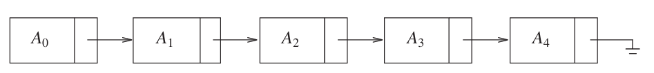
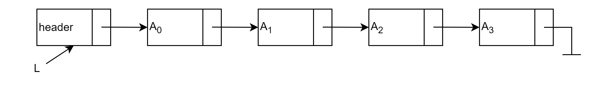
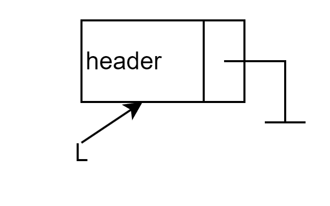
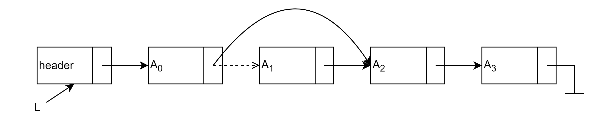
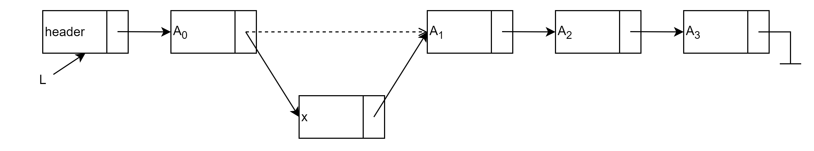
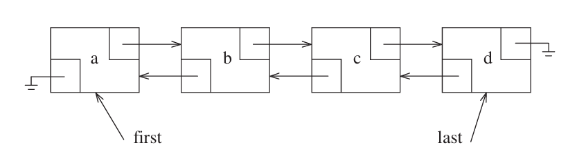

## Abstract Data Types

**抽象数据类型**(abstract data types)是带有一组操作的对象的集合，ADT本身不包含操作的实现，可以将其看作是模块化的一种延伸

## The List ADT

对于形式为 $A_0, A_1, A_2,\cdots,A_{n-1}$ 的**线性表**(linear list)，它的大小为 $N$

>  大小为 0 的线性表被称为**空列表**(empty list)

除空列表以外的任意线性表，$A_i$ 都在 $A_{i-1}(i<N)$ 的后面（后继，succeeds）,而 $A_{i-1}$ 在 $A_{i}$ 的前面（前驱，precedes）.而 $A_0$ 的前驱和 $A_{n-1}$ 的后继是没有定义的
线性表中的元素 $A_i$ 的位置为 $i$

线性表主要包括以下这些操作：

- `printList`:打印线性表中的所有元素
- `makeEmpty`:将线性表变为空线性表
- `find`:返回元素第一次出现的位置
- `insert`:将元素插入到指定的位置
- `remove`:删除指定的位置的元素
- `next`:返回指定位置的元素的后继
- `previous`:返回指定位置的元素的前驱

### Simple Array Implementation of List

使用**数组**就可以实现上面的所有操作

其中，`printList` 需要线性时间，`insert` 和 `remove` 取决于元素的位置，最差的情况为 $O(N)$

数组的大小是固定的，但 C++标准库提供了一个可以动态调整大小的类模板 `vector`

下面是它简化后的实现[^1]为了不与标准库的 `vector` 混淆，这里将其命名为 `Vector`

??? code  "Vector的实现"
    ```cpp
    template<typename T>
    class Vector
    {
    private:
        int theSize;
        int theCapacity;
        T* elems;
    public:
        static const int SPACECAPACITY = 16;

        explicit Vector(int size = 0) : theSize(size), theCapacity(size + SPACECAPACITY)
        {
            elems = new T[theCapacity];
        }

        ~Vector()
        {
            delete[] elems;
        }

        void resize(int newSize)
        {
            if (newSize > theCapacity)
                reverse(theCapacity * 2);

            theSize = newSize;
        }
        
        void reverse(int newCapacity)
        {
            if (newCapacity < theSize)
                return;

            T* newElems = new T[newCapacity];
            for (int i = 0; i < theSize; ++i)
            {
                newElems[i] = std::move(elems[i]);
            }

            theCapacity = newCapacity;
            std::swap(elems, newElems);
            delete[] newElems;
        }

        T operator[](int index)
        {
            return elems[index];
        }

        bool empty()
        {
            return theSize == 0;
        }

        void clear()
        {
            theSize = 0;
        }

        void push_back(T& elem)
        {
            if (theSize == theCapacity)
                reverse(theCapacity* 2 + 1);

            elems[theSize++] = elem;
        }

        void pop_back()
        {
            theSize--;
        }
    };
    ```

如果需要频繁的进行**插入和删除**，那么数组实现的性能将不容乐观。因此我们引入了**链表**(linked list)

### Simple Linked Lists

链表由一系列包含元素和后继节点链接的节点组成，这些节点在内存中不一定相邻。我们将这个指向后继元素的链接称为 `next`,最后一个元素的 `next` 指向 `nullptr`.如下图所示



虽然上面的描述已经能够完成所有的操作，但是这会出现三个问题：

1. 没有一个足够明确的方式在链表前面插入元素
2. 删除链表的第一个元素是一个特殊情况，因为需要改变链表的起始
3. 删除算法需要我们跟踪要删除的那个元素之前的元素

只需要在链表的最前面增加一个**哨兵节点**就可以解决这三个问题，如下图所示



我们将链表的节点定义如下
```cpp
template<typename T>
struct Node
{
	T element;
	Node* next;
	
	Node() = default;
	Node(T elem) : element(elem), next(nullptr) { }
};

template<typename T>
using PtrToNode = Node<T>*;
```

链表的 ADT 定义为
```cpp
template<typename T>
class List
{
private:
    PtrToNode<T> header;
    int size = 0;
public:
    List();
    ~List() { makeEmpty(); delete header; }
    void insert(int pos, const T& val);
    void remove(int pos);
    int  find(const T& val) const;
    void makeEmpty();
    void printList() const;
    int getSize() const { return size; }
    bool empty() const { return size == 0; }
};
```

接下来来看这些的操作的实现细节

=== "初始化"

    只需要将哨兵节点的 `next` 指向 `nullptr` 即可,如下图所示

    {width="280px"}

    ```cpp
    template<typename T>
    List<T>::List()
    {
        header = new Node<T>();
        header->next = nullptr;
    }
    ```
=== "删除操作"
    只需要沿 `next` 链接找到要删除的元素之前的元素，将它的 `next` 指向要删除的元素的后继节点，再释放被删除的节点即可,如下图所示

      

    ```cpp
    template<typename T>
    void List<T>::remove(int pos)
    {
        if (pos < 0 || pos >= size)
            throw std::out_of_range("List::remove: pos out of range");

        PtrToNode<T> curr = header;
        for (int i = 0; i < pos; ++i)
            curr = curr->next;

        PtrToNode<T> victim = curr->next;
        curr->next = victim->next;
        delete victim;
        --size;
    }
    ```
=== "插入操作"
    有了哨兵节点，在链表最前面插入元素也不再是特殊情况：`insert` 将元素插入到位置 `pos`，只需要先找到位置 `pos-1` 的节点（`pos` 为 0 时即哨兵节点），再把它的新后继指向原来的后继即可，如下图所示

      

    ```cpp
    template<typename T>
    void List<T>::insert(int pos, const T& val)
    {
        if (pos < 0 || pos > size)
            throw std::out_of_range("List::insert: pos out of range");

        PtrToNode<T> curr = header;
        for (int i = 0; i < pos; ++i)
            curr = curr->next;

        PtrToNode<T> node = new Node<T>(val);
        node->next = curr->next;
        curr->next = node;
        ++size;
    }
    ```
=== "查找操作"
    从哨兵节点的后继开始逐个比较，返回元素第一次出现的位置，未找到则返回 `-1`

    ```cpp
    template<typename T>
    int List<T>::find(const T& val) const
    {
        int pos = 0;
        PtrToNode<T> curr = header->next;
        while (curr != nullptr)
        {
            if (curr->element == val)
                return pos;
            curr = curr->next;
            ++pos;
        }
        return -1;
    }
    ```
=== "打印与清空"
    沿着 `next` 链接遍历整个链表即可。`makeEmpty` 复用 `remove(0)` 逐个释放节点，省去重复的释放逻辑

    ```cpp
    template<typename T>
    void List<T>::printList() const
    {
        PtrToNode<T> curr = header->next;
        while (curr != nullptr)
        {
            std::cout << curr->element << " ";
            curr = curr->next;
        }
        std::cout << std::endl;
    }

    template<typename T>
    void List<T>::makeEmpty()
    {
        while (!empty())
            remove(0);
    }
    ```

### Double Linked Circular List

双向循环链表是一种在单向循环链表的基础上，每个节点都有前驱和后继指针的链表。它可以在任意位置插入和删除元素，同时支持从任意位置遍历链表。如下图所示



它的节点定义如下
```cpp
template<typename T>
struct Node
{
	T element;
	Node* prev;
	Node* next;
	
	Node() = default;
	Node(T elem) : element(elem), prev(nullptr), next(nullptr) { }
};
```


**栈**(stack)是一个插入与删除都只能在一个位置进行的线性表，这个位置被称为栈顶。

## Stack Model
栈可以看作是一个**后进先出**(last in, first out, LIFO)的线性表
栈的两个基本操作是 `push` (类似于 `insert`)和 `pop` (类似于 `remove`);除此之外，还可以使用 `top` 来查看栈顶元素，对空栈调用 `pop` 或 `top` 将会导致错误

## Implementation of Stacks

因为栈是一个线性表，因此任何线性表都可以实现栈的功能。两种主流的实现方式是使用链表和数组

#### Linked List Implementation

使用一个单链表，但是只在链表的头部进行操作，这里我使用 C++标准库的 `forward_list` 来实现
```cpp
template<typename T>
class Stack
{
private:
    std::forward_list<T> elems;
    int size = 0;
public:
    bool empty() const{ return size == 0; }

    int size() const { return size; }

    void push(const T& elem)
    {
        elems.push_front(elem);
        ++size;
    }

    void pop()
    {
        if (empty())
            throw std::runtime_error("the stack is empty");
        elems.pop_front();
        --size;
    }

    T& top()
    {
        if (empty())
            throw std::runtime_error("the stack is empty");
        return elems.front();
    }
};
```

#### Array Implementation

```cpp
template<typename T>
class Stack
{
private:
    static constexpr std::size_t N = 16;
    T elems[N];
    int sz = 0;
public:
    bool empty() const{ return sz == 0; }

    int size() const { return sz; }

    void push(const T& elem)
    {
        if (sz == N)
            throw std::runtime_error("the stack is full");

        elems[sz++] = elem;
    }

    void pop()
    {
        if (empty())
            throw std::runtime_error("the stack is empty");
        --sz;
    }

    T& top()
    {
        if (empty())
            throw std::runtime_error("the stack is empty");
        return elems[sz - 1];
    }
};
```
### Applications

## Queue ADT

[^1]: 这里省略原书代码中的一些 C++特性，如移动语义和迭代器


