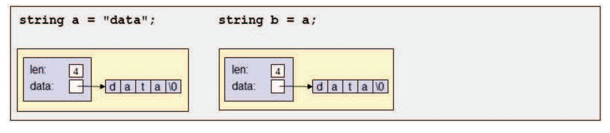
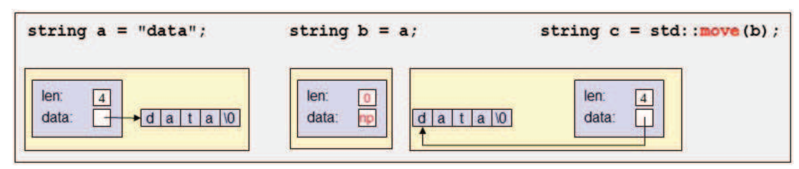

## Motivation of Move Semantics

假设我们有如下的代码

```cpp title="motiv03.cpp"
#include <string>
#include <vector>

std::vector<std::string> createAndInsert()
{
	std::vector<std::string> coll;
	coll.reserve(3);
	std::string s = "data";

	coll.push_back(s);
	coll.push_back(s + s);
	coll.push_back(s);

	return coll;
}

int main()
{
	std::vector<std::string> v;

	v = createAndInsert();

	return 0;
}
```

对于不支持移动语义的编译器（C++03），这段代码需要进行**10次内存分配和6次内存释放**。不必要的内存分配主要源于以下操作：

- 将一个临时对象插入到集合中
- 将一个不再需要的对象插入到集合中
- 为一个临时的集合及其所有元素赋值

我们可以通过将 `vector` 作为引用参数传入，或者使用 `std::swap()` 来避免最后一次的赋值。但这看起来非常繁琐，而且无法解决前两个问题。因此，C++11 引入了**移动语义**

```cpp title="motiv11.cpp"
#include <string>
#include <vector>

std::vector<std::string> createAndInsert()
{
	std::vector<std::string> coll;
	coll.reserve(3);
	std::string s = "data";

	coll.push_back(s);
	coll.push_back(s + s);
	coll.push_back(std::move(s));

	return coll;
}

int main()
{
	std::vector<std::string> v;

	v = createAndInsert();

	return 0;
}
```

修改后的代码虽然只改动了一行，但是省去了六次内存的分配与释放，上面提到的不必要的内存操作都不会发生

这是因为编译器会自动判断一个对象是否即将被销毁，并对该对象使用移动语义，**将其所有权进行移动而不是复制其内容**。我们也可以使用 `std::move()` 显式地告诉编译器我们在这里不再需要该变量的值，从而触发移动语义

!!! tip "性能收益"
    使用移动语义重新编译程序，通常可以提升 **10%-40%** 的性能

这里有两点内容需要特别注意：

-   `std::move(s)` 只是**标记** `s` 可以进行移动，它本身不进行任何移动，`s` 的值是否移动取决于被调用方
-   值被移动后的对象仍处于有效的状态，被称为**有效但未指定的状态**（valid but unspecified state）。此时，仍可以像使用一个未被移动的对象那样使用该对象，但它的值究竟是什么取决于函数的实现

!!! warning "移动后的对象"
    被移动后的对象处于**有效但未指定的状态**：它可以安全地析构，也可以继续参与赋值等操作，但**不应再依赖它的具体值**

## Implementing Move Semantics

自 C++11 开始，`std::vector` 提供了两个不同的 `push_back()` 函数：

```cpp
void push_back(const T& elem);
void push_back(T&& elem);
```

第二个重载使用了被称为**移动语义**的新语法：其参数为**右值引用**（rvalue reference）形式，即两个 `&` 且不带 `const`；而传统的只有一个 `&` 的引用被称为**左值引用**（lvalue reference）

这两个函数的主要区别是

-   `push_back(const T& elem)` 不会修改被传入的参数的值
-   `push_back(T&& elem)` 可以修改被传入的参数并“偷”走它的值。当调用者不再需要参数的值时会调用这个函数；在函数调用结束后，调用者仍可以使用参数，只要其不再依赖它的值

### Using the Copy Constructor

`push_back(const T& elem)` 会调用复制构造函数，我们以 `std::string` 为例来看一下构造函数如何工作

```cpp
std::string a = "data";
std::string b = a;
```

复制构造函数将会复制 `a` 中的所有内容并为其分配一块新内存，如下图所示



### Using the Move Constructor

`push_back(T&& elem)` 会调用移动构造函数，这个构造函数会从一个不再需要其值的 `string` 创建一个 `string`，考虑下面的代码

```cpp
std::string c = std::move(b);
```

移动构造函数首先复制两个成员 `len` 和 `data`，新字符串由此获取了 `b` 中值的所有权。而由于 `b` 的析构函数会释放内存，我们也必须修改源字符串：使其失去对内存的所有权，并将其置于表示空字符串的一致状态



## Copying as a Fallback

对于临时对象或标记了 `std::move()` 的对象，可以对其使用移动语义。函数可以通过提供一个参数为右值引用的重载，从参数“偷”值作为特殊优化。然而，如果没有提供支持移动语义的特殊优化，通常将使用复制作为回退

例如，对于一个没有提供以右值引用为参数的 `push_back` 的容器，我们仍然可以将一个临时对象或者标记为 `std::move` 的对象作为参数传入。对于临时对象或者标记为 `std::move` 的对象，编译器会**优先选择参数被声明为右值引用的函数**；如果这样的函数不存在，通常会使用复制

!!! tip "泛型代码中的习惯"
    对于泛型代码，总是将不再需要的对象使用 `std::move()` 进行标记是很重要的。即使被调用的函数没有提供移动优化，`std::move()` 也不会造成任何损害，最多只是回退到复制

## Move Semantics for const Objects

声明为 `const` 的对象**无法被移动**，因为移动语义的实现要求参数是可以被修改的。因此，对 `const` 对象使用 `std::move()` 是没有效果的

!!! warning "不要按 const 值返回"
    一个 `const` 返回值不能被移动。因此，从 C++11 开始，将按值返回的函数声明为 `const` 不再是一个好的代码风格
