## Memory Technologies

如今的内存系统主要使用4种内存技术：DRAM,SRAM,闪存和机械硬盘

### SRAM

**SRAM**(static random access memory)是**只有一个端口用于读写**的简单集成电路，通常使用6-8个晶体管来保存一位的信息，而且功耗较低。除此之外，它还有以下的特点：

- 虽然读写的访问时间不同，但访问任何数据所需的时间是固定的
- 不需要刷新，访问时间非常接近时钟周期

SRAM 常用作处理器的**缓存**(cache)

### DRAM

**DRAM**(dynamic random access memory)是一个由单个晶体管控制读写的电容。  
由于 DRAM 每一位只需要一个晶体管进行控制，因此成本低于 SRAM  
储存在 DRAM 中的数据需要周期性的进行刷新，即将数据读取后再写回。DRAM 使用**双层解码结构**(two-level decode structure)一次刷新一整行的数据，这样有助于提升性能

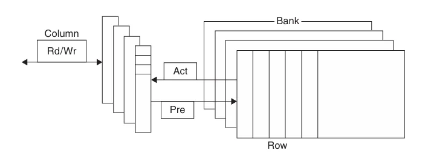

如上图，DRAM 内部被划分为多个**存储体**(memory bank)，每个存储体都有一些**行缓冲器**(row buffer)，从而实现对同一地址的同步访问
假如有 $n$ 个存储体，在一个访问时间内便能轮换访问 $n$ 个存储体，使得带宽提升了 $n$ 倍，这种轮换访问方法被称为**地址交错**(address interleaving)

!!! info "DRAM的类型"
    - **SDRAM**（同步 DRAM）：通过一个时钟来消除同步内存和寄存器所需的时间
    - **DDR SDRAM**(double data rate SDRAM) ：能在时钟的上升沿和下降沿中进行数据传输，从而提升了一倍的**带宽**(bandwidth)
    - **双内联内存模块** (dual inline memory module)

DRAM 主要用于构建**主存**(main memory)

### Flash Memory

**闪存**(flash memory)是一种电子可擦除可编程只读存储器 (EEPROM).

写操作会损耗闪存的存储位，通过名为**磨损均衡**(wear leveling)的方法将需要写的块重新映射到写入次数较少的块，从而延长闪存的寿命

### Disk

**磁盘**(disk)由一组绕轴旋转的**金属盘片** (platter) 构成，盘片上覆有磁记录材料，通过一个**读写头** (read-write head) 来读写信息，整个驱动器被密封在磁盘内部

磁盘由下面几个部分组成：

- **迹** (track)：磁盘表面上的同心圆
- **区**(sector)：构成迹的某个片段，是能够被读写的最小单位的信息，包括：区 ID、数据以及纠错码 (ECC)，计量单位为 bit 或 byte
- **柱面** (cylinder)：读写头下所有的迹（形成一个柱面）

!!! note "访问磁盘某个区的时间"
    访问磁盘某个区的时间由以下几部分构成:
    
    - **寻找时间**(seek time)：定位读写头到要被访问的迹
    - **旋转时延**(rotation latency)：将要访问的区旋转至读写头下所需的时间，通常假设为旋转时间的一半
    - **数据传输**(data transfer) = 区的大小 / 传输速率 (transfer rate)
    - **控制器开销**(controller overhead)

??? tip  "Stream Benchmark"
    Stream Benchmark 是一种测试内存性能的方法，它利用没有空间局部性和比缓存更大的向量操作来衡量性能

## Introduction
因为程序不会以相同的概率访问它的全部代码或数据，因此可以创造一种程序拥有无限快速内存的假象。**局部性原理**(principle of locality)为实现这种假象提供了可能，局部性分为两类：

- **时间局部性**(temporal locality):如果内存中的某个地址被访问，那么在**短时间内**很有可能在下一次再次被访问
- **空间局部性**(spatial locality):如果内存中的某个地址被访问，那么与它**相邻的地址**很有可能在下一次被访问

可以通过将计算机的内存实现为**内存层级**(memory hierarchy)的方式来利用局部性原理，从而加速对数据的访问。内存层级由多个速度与大小不同的内存等级组成，如下图  
距离 CPU 越近，访问速度越快，存储空间越小，每一位的成本越高

各个层级上的数据也是层次化的：离 CPU 更近的层级上的数据通常是更远层级的子集，最下方的层级保存着所有的数据，且数据每次只能在两个**相邻的层级**之间传递

在两个内存层级之间传递的最小的信息单元称为**块或行**(block/line)(下图中的蓝色部分)

**命中**(hit)指的是处理器请求的数据位于上层内存 

- **命中率**(hit rate):请求的数据位于上层内存的比例
- **命中时间**(hit time):访问上层内存所需的时间，包括判断是否命中所需的时间

> 命中率常用于衡量内存层级的性能

**失效**(miss)指的是处理器请求的数据没有位于上层内存

- **失效率**(miss rate):请求的数据不在上层内存的比例($1-\text{hit rate}$)
- **失效惩罚**(miss penalty):将上层的数据块与对应的下层的数据块进行交换的时间，再加上将这个块发送给处理器的时间

因为所有程序都需要大量时间访问内存，因此内存系统是决定性能的重要因素。为了提高内存系统的性能，计算机设计师提出了许多复杂的机制。

## Caches

**缓存**(cache)最早指内存层级中处理器和主存之间的部分，现在也泛指利用局部性访问的储存器

> [第四章](4.md)介绍的处理器中的 Memory 可以直接替换为缓存

首先考虑一个处理器一次只读取一个字的简单情况，在读取之前，缓存中的最近被访问的数据包括 $X_1,X_2,\cdots,X_{n-1}$，而处理器需要读取的数据 $X_n$ 不在缓存中，这会导致一次失效。因此，内存系统会读取底层级内存中的数据并将其加入到缓存中，如下图所示

在上面的例子中，有两个问题需要考虑：

!!! question ""
    我们如何知道一个数据是否在缓存中以及我们如何找到它？

如果每个字都在缓存中有一个准确的位置，那么想要找到它就很简单。为内存中的每个字分配缓存位置最简单的方法是根据字在内存中的地址来分配，这种方法被称为**直接映射**(direct mapped),可以使用下面的公式计算字在缓存中的位置（即**索引**）
$$
\text{(Block Address) modulo (Number of the blocks in the cache)}
$$
>  如果缓存的块数是2的幂，只需要取地址的低N位即可。其中 $N=\log_2\text{缓存的块数}$

因为同一个缓存中的位置可能会被多个内存地址映射，因此为缓存添加一组**标签**(tags)来判断缓存中的字是否为要读取的字。标签只需要包含地址中未用于缓存的位置的部分，如下图

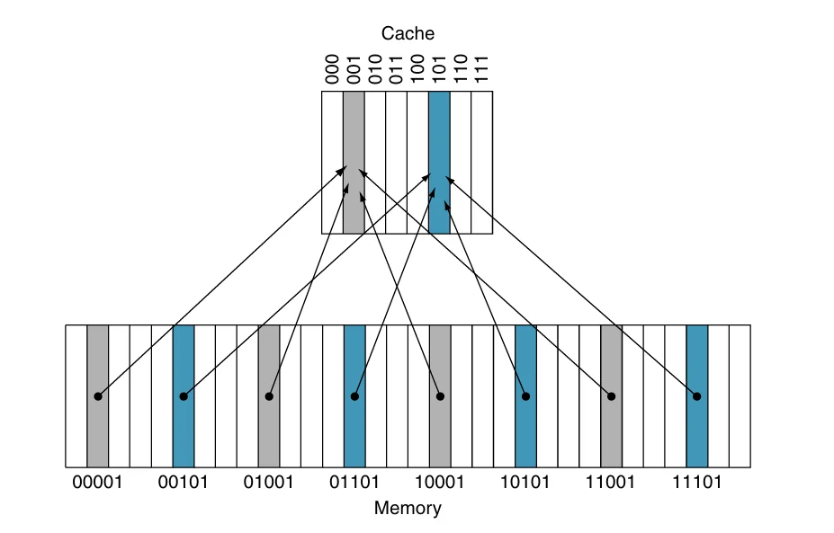

在上图中，因为缓存的块数是8,所以索引需要低3位，标签就是地址中剩下的高2位

除此之外，还需要增加一个**有效位**(valid bit)表示高速缓存块内是否有合法的数据，若有则将其设为 1，否则为 0

??? example "例子"
    对一个缓存块数为8, 初始为空的缓存进行如下的访问

    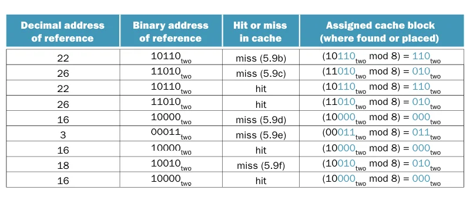

    各操作后缓存的变化如下

    

    从图中不难发现，第2次访问（$26=11010_\text{two}$）和第8次访问（$18=10010_\text{two}$）被映射到了同一个缓存块内，在这种情况下，最近访问的数据将会替换原本的数据，这体现了[**时间局部性**](#introduction)

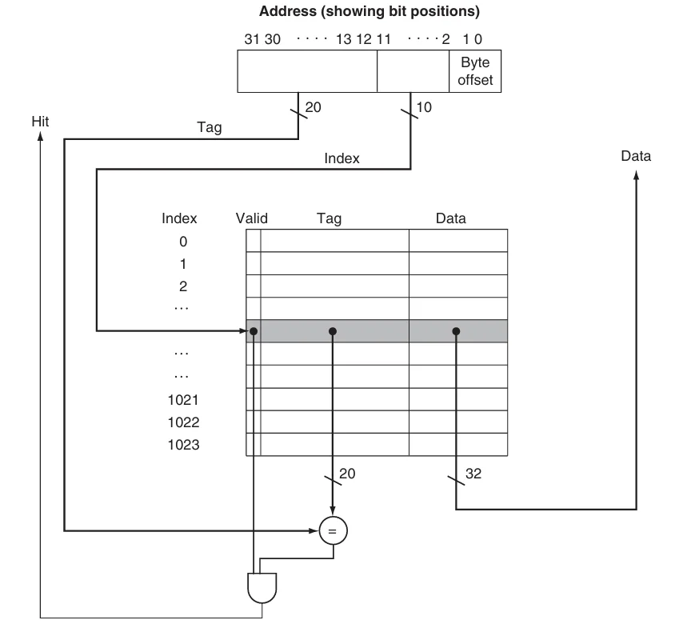

上图展示了一个32位内存地址与缓存的关系，如图所示，可以将一个缓存块分为：

- 标签字段：用于与缓存的标签字段的值进行比较
- 缓存索引：用于选择缓存块
- 数据字段：用于存储实际的数据
标签字段和缓存索引唯一确定了缓存块中的内存地址
因为一个地址表示一个字节，并且在缓存中的数据以**字**（即4 字节）为单位，如果字在内存中是对齐的，地址的低 2 位通常可以被忽略（都是00）

!!! note "缓存的大小"
    假设满足下面这些条件：

    - 32位地址
    - 缓存地址直接映射
    - 缓存大小为 $2^n$ 个块，所以 $n$ 位地址用于表示索引
    - 块大小为 $2^m$ 个字（$2^{m+2}$ 字节), 因此 $m$ 位地址用于表示字

    标签字段的大小为
    $$
    32-(n+m+2)
    $$
    直接映射的缓存所需的位数为
    $$
    \begin{aligned}
    &2^n\times(\text{block size + tag size + valid field size})\\\\
    &=2^n\times(2^m\times32+(32-n-m-2)+1)\\\\
    &=2^n\times(2^m\times32+31-n-m)
    \end{aligned}
    $$

!!! tip "缓存的命名"
    在给缓存命名时只需要考虑 data 字段的大小，忽略标签字段与有效位。例如上面图中的缓存被命名4KiB 缓存

### Handling Cache Misses

控制单元需要检测缓存是否命中，如果失效，需要通过从内存中读取所需的数据来处理失效，这将会导致流水线停顿；如果命中，处理器将继续使用数据就像无事发生

缓存失效可以分为**指令失效**和**数据失效**，指令失效可以通过完成以下步骤来解决：

1. 将原本的 PC 值存入内存
2. 从主存中读取数据并等待完成
3. 将数据写入缓存并设置标签，有效位等内容
4. 重新开始执行原本的 PC 处的指令

### Handling Writes

在执行一个存储指令时，我们只把数据写入了数据缓存（没有改变主存）；那么，在写入缓存之后，主存的值就会和缓存中的值**不一致**(inconsistent).解决这个问题最简单的方法有下面几种：

- **写穿透**(write through)：在执行写操作时同时更新缓存和下一级存储，保证两者之间的数据一致
- **写返回**(write-back)：在产生写操作时只把数据写入缓存，当缓存被替换时将数据写入下一级存储

!!! info "写缓冲"
    虽然写穿透可以很简单的处理写操作，但会带来一些性能问题。解决方案是引入一个**写缓冲**(write buffer),将需要写回主存的数据暂存在写缓冲中。当写入主存的操作完成后，写缓冲中的表项将被释放。如果写缓冲满了，处理器必须停顿流水线直到写缓冲中出现空闲表项。但是，如果主存写操作的速率小于处理器产生写操作的速率，多大容量的缓冲都无济于事。因为写操作的产生速度远远快于主存系统的处理速度。

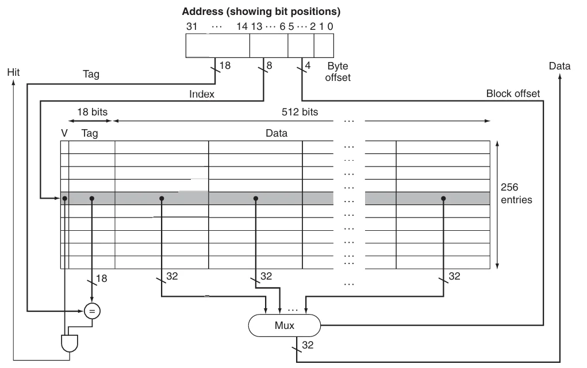

### Measuring and Improving Cache Performance

CPU 时间可以分为运行程序所花费的时钟周期和等待内存系统所花费的时钟周期：
$$
\text{CPU time}=(\text{CPU execution clock cycles}+\text{Memory-stall clock cycles})\times\text{Clock cycle time}
$$

内存停顿时钟周期主要是因为缓存失效，可以将其分为**读失效**和**写失效**
$$
\text{Memory-stall clock cycles}=\text{Read-stall clock cycles}+\text{Write-stall clock cycles}
$$

读失效造成的停顿可以定义为
$$
\text{Read-stall clock cycles}=\frac{\text{Reads}}{\text{Program}}\times\text{Read miss rate}\times\text{Read miss penalty}
$$

写失效的情况更为复杂，对于写穿透，停顿主要来自两个方面：

1. 写失效：在连续写之前需要将数据块取回
2. 写缓冲停顿：在写缓冲满时进行写操作会引发该停顿

因此，写操作造成的停顿等于二者之和
$$
\text{Write-stall clock cycles}=\left(\frac{\text{Writes}}{\text{Program}}\times\text{Write miss rate}\times\text{Write miss penalty}\right)+\text{Write buffer stalls}
$$

大多数写穿透缓存的结构中，读和写的失效代价是相同的，如果写缓冲停顿可以忽略不计，那么就可以使用失效率和失效代价来同时刻画读操作和写操作：
$$
\text{Memory-stall clock cycles}= \frac{\text{Memory accesses}}{\text{Program}} \times\text{Miss rate}\times\text{Miss penalty}
$$

也可以写为
$$
\text{Memory-stall clock cycles}= \frac{\text{Instructions}}{\text{Program}} \times\frac{\text{Misses}}{\text{Instruction}}\times\text{Miss penalty}
$$

??? example "计算缓存性能"
    假设指令cache的失效率为2%，数据cache的失效率为4%。如果处理器的CPI为2，没有任何的访存停顿；对于所有的失效，失效代价都为100个时钟周期。如果配置了一个从不失效的完美缓存，那么处理器的性能会提高多少？假设load和store指令占所有指令的36%

硬件设计师们还会用**平均内存访问时间**(average memory access time, AMAT) 这一指标来衡量高速缓存性能，因为它能同时反映命中和失效的情况，公式如下：
$$
\text{AMAT}=\text{Time for a hit}+\text{Miss rate}\times\text{Miss penalty}
$$

### Flexible Placement of Blocks

前面的已经介绍了一种被称为直接映射的策略，它将主存中的任意数据块地址直接映射到上层存储的一个准确位置。除了直接映射之外，还有两种方法

- **全相联**(full associative)中的数据块可以放在缓存的**任何位置**  
为了寻找一个特定的块，需要搜索缓存中的所有块，为提升性能，每个缓存表项都有一个比较器可以并行地进行比较，这些比较器极大增加了硬件成本，因此全相联策略只能用于容量较小的缓存

- **组相联**(set associative)中每个块有可以放在**一个组内的任意位置**  
将缓存划分为一定数量的包含 $n$ 个块的组，这样的缓存被称为 **n路组相联**($n$-way set associative),内存中的一个块会被映射到唯一的一个组，并且可以被放在**该组内的任何位置**

组相联结合了直接映射和全相联：一个块被直接映射到一个组，在组内则是全相联。可以使用下面的公式计算数据块被映射的组
$$
\text{(Block Address) modulo (Number of the sets in the cache)}
$$
为了寻找一个特定的块，需要搜索组中的所有块

下图展示了三种策略：

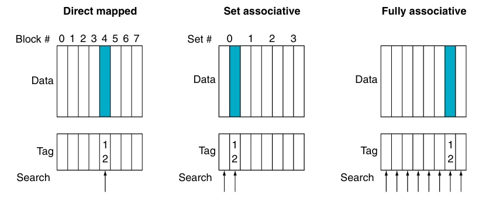

我们也可以将所有块放置策略看作是组相联的变体，对于一个8个块的缓存，直接映射即单路组相联，全相联则是8路组相联，如下图

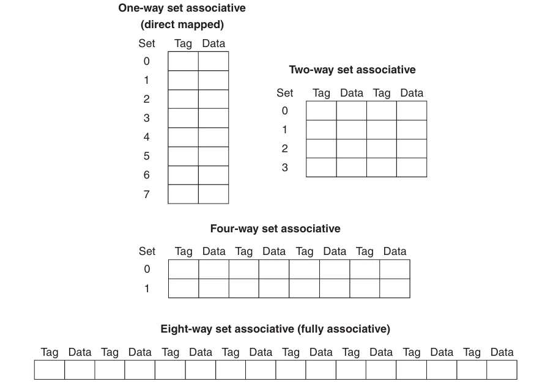

> 如果缓存大小固定，增加相联度将会减少组数

!!! note ""
    增加相联度的优点是降低失效率，缺点则是增加命中时间

现在考虑在组相联缓存中寻找一个特定的块，和直接映射类似，可以将组相联的地址分为三个部分

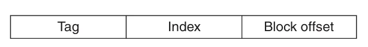

- **索引**(index):用来选择一个组
- **标签**(tag):用来在已选定的组中通过比较来选择一个块
- **块偏移**(block offset):所需的数据在块中的地址

>  因为全相联缓存只有一个组，因此没有索引

组相联通过多个比较器实现并行查找， $n$ 路组相联需要 $n$ 个比较器和一个 $n$-to-1选择器

下图为一个4路组相联缓存的示意图

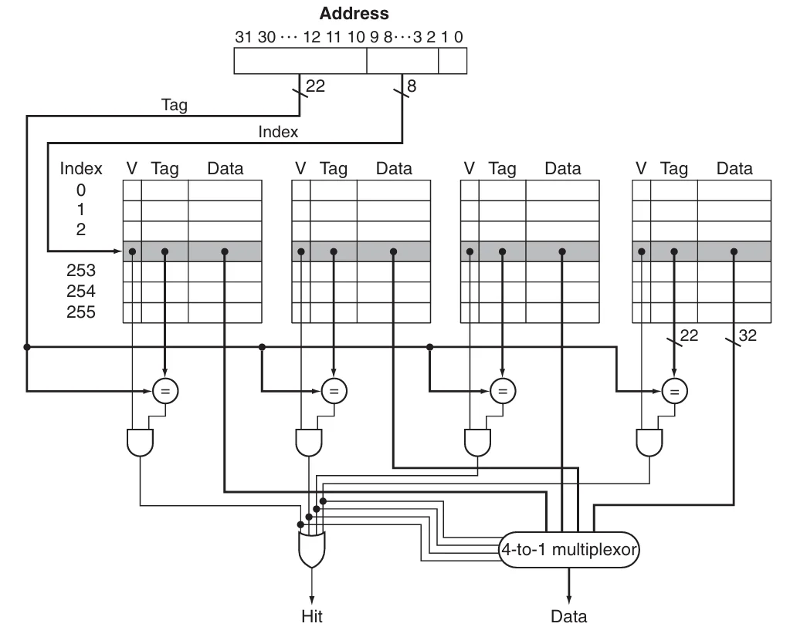

选择直接映射、组相联或全相联主要取决于未命中的成本与实现关联性所需的成本，这包括时间和额外硬件

### Replace Blocks

当缓存发生缺失时，需要将对应的数据块加入到缓存中，如果该数据块对应的缓存组已满，就需要替换数据块。

- 对于直接映射，因为每个数据块都在缓存中有唯一的位置，所以直接替换对应的数据块即可
- 对于组相联，数据块可以放在组内的任意一个位置，LRU(least recently used)是最常见的方法，它会选择未访问时间最长的数据块进行替换
实现 LRU 的方法是记录同一个组内的数据块的相对使用时间，例如对于一个2路组相联，可以使用1个编程位来记录两个数据块的先后顺序
- 对于全相联，数据块可以放在缓存的任意一个位置

### Multilevel Cache

为了缩小处理器和访问内存之间巨大的性能差距，现代处理器引入了**多级缓存**(multilevel cache),即在 **处理器核心与主存**之间设置多个不同容量和速度的缓存层级。以二级缓存为例，当一级缓存发生缺失时，会先在第二级缓存中寻找需要的值，如果二级缓存命中，将显著降低缺失惩罚

一级和二级缓存的设计目标不同，对于一级缓存，主要关注的是**降低命中时间**从而缩短时钟周期数或减少流水线阶段。因此一级缓存**容量更小**，同时采用**更小的块大小**，来降低缺失惩罚；而二级缓存主要关注**缺失率**，从而降低内存访问带来的缺失惩罚。相对来说空间会更大，且采用更高度的相联置放，以降低失效率

### Cache Coherence

TODO

### Cache Control

TODO

## Dependable Memory Hierarchy

假设有某种服务的需求，用户可以看到一个系统在两种分别有需求的服务的状态之间交替：

1. 服务完成：交付的服务与需求相符
2. 服务中断：交付的服务与需求不同

**失效**(failure)会导致系统由状态1转换到状态2；而从状态2转换到状态1的过程被称为**恢复**(restoration).系统中某个部件的失效可能并不会导致系统的失效，为了区分，将部件的失效称为**故障**(fault)

失效可能是永久的，也可能是暂时。暂时的失效会导致系统在状态1和状态2之间振荡，因此前者比后者更好诊断。这引出了两个相关的定义：**可靠性**(reliability)与**可用性**(availability)

- **可靠性**是衡量连续完成的服务，即从一个参考点到失效的时间
**平均无故障时间**(mean time to failure, MTTF)是可靠性的一个度量，与之类似的一个术语是**年度失效率**(annual failure rate, AFR),表示在已知 MTTF 的条件下，一年中可能失效的设备的百分比

> 当 MTTF 过大时可能会产生不正确的结果，此时，AFR 更具参考价值

服务中断使用**平均修复时间**(mean time to repair, MTTR)来衡量
**平均失效间隔时间**(mean time between failure, MTBF)=MTTF+MTTR

- **可用性**表示系统正常工作时间在连续两次服务中断间隔时间中所占的比例
$$
\text{Availability}=\frac{\text{MTTF}}{(\text{MTTF+MTTR})}
$$

可以使用"nines of availability"来衡量系统的可用性，如下图

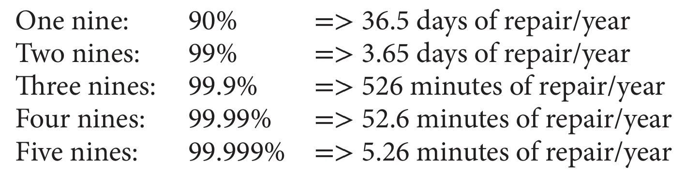

提高系统的 MTTF 有如下三种方法：

1. 故障避免技术(fault avoidance)：通过合理构建系统来避免故障的出现。
2. 故障容忍技术(fault tolerance)：使用增加冗余，即使出现故障，仍然可以按照需求完成服务。
3. 故障预测技术(fault forecasting)：预测故障的出现和构建，从而允许在器件故障前进行替换

### Error Detect Code

**汉明距离**(Hamming distance)是两个等长二进制数对应位置不同的位的数量

汉明使用奇偶校验码进行错误检查，如果一个字含有奇数个1,那么它的奇偶校验码为1,否则为0.当一个位被写入内存时，奇偶校验位也同时被写入，因此 N+1位的字的奇偶校验一定是偶数

一位奇偶校验码只能检测奇数个错误，常用于检测1位错误；而对于两位的错误，一位奇偶校验码则无法检测到任何错误。同时，一位校验码无法纠正错误

**汉明纠错码**的汉明距离为3，计算方法如下：

1. 从左到右由1开始依次编号，与传统的从最右侧由0开始编号相反
2. 将编号为2的整数幂的位标记为奇偶校验位 $(1,2,4,8,16,\cdots)$
3. 剩余其他位用于数据位 $(3,5,6,7,9,10,11,12,13,14,15,\cdots)$
4. 奇偶校验位的位置决定了其对应的数据位（下图）​ 
5. 设置奇偶校验位，为各组进行偶校验
   
第四步如下所示：

- 校验位 1($0001_2$) 检查 $1,3,5,7,9,11,\cdots$ 位，这些位的编号最右一位为 1($0001_2$、$0011_2$、$0101_2$、$0111_2$、$1001_2$、$1011_2,\cdots$)。
- 校验位 2($0010_2$)检查 $2,3,6,7,10,11,14,15,\cdots$ 位，这些位的编号最右第二位为 1。
- 校验位 4($0100_2$)检查 $4\sim 7,12\sim 15,20\sim 23,\cdots$位，这些位的编号最右第三位为 1。
- 校验位 8($1000_2$)检查 $8\sim 15,24\sim 31,40\sim 47,\cdots$位，这些位的编号最右第四位为 1

> 每个数据位都被至少两个奇偶校验位覆盖

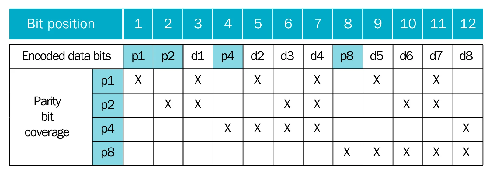

可以将汉明距离增加到4个，这意味着我们可以**纠正一位错误**或者**检测两位错误**。只需要再增加一个奇偶校验位用于记录整个字的奇偶校验，称为**双位检测**(double error detecting, DED)

例如，对于一个4 位的字，它的 DED 为
$$
\begin{array}{llllllll}
1 &2 &3 &4 &5 &6 &7 &8\\\\
p_1 &p_2 &d_1 &p_3 &d_2 &d_3 &d_4 &p_4
\end{array}
$$
用 $p_1$ $p_2$ 和 $p_3$ 计算出一个奇偶校验码 $H$,根据 $H$ 和 $p_4$ 的值，有如下4种情况：

- $H$ 和 $p_4$ 都是偶（即都为0）,没有错误
- $H$ 为奇且 $p_4$ 为偶，一个位出现错误，并且可以纠错
- $H$ 为偶且 $p_4$ 为奇，$p_4$ 出现错误，翻转 $p_4$ 即可
- $H$ 为奇且 $p_4$ 为奇，两个位出现错误

### RAID

## Virtual Memory

**虚拟内存**(virtual memory)是一种将主存用作第二级储存（通常是硬盘）的缓存的技术

使用虚拟内存主要有以下几个原因：

- 高效且安全的在多个程序间共享内存
- 让单一用户程序可以使用超过原始大小的内存
- 虚拟内存通过重定位简化可执行程序的加载

虽然虚拟内存与缓存的工作原理相同，但不同的历史起源导致了它们使用不同的术语

虚拟内存的数据块被称为**页**(page)，失效被称为**页错误**(page fault)

对于使用虚拟内存的计算机，处理器使用的都是**虚拟地址**(virtual address)，硬件和软件相结合可以将虚拟地址转换为物理地址，进而访问主存

将虚拟地址转换为物理地址的过程被称为**地址映射**或者**地址翻译**(address translation)，过程如下图所示

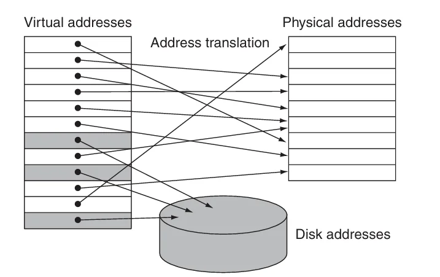

从图中可以看出，虚拟内存和物理内存都被划分为了页，因此虚拟页可以映射到物理页

在虚拟内存中，地址被分为了虚拟页编号和页偏移量两部分，下图展示了将虚拟地址转换为物理地址的过程

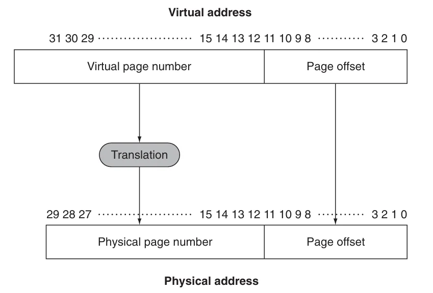

如图所示，物理页编号组成了物理地址的高位，而页偏移量则是低位。物理地址中的页偏移量与虚拟地址中的完全相同，页偏移量的位数决定了页的大小

虚拟内存的许多设计都是为了减少页错误，一次页错误可能需要花费数百万时钟周期来处理，代价十分高昂。因此，在设计虚拟内存时需要注意下面这几点：

- 页的大小应该足够大以摊还漫长的访问时间
- 选择可以减少页错误率的组织方式
- 使用软件来处理页错误
- 虚拟内存中使用**写返回** 策略（写穿透耗时太长）

### Page Table

页错误造成的损失十分高昂，因此我们在虚拟内存中选择全相联作为虚拟内存的置放策略，即页可以被放置在内存中的任意位置。但这将会导致一个新问题，即如何寻找一个页。全部查找显然是不现实的，解决方案是使用一个被称为**页表**的结构，它保存了虚拟地址与物理地址的映射关系。每个程序都有自己的页表，将程序的虚拟地址空间映射到主存中。页表同样位于主存中，并且假设它是主存中的一个固定大小的连续区域，硬件通过指向页表的起始位置的**页表寄存器**来找到页表的地址

!!! info "状态和进程"
    页表，程序计数器以及寄存器决定了虚拟机的**状态**(state)，这个状态通常被称为**进程**(process).当一个进程正在被处理器运行时，它是**活跃**(active)，否则它是**不活跃**(inactive)的。操作系统通过加载一个进程的状态使其变得活跃，在这个过程中，操作系统只加载页表寄存器而不是整个页表。如果需要让另一个进程使用处理器，我们需要先保持当前的进程，然后等另一个进程执行结束后恢复它的状态

下图[^1]展示了带有页表的地址翻译过程

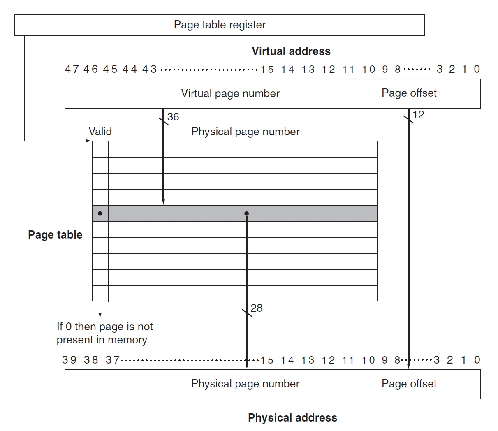

可以看到，页表中的每一项都有一个有效位

- 如果有效位为0，那么页不在主存中，将会导致页错误
- 如果有效位为1，那么页位于主存中，该项包含了物理地址

因为页表包含了所有可能的虚拟页，因此不需要标签；虚拟页表号即为索引

### Page Fault

如果有效位为0，将会导致页错误。操作系统会通过异常机制来接管控制，一旦操作系统接管了控制，它必须在下一级存储（闪存或机械硬盘）中寻找页并决定对应的页放置在主存中的位置。由于我们事先并不知道页会被放在主存中的位置，因此，操作系统在创建进程时会在闪存（或硬盘）上创造一个空间用于保存所有的页，称为**交换空间**(swap space).同时也创建了一个记录每个虚拟页的存储情况的数据结构，该数据结构可以是页表的一部分，也可以是一个类似页表的辅助数据结构

下图所示的页表中，除了用于保存物理地址的页之外，空闲的页（灰色的块）会被标记并在磁盘（二级内存）中保留它们的交换空间

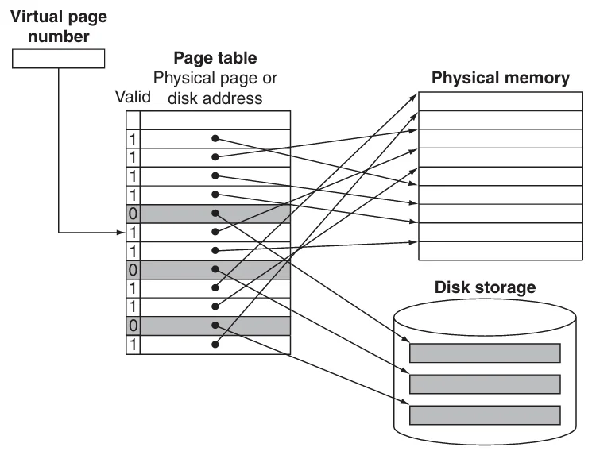

当页错误发生时，如果主存中的所有页都已被使用，操作系统必须选择一个页进行替换。因为我们想最小化页错误的数量，因此操作系统使用**最近使用**(least recently used, LRU)替换方法。操作系统会搜索最近最少使用的页面，将被替换的页放在第二级存储中的交换空间

实现一个精确的 LRU 方法过于复杂，因此，大多数操作系统都使用近似 LRU 。RISC-V 处理器提供了一个**引用位**，当页被访问是设置它的引用位。操作系统会周期性的清楚有效位并重新设置，以便找到在特定的时间段内需要被替换的页

### Large Virtual Addresses

32位虚拟地址，页大小为4KiB ，页表项为4 bytes 的页表的大小为4MiB 。也就是说，我们需要为每个程序提供4MiB 的页表，这个数字貌似不是很大，但如果同时运行上百个程序，所需要的内存就十分庞大。如果我们使用的是64为虚拟地址，这个数字将更加庞大。因此，有以下这些方法来解决这个问题

1. 最简单的方法是提供一个限制寄存器来限制页表的大小  
如果虚拟页编号超过了限制，那么就为它再分配一个页表项
2. 提供两个分开的页表，每个页表有独立的限制  
一个表向上增长（对应栈）,一个向下增长（对应堆）.这样将地址空间划分为两段，高位地址用于决定使用哪个段。这种方法的缺点是在非连续、稀疏的地址空间上表现不佳
3. 减小页表的大小对虚拟地址使用一个哈希函数，这样的结构被称为**逆页表**  
这种结构不再使用索引，因此查找起来比较麻烦
4. 将每个页表也当作一个页保存在页表中
5. 多级页表，RISC-V 处理器使用的正是这种方法  
从高位地址开始寻找，如果在某个页表中找到了的话（合法位为 1），那么继续到下一级页表中寻找，直至最后一个页表，如下图

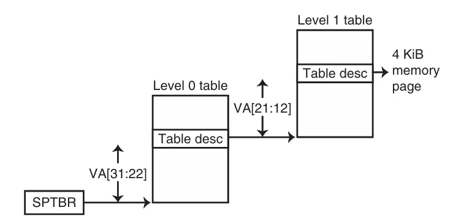

### TLB

因为页表保存在主存中，程序访问内存需要进行两次：第一次访问主存获得物理地址，第二次访问主存获得数据。可以利用局部性原理，增加一个特殊的缓存来保存最近使用过的地址转换，这个特殊缓存通常被称为**转译 - 旁路缓冲器**(translation-lookaside buffer, **TLB**).

下图展示一个带有 TLB 的页表，虽然图中展示的是一个单级页表，但 TLB 也同样适用于多级页表，此时TLB 只是从最后一级页表加载物理地址和标签

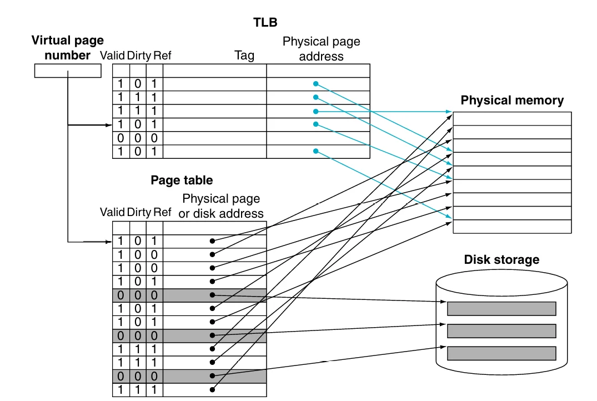

TLB 中的每个项的标签位保存了虚拟页编号，而数据位保存了物理页编号，同时也保留了页表中的几个状态位（合法位、引用位、脏位等)

每次内存访问时，先在 TLB 中查找虚拟页号：

若TLB **命中**：用物理页号生成地址，并设置对应引用位；若为写操作，还需设置脏位。

若TLB 失效：处理起来比较复杂，TLB 失效可以分为两种情况：

1. 页已经在内存中，我们只需要创建失效的TLB 项
2. 页不在内存中，我们需要将控制交给操作系统来处理一个页错误

处理页错误或者 TLB 失效需要使用**异常机制**中断激活的程序，将控制权交给操作系统，然后在恢复被中断的进程。

为了在异常处理完成后能够恢复被中断的进程，需要使用 **SPEC**(supervisor exception program counter) **寄存器**保存该进程的状态。除此之外，TLB 失效或页错误需要在当前时钟周期结束时及时声明，这样的话下一个时钟周期就会执行异常进程而非后面的正常指令，及时防止可能得写入操作带来的破坏

一旦操作系统知道虚拟内存发生了一个页错误，它必须完成下面三步：

1. 使用虚拟地址查找页表项并在第二级存储中寻找被引入的页
2. 选择一个物理页进行替换，如果被选择的页设置了脏位，必须在将新虚拟页写入物理页之前将其写入第二级存储
3. 将被引入的页从第二级存储写入到被选中的页

第三步通常需要大量的时钟周期，因此操作系统通常会将控制转移给其他进程，等待写入完成后再将之前的进程恢复

对于**数据访问**，页错误的异常将会更加难处理，因为这类页错误会发生在指令执行期间，并且在处理好异常之前指令无法继续执行下去，即使处理好之后该指令也得重新开始

下面是一个典型的 TLB 的规格

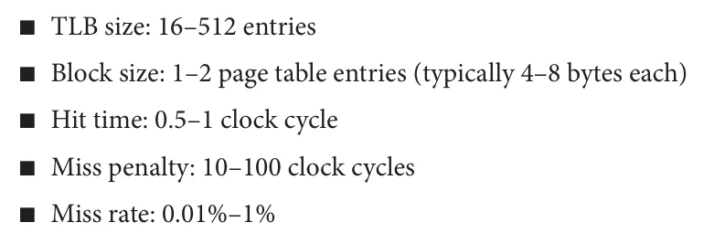

### Integrating Virtual Memory, TLBs, and Caches

虚拟内存和缓存共同组成了内存层级，不在主存中数据也不能出现在缓存中。操作系统通过周期性的刷新缓存中的数据来维持这一结构，如果在此时访问页表会造成页错误

下图给出了可能的失效组合

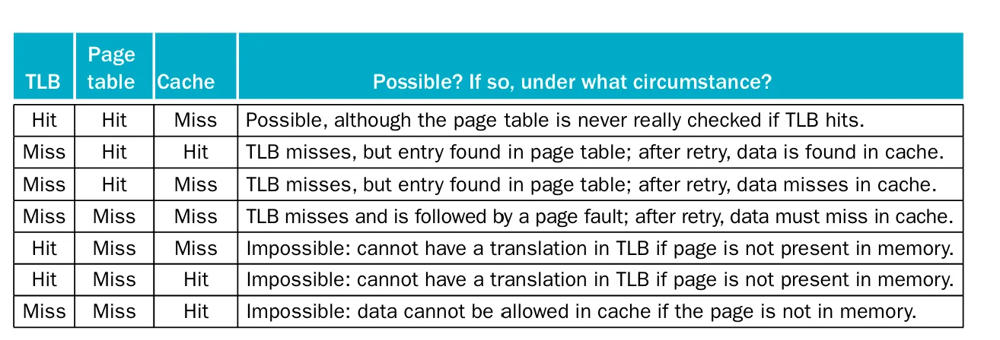

后三种情况是不可能发生的

### Protect

保护机制必须确保在多个进程共享一个主存时，一个进程不能写入其他进程或者操作系统的地址空间；同时，还需要确保一个进程不会读取到另一个进程的数据

TLB 通过提供一个**写访问位**(write access bit)防止页被意外写入  
操作系统提供确保页表组织良好，使得独立的虚拟页映射到不相交的物理页，那么就可以确保一个进程不会读到另一个进程上；将页表放入受保护的地址空间，使得只有操作系统能够修改页表，而用户无权修改

硬件提供了以下机制帮助操作系统实现内存系统的保护

1. 为操作系统进程和用户进程提供至少两个模式
2. 为进程在处理器上提供一个只能读不能写的部分，包括用户/超级管理员位，页表指针和TLB
3. 提供一个可以让处理器在用户模式和超级管理员模式切换的机制

## Conclusion

!!! info "总结：内存层级设计的四个问题"
    === "**置放策略**"

        - 直接映射
        - 全相联
        - 组相联

        

        提升相联度通常会降低失效率，但是随着缓存尺寸的增大，关联度带来的改善越来越小；这是由于较大缓存的总体未命中率较低，提高未命中率的空间就减少了

        关联度增加可能带来的缺点是成本增加和访问速度变慢

        

    === "**寻找数据块**"
        寻找数据块的方法取决于置放策略

        
        
        置放策略的选择还需要考虑失效和实现相联度的代价
        
    === "**替换策略**"
        对于直接映射，只有唯一的候选块进行替换

        对于组相联和全相联，有两种主要的方法：

        - 随机：随机选择一个候选块，可能需要一定的硬件协助
        - LRU：被替换的块是最长时间未被使用的块

        LRU的成本较高，通常情况下使用近似 LRU,即使用一个位来记录页的使用情况

    === "**写入策略**"
        下面是两种主要的写入策略及其优势：

        - 写穿透：数据将同时写入缓存和内存层级中低一级的块
            - 处理器可以以缓存接受的速度写入单个字。
            - 一个块内的多次写入只需对下一级存储写一次。
            - 当块被回写时，由于整个块都会被写入，系统可以有效利用高带宽传输。
        - 写返回：数据将只写入缓存，当数据被修改时将写入到内存层级中低一级的块
            - 失效更简单也更便宜，因为它们从不需要将块写回到下一级。
            - 写穿透比写返回更容易实现，尽管写穿透缓存需要使用写缓冲区

### The Three Cs Model

TODO

我们可以将所有的失效分为以下三类（**three Cs**）:

- **强制失效**
- **容量失效**
- **冲突失效**
- 
下图展示了三种失效所占的比例

下表给出了三种失效的解决办法及其代价

## Fallacy and Pitfalls

TODO

[^1]: 不知道为什么第二版没有这个图, 所以这里用的是第一版的图.使用的是64位地址空间