## Introduction

通过简单地将多个较小的计算机连接起来，从而创造出性能更强的计算机，这就是**多处理器**(multiprocessor)的设计思路。如果软件能够高效利用多处理器，那么将一个大型的低效的处理器替换为多个高效的小型处理器可以获得更好的性能。因此，多处理器软件必须能够在可变数量的处理器上正常运行。

对于相互独立的任务，高性能意味着高吞吐量，称为任务级并行或者进程级并行。这些任务通常是同时运行在多个处理器上的单一程序，被称为**并行处理程序**(parallel processing program)

为了避免重复，多处理器通常被称为**多核微处理器**而不是多处理器微处理器，多核芯片中的处理器被称为**核**(core)。这些多核处理器通常都是**共享内存多处理器**(shared memory multiprocessor, SMP)，因为它们总是共享一个物理地址空间

下图展示了**串行**(serial)、**并行**(parallel)、**顺序**(sequential)和**并发**(concurrent)之间的差异

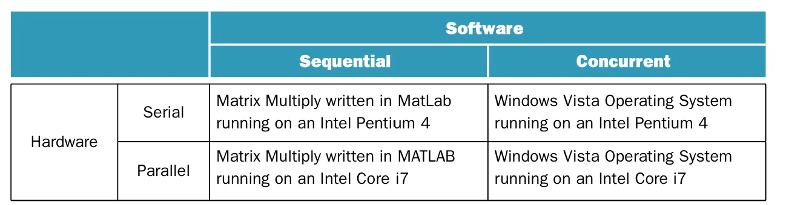

从图中可以看出，顺序程序和并发程序既可以运行在串行硬件上，也可以运行在并行硬件上

并发变革的主要挑战不仅是使顺序程序在并行硬件上获得更高性能，更是使并发程序在多处理器上获得更高性能

## The Difficulty of Creating Parallel Processing Programs

并发的挑战不在于硬件，而在于编写一个使用多处理器更快地完成一个任务的软件，并且这个问题还会随着处理器数量的增加变得愈发困难。我们必须能够通过运行在多处理器上的并行进程获得更好的性能或能耗，否则编写并行程序是没有意义的。

并行程序的挑战主要包括：**调度**、将任务划分为并行的部分、平衡不同处理器之间的**负载**、**同步**以及在不同部分之间进行**通信**

下面我们通过 Amdahl 定理推导出并行程序相较于串行程序的加速比

$$
\begin{aligned}
&\text{Execution time affected after improvement}=\\
&\frac{\text{Execution time affected by improvement}}{\text{Amount of improvement}}
+\text{Execution time unaffected}
\end{aligned}
$$

对上面的式子做一些变换

$$
\text{Speed-up}=\frac{\text{Execution time before}}{\text{(Execution time before - Execution time affected)}+\dfrac{\text{Execution time affected}}{\text{Amount of improvement}}}
$$

分子分母同时除以 $\text{Execution time before}$ 可以得到

$$
\text{Speed-up}=\frac{1}{(1-\text{Fraction time affected)}+\dfrac{\text{Fraction time affected}}{\text{Amount of improvement}}}
$$

!!! tip "Amdahl 定律的启示"
    整体加速比受限于未被改进的部分：即使改进幅度趋于无穷，加速比也只会趋近 $\dfrac{1}{1-\text{Fraction time affected}}$。因此在保持问题规模不变的情况下获得更高的加速比，其难度要大于按比例增大问题规模的情况

因此，可以引出两个相关概念

- **强扩展**(strong scale):在保持问题规模不变的情况下测得的加速比
- **弱扩展**(weak scale):在问题规模随着处理器数量成比例变化的情况下测得的加速比

> 假设问题的规模为 $M$ ，处理器的数量为 $P$ ，那么强扩展下每个处理器的工作量近似为 $M/P$，而弱扩展下每个处理器的工作量近似为 $M$

需要注意的是，存储器层级结构可能会对弱扩展比强扩展更简单的传统观念造成影响

## SISD, MIMD, SIMD, SPMD, and Vector

可以按照指令流和数据流的数量对并行处理器进行分类，如下图所示

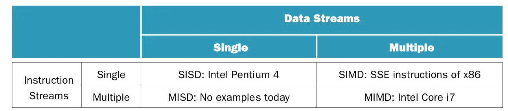

一个传统的单核处理器具有**单个指令流和单个数据流**(single instruction stream, single data stream, **SISD**)，而一个传统的多核处理器具有**多个指令流和多个数据流**(multiple instruction streams, multiple data streams, **MIMD**)

单个程序通常会运行在一个 MIMD 计算机的所有处理器上，不同的处理器通过条件语句执行不同的代码，这被称为**单程序多数据**(single program multiple data, **SPMD**)

最接近**多指令流单数据流**(MISD)的处理器在单数据流上以流水线方式执行一系列计算。相比之下，与 MISD 相反的类型 **SIMD**(Single Instruction stream, Multiple Data streams)则对数据向量进行操作

SIMD 的一个好处是所有并行的执行单元都是同步的，它们都响应由同一程序计数器(PC)中发出的同一指令。除此之外，使用 SIMD 还可以摊销多个执行单元的控制成本，减少指令带宽和空间

!!! note
    虽然每个单元都执行相同的指令，但每个执行单元有独立的地址寄存器，可以使用不同的数据地址

!!! tip "SIMD 的适用场景"
    - 处理相同的数据结构时表现良好，例如使用 `for` 循环遍历数组
    - 每个执行单元必须执行不同操作时表现欠佳，例如 `switch-case` 语句

### Multimedia Extensions

x86 指令集通过**多媒体扩展指令**(multimedia extensions, **MMX**)的方式实现 SIMD，窄整数的子字并行最早就是受到了 x86 MMX 的启发。随着摩尔定律持续发挥作用，越来越多的指令被添加，从最早的 **SSE** 到现在的 **AVX**。其中 AVX-512 支持同时处理 8 个 64 位浮点数

### Vector

一种更古老但更优雅的实现 SIMD 的方式是**向量体系结构**(vector architecture)，其采用流水线化的 ALU，从而以更低的功耗获得良好的性能。

向量的基本原理是从内存中收集数据元素，将数据按顺序放在一大组寄存器中，使用流水线执行单元顺序操作寄存器中的数据，将结果写回内存。向量的核心特性是一组向量寄存器

!!! example "Vector and Scalar"
	对于 DAXPY(double precision $a \times X$ plus $Y$)循环
	$$
	Y=a\times X+Y
	$$
	其中 $X$ 和 $Y$ 是64位双精度浮点数的向量，初始时位于内存中；$a$ 是一个双精度的标量。假设 $X$ 和 $Y$ 的起始地址分别位于 `x19` 和 `x20`
	对比一下传统的 RISC-V 代码和向量化的 RISC-V 代码

	=== "Conventional RISC-V"
		``` asm
				fld     f0, a(x3)       // load scalar a
				addi    x5, x19, 512    // end of array X
		loop:   fld     f1, 0(x19)      // load x[i]
				fmul.d  f1, f1, f0      // a * x[i]
				fld     f2, 0(x20)      // load y[i]
				fadd.d  f2, f2, f1      // a * x[i] + y[i]
				fsd     f2, 0(x20)      // store y[i]
				addi    x19, x19, 8     // increment index to x
				addi    x20, x20, 8     // increment index to y
				bltu    x19, x5, loop   // repeat if not done
		```

	=== "Vector RISC-V"
		``` asm
			fld         f0, a(x3)       // load scalar a
			vsetvli     x0, x0, e64     // 64-bit-wide elements
			vle.v       v0, 0(x19)      // load vector x
			vfmul.vf    v0, v0, f0      // vector-scalar multiply
			vle.v       v1, 0(x20)      // load vector y
			vfadd.vv    v1, v1, v0      // vector-vector add
			vse.v       v1, 0(x20)      // store vector y
		```

向量处理器极大减少了动态指令的带宽，只需要执行7条指令，而传统的 RISC-V 代码则需要超过 500 条指令；另一个差异是使用向量减少了流水线冒险的频率

### Vector versus Scalar

与传统标量指令相比，向量指令有以下几个优点：

- 一个向量指令等价于一个完整的循环，取值和解码所需的带宽极大地减少
- 向量中每一个结果的计算与同一向量中其他结果的计算是独立的，因此不需要检查向量指令内的数据冒险
- 当程序中存在数据级并行时，相比使用 MIMD 多处理器，使用向量体系结构和编译器的组合更容易写出高效的应用程序
- 只需要检查两条向量指令之间的向量操作数是否会发生数据冒险，这将减少检查的次数从而节省能耗和时间。
- 访问存储器的向量指令具有确定的访问模式。如果向量中的数据元素位置都是连续的，则对整个向量而言，主存储器的延迟开销只有一次，而不是对向量中的每个字都产生一次。
- 因为整个循环被具有已知行为的向量指令所取代，所以通常由循环引发的控制冒险不再存在。
- 与标量体系结构相比，节省的指令带宽和冒险检查以及对存储器带宽的有效利用，使得向量体系结构在功耗和能耗方面更具有优势

由于以上的原因，对于同样数量的数据，向量操作比一系列标量操作更快

### Vector versus Multimedia Extension

向量和 MMX 主要有以下几点不同：

1. 向量指令可以指定几十种操作，而 MMX 只能指定几种操作
2. 向量操作的元素个数存放在一个单独的寄存器中，而不是像 MMX 放在 `opcode` 中
3. 向量的数据不需要是连续的，其支持步长访问，即加载内存中每隔 $n$ 个元素的数据和索引访问，即按照数据项的地址将数据加载到向量寄存器中，也称为**聚集-散射**(gather-scatter)

与 MMX类似，向量可以支持多种不同的数据宽度，可以使向量操作处理 32 个 64位数据、64 个 32 位数据、128 个 16 位数据或者 256 个 8 位数据。向量指令的并行特性可以使其采用深度流水线的功能单元、并行功能单元阵列或者并行功能单元与流水功能单元的组合来执行这些操作。下图展示了如何通过并行流水线来提高向量加法的性能

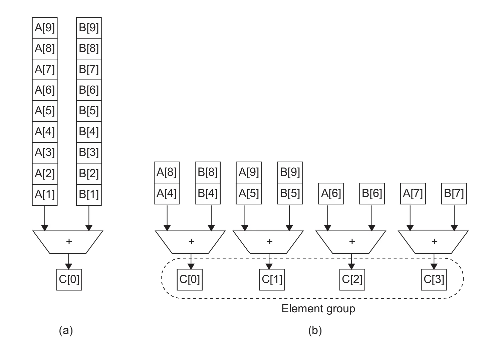

向量算术操作通常只允许一个向量寄存器的 $N$ 个元素与另一个向量寄存器的 $N$ 个元素进行运算，这使得我们可以将并行向量单元构建为多个并行的**向量通道**(vector lane)，下图展示了四通道向量单元的结构

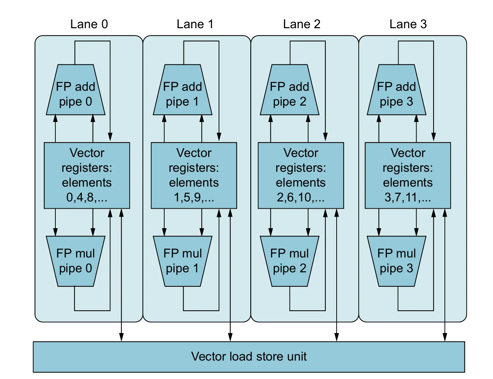

为了利用多通道，应用程序和体系结构都必须支持长向量。否则，指令将很快执行完毕以至于没有足够的新指令可以被执行，可以使用**指令级并行**技术为向量单元提供足够的向量指令

!!! tip "向量的缺陷"
	向量寄存器巨大的状态会增加上下文切换的时间，加大处理向量加载和存储中的页错误的难度。除此之外 SIMD 指令已经实现了向量指令的部分优点

## Hardware Multithreading

**硬件多线程**是一个与 MIMD 相关的概念。MIMD 依赖多个处理器或线程使处理器保持繁忙，而硬件多线程允许多个线程以重叠的方式共享一个处理器的功能单元，从而高效利用硬件资源。处理器必须要为每个线程保存独立的状态，除此之外，硬件必须能够快速地进行线程切换

硬件多线程主要有两种实现方式：

- **细粒度多线程**(fine-grained multithreading)：在每条指令执行后切换线程，以轮转的方式交替执行多个线程，处理器必须能够在时钟周期内完成线程切换

	细粒度多线程的优点是可以隐藏由停顿造成的吞吐量下降；缺点是降低了单个线程的执行速度

- **粗粒度多线程**(coarse-grained multithreading)：只有出现高开销的停顿（如末级缓存失效）才切换线程

**同时多线程**(simultaneous multithreading, SMT)使用多发射、动态调度流水线的处理器资源来实现**线程级并行**和**指令级并行**。通过寄存器重命名和动态调度等方法，可以发射来自相互独立的多个线程的多条指令，且不需要考虑它们之间的依赖关系，因为可以通过动态调度能力来解决相关性的问题。

SMT 同时执行来自多个线程的指令，不需要在每个周期切换资源

下图展示了细粒度多线程、粗粒度多线程以及 SMT 的区别

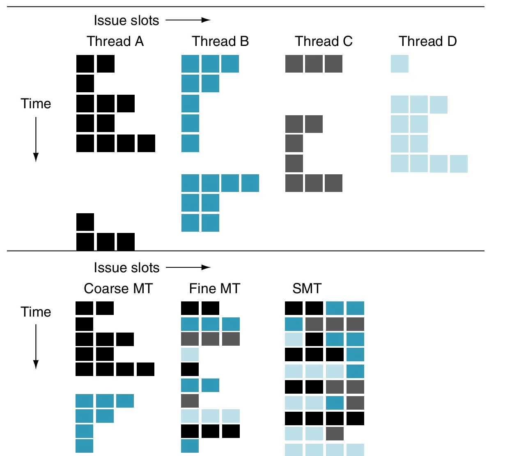

上半部分是四个线程在没有多线程的超标量处理器上独立运行的情况，而下半部分则分别是细粒度多线程、粗粒度多线程以及 SMT 的运行情况

没有多线程的超标量处理器的发射槽的使用受限于指令级并行的缺失，除此之外，一个较大的停顿会导致整个处理器处于空闲状态

对于细粒度多线程，线程的交替运行极大地消除了空闲的时钟周期，但是由于一个线程在一个时钟周期只能发射一条指令，受限于指令级并行，仍会造成处理器空闲；对于粗粒度多线程，长停顿基本上被线程切换所隐藏，但流水线启动的开销仍会造成空闲周期，而指令级并行的限制则意味着所有发射槽都将空闲；对于 SMT ，线程级并行和指令级并行同时被使用，多个线程在一个时钟周期内使用发射槽。理想状况下，发射槽的使用仅受到多个线程之间资源需求不平衡和资源可用性的限制

下图展示了多线程对处理器性能及能耗的影响

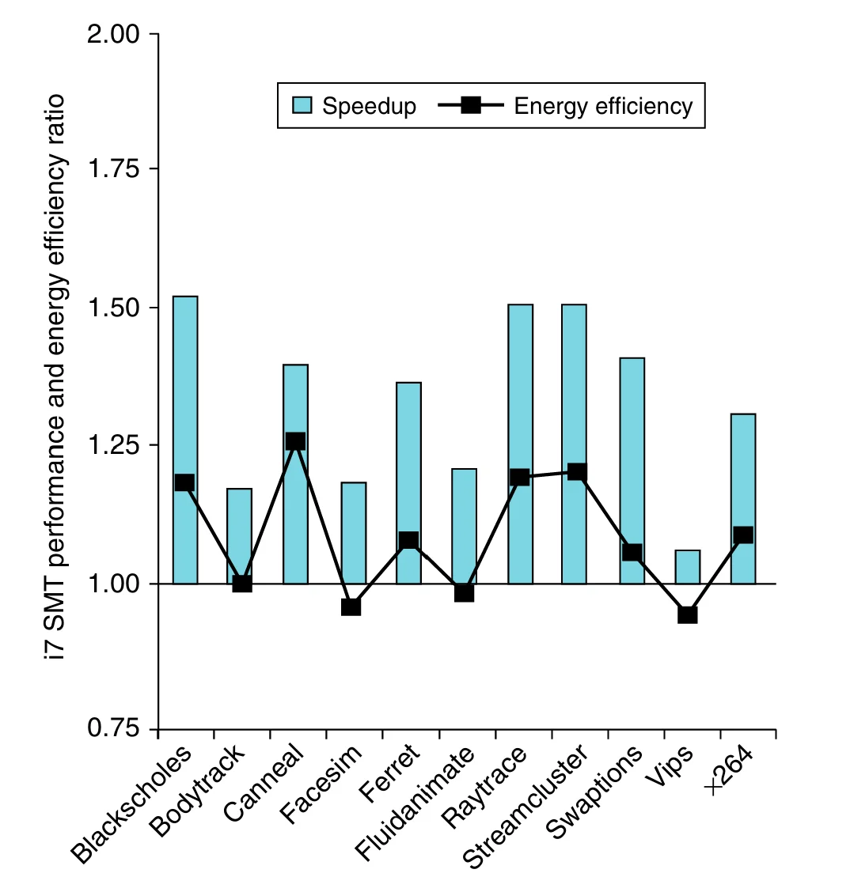

## Multicore and Shared Memory Multiprocessors

提供一个可供所有处理器共享的物理地址空间，降低了将老程序移植到并行硬件的难度，这使得程序无须考虑数据的存放位置，只需考虑如何并行执行。硬件通常会通过缓存一致性确保内存中的数据是一致的

**共享内存多处理器**(shared memory multiprocessor, SMP)为所有处理器提供一个物理地址空间，处理器通过内存中所有处理器都能访问的共享变量进行通信

下图是一个典型的 SMP 的架构

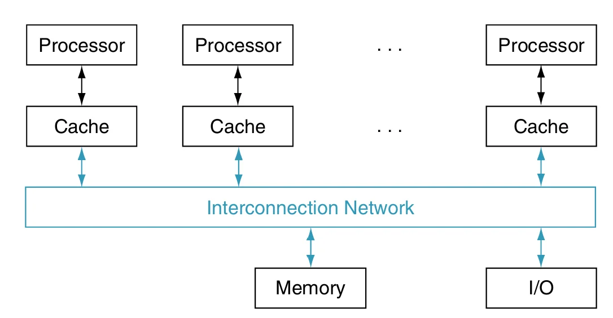

!!! note
    这些处理器仍可以在它们的虚拟地址空间中执行独立的任务

有两种方式为多核处理器提供单一的地址空间：

- **统一内存访问**(uniform memory access, UMA)：所有处理器访问内存中的数据的延迟是相同的
- **非统一内存访问**(nonuniform memory access, NUMA)：一些处理器访问内存中数据的速度快于其他处理器

NUMA 的编程难度大于 UMA，但是 NUMA 可以扩展到更大的规模，并且对附近的内存有着更低的延迟

在处理器并行处理数据的过程中通常会共享数据，同时也需要对共享数据进行协调。一个方法是使用**锁**(lock)，同一时间只有一个处理器可以获得锁，其他需要访问共享数据的处理器必须要等到持有锁的处理器释放锁才能访问

!!! tip "共享虚拟地址空间"
	另一种提供共享地址空间的方法是共享同一个虚拟地址空间、使用多个分离的物理地址空间，由操作系统来处理通信。这种方法需要高昂的成本来提供可用的共享内存抽象

## Introduction to Graphics Processing Unit

下面是 **GPU**(graphics processing unit)有别于 CPU 的两个关键特性：

- GPU 是 CPU 的一个补充加速器，因此其不需要完成 CPU 的所有任务，这使得 GPU 可以将资源集中于图形处理
- GPU 的问题规模通常是几百 MB 到几 GB，而不是几百 GB 到几 TB

上面这两个特性导致了 GPU 架构的几个设计风格：

- GPU 不依赖多级缓存来解决内存延迟，而是通过硬件多线程来隐藏内存延迟
- GPU 的内存主要关注带宽而不是延迟，其拥有带宽更高的 DRAM 芯片。对于通用计算任务，需要考虑数据由 CPU 内存传输到 GPU 内存的时间
- 因为 GPU 依赖很多的线程来获得更好的内存带宽，每个 GPU 处理器高度多线程化，并且其拥有更多的处理器

### NVIDIA GPU Architecture


与向量类似，GPU 在**处理指令级并行**问题时可以获得良好的性能，GPU 是一个由多线程 SIMD 处理器组成的 MIMD，其依赖 SIMD 处理器中的硬件多线程来隐藏内存延迟。

下图展示了一个简化的 SIMD 处理器

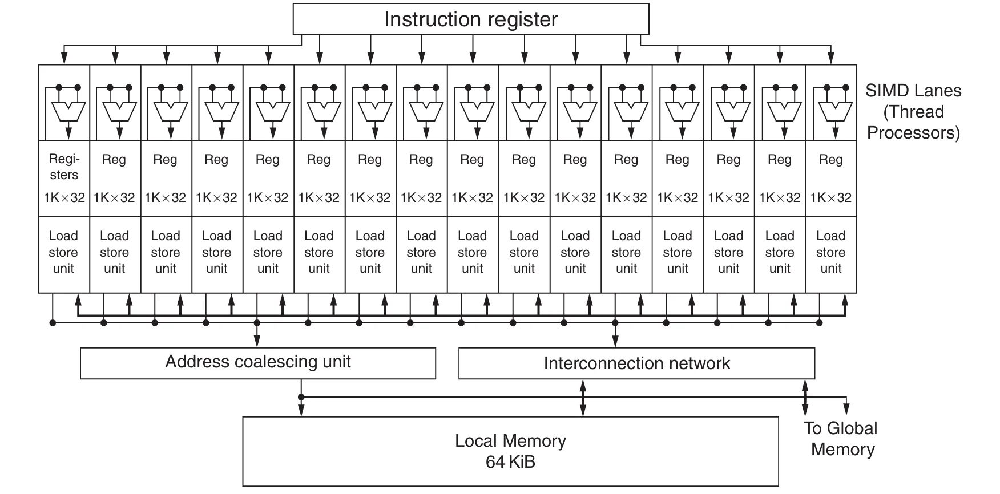

硬件创建、管理、调度和执行的机器对象是一个 **SIMD 指令的线程**，被称为 **SIMD 线程**。这些 SIMD 线程拥有独立的程序计数器并且运行在一个多线程 SIMD 处理器上。GPU 硬件拥有两个等级的硬件调度器：

1. **线程块调度器**为多线程 SIMD 处理器分配线程块
2. SIMD 处理器上的 **SIMD 线程调度器**决定运行哪一个线程

SIMD 处理器拥有被称为 **SIMD 通道**(SIMD lane)的并行功能单元来执行指令，类似于向量通道

### NVIDIA GPU Memory Structures

下图展示了 NVIDIA GPU 的内存结构。我们将每个 SIMD 处理器上的内存称为**本地内存**(local memory)，它会被同一个多线程 SIMD 处理器中的 SIMD 通道共享，但是不能被其他 SIMD 处理器访问。被整个 GPU 共享的内存被称为 **GPU 内存**(GPU memory)

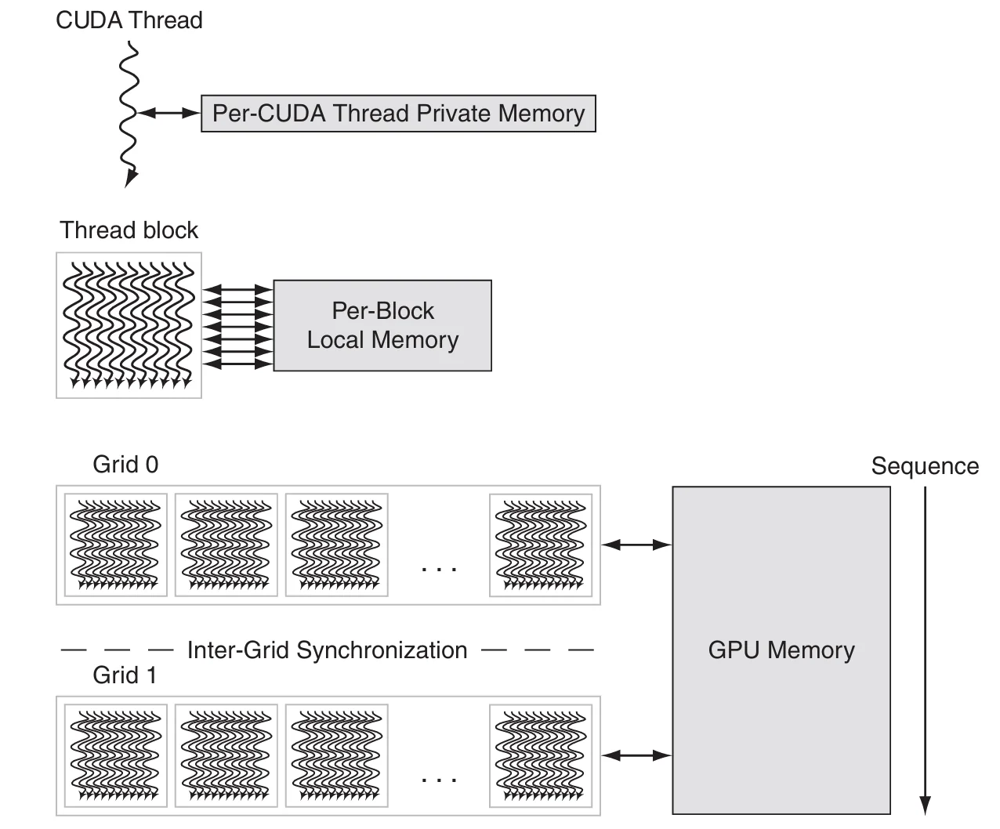

GPU 通常使用较小的缓存，并依靠大量 SIMD 指令线程的多线程来隐藏访问 DRAM 的长延迟。系统处理器中用于缓存的芯片面积被用在计算资源上，以及用于保存 SIMD 指令线程状态的大量寄存器上。

下表给出了 SIMD 处理器与 GPU 的联系与区别

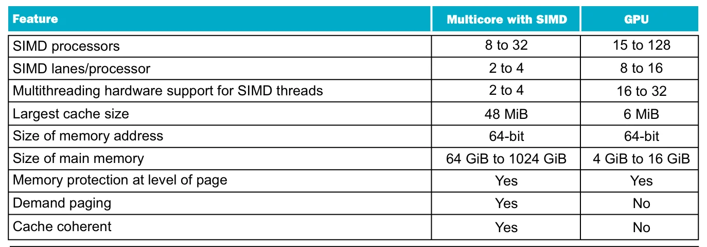

## Domain-Specific Architecture


**领域特定架构**(domain-specific architecture, DSA)只能完成较小范围的任务，但它们在这些任务上表现极佳。现在计算机通常会有一个标准处理器运行传统程序，同时还有领域特定处理器

DSA 的设计遵循下面的五条原则

1. 使用专用内存最小化数据移动的距离。通过为领域内的特定功能专门设计的软件控制内存，数据移动得以减少
2. 将放弃高级微架构优化而节省下的资源投入到更多的算术单元或更大的内存中
3. 使用最简单的、符合领域的并行形式
4. 将数据的大小和类型缩减到该领域所需的最简单形式
5. 用领域专用编程语言将代码移植到 DSA

一个著名的例子是 Google 的 **TPU**(Tensor Processing Unit)，这是一个为深度神经网络设计的 DSA

下图为简化后的 TPUv1 的架构图


TPU 的设计遵循了 DSA 的设计原则，右上角的**矩阵乘法单元**(matrix multiply unit, MXU)包含 $256\times256$ 个 ALU，这些 ALU 使用 SIMD 并行，符合“使用最简单的、符合领域的并行形式”的设计原则。除此之外，TPU 将数据大小与类型缩减到 8 到 16 位的整数，并且使用专用的内存。最后，TPU 使用 TensorFlow 进行编程，简化了将 DNN 程序移植到 DSA 的难度

!!! info "总体拥有成本"
    度量数据中心成本的最好方式是**总体拥有成本**(total cost of ownership, TCO)，它是购买硬件的成本加上运行期间的电力、散热以及空间成本


## Cluster and Warehouse-Scale Computers

共享地址空间的另一个选择是让每个处理器拥有**独立的物理地址空间**，下图为这种结构的示意图

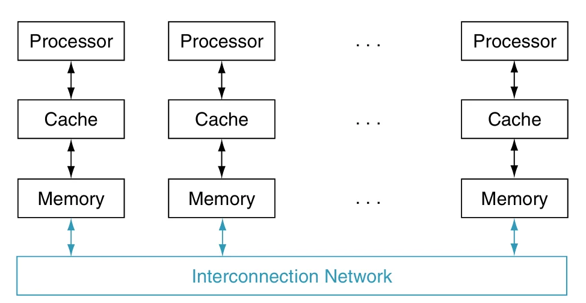

这种处理器依靠显式的**消息传递**(message passing)进行通信。只要系统提供发送和接收消息的例程，处理器之间的协调就可以通过消息传递来实现：发送方知道消息何时发出，接收方也知道消息何时到达。如果发送方需要确认消息已经到达，接收方还可以向其回送一条确认消息

一些并发应用程序在并行硬件上运行良好，这与硬件是否提供共享地址空间或消息传递机制无关，因此**集群**(cluster)已成为当今消息传递并行计算机中最普遍的实例。由于拥有独立的存储器，集群的每个节点都可以运行操作系统的不同副本。相较之下，微处理器内的核心通过芯片内部的高速网络互连，运行单一操作系统；多芯片共享存储器系统则通过存储器互连进行通信

网络服务需要建造新的建筑，用来放置、供电并冷却 50000 台服务器。虽然它们可以被归类为大型集群，但其架构和运维要更为复杂，我们将其视为一类新的计算机，称为**仓储级计算机**(Warehouse-Scale Computer, WSC)

尽管在目标上与服务器有一些共同点，但 WSC 还是有以下三个主要区别：

1. 大量、简单的并行性
2. 计算运营成本
3. 规模及与规模相关的机会和问题

## Multiprocessors Network Topologies

多核处理器需要网络来连接核心，而集群需要局域网来连接服务器

网络的成本主要包括开关的数量，开关连接到网络的链路数量，每条链路的宽度（位数），将网络映射到芯片时链路的长度

网络的性能也由多个因素决定，包括无负载的网络上发送和接受信息的延迟，给定时间内能传输的消息的最大数量的吞吐量，由网络争用引起的延迟，以及取决于通信模式的可变性能
网络的另一个性质是容错，在受能耗限制的系统里，系统能耗可能是最重要的问题

网络通常使用图来表示，图的每条边代表通信网络的链路。在本节的图中，处理器-内存节点显示为黑色方块，开关显示为蓝色圆点。同时，所有链接都是双向的即信息可以向任一方向流动。所有网络都由开关组成，其链路连接到处理器-内存节点和其他开关。

我们可以将一系列节点连接在一起，形成一个被称为**环**(ring)的拓扑

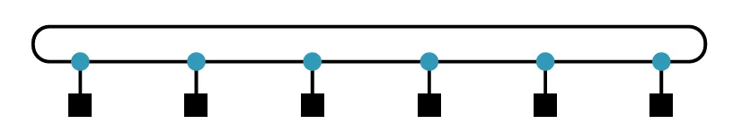

可以使用两个指标来衡量网络的性能

- 总**网络带宽**(network bandwidth)：每条链路的带宽乘上链路的数量。通常表示峰值带宽
- **二分带宽**(bisection bandwidth)：将处理器分成两半进行计算，然后将跨越假想分界线的链接的带宽相加。通常表示最带宽

因为有些网络拓扑不是对称的，在选择二分带宽的分界线时可以选择产生最差网络性能的分法。具体来说，就是计算所有可能的分法，然后选择**最差的**哪一个

!!! info "全互联网络"
    一个极端的拓扑是**全互联**(fully connected network)，即每个处理器都与其他处理器有双向连接。全互联的总网络性能是 $P\times(P=1)/2$ ，二分带宽是 $(P/2)^2$

全互联极大的提升了性能，同时也极大的提升了成本。因此需要寻找环的成本与全互联的性能相结合的拓扑
下图展示了两种比较常见的拓扑

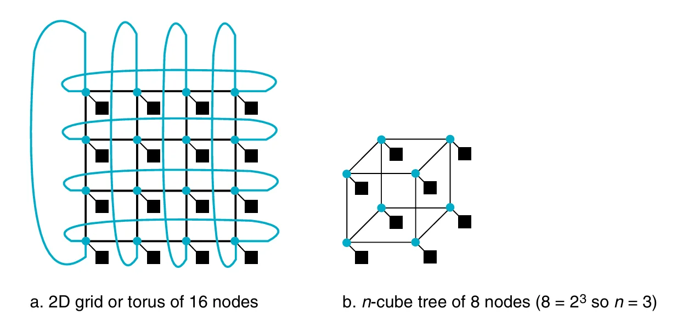

另一种方法是将网络中的处理器的每个节点处留下小于处理器-内存-开关节点的开关，这种开关规模更小，因此可以减小距离并提高性能。这种网络通常被称为**多级网络**(multistage network)。多级网络的类型与单级网络一样多，下图是两个常见的多级网络组织结构

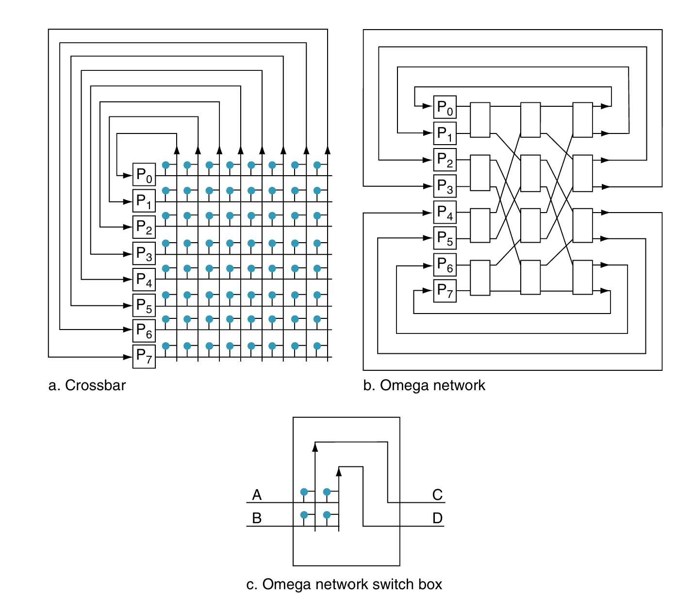{width="60%"}

**全连接**(fully connected)或**交叉开关网络**(crossbar network)允许任何节点在通过网络时可与任何其他节点通信。Omega 网络所使用的硬件少于交叉开关网络（前者需要 $2n\log_2n$ 个开关，后者需要 $n^2$ 个开关）​，但消息之间可能会发生争用，具体取决于通信模式

通常情况下，链路的距离越长，以高时钟频率运行网络的成本越高；较短的距离使得为链接分配更多的电线变得更容易，而且短线路的成本也小于长线路。另一个限制是：必须将三维的图像绘制到本质上其实是二维的芯片上。除此之外，也需要关注**能耗**。最重要的是，当为硅片或数据中心构造网络时，在纸上设计的拓扑结构看起来十分完美，但在真正制造时可能是不切实际

## Pitfalls and Fallacies

!!! bug "Fallacy"
	- 并行计算机不遵循 Amdahl 定律
	- 峰值性能可代表实际性能
	- 在不提升内存带宽的前提下可以得到不错的向量计算性能

!!! failure "Pitfall"
	- 不开发软件来利用和优化新颖的体系结构
	- 假设指令系统体系结构可以完全隐藏所有物理实现属性
