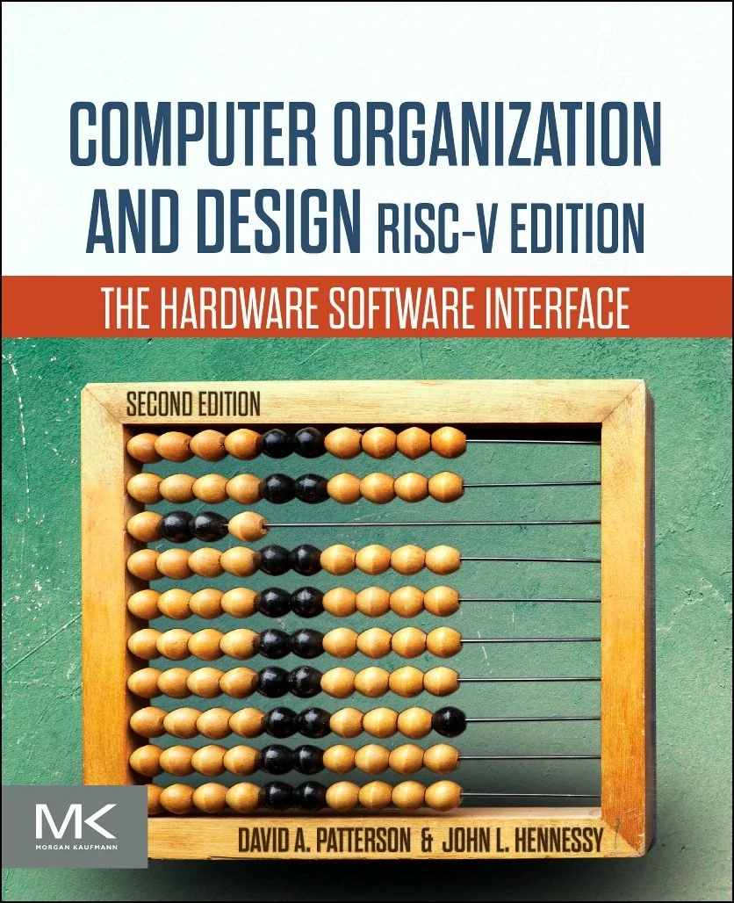

使用的教材是**David A. Patterson**和**John L. Hennessy**的*Computer Organization and Design: The hardware and software interface(RISC-V 2nd edition)*

<figure markdown="span">
  { width="50%" }
  <figcaption></figcaption>
</figure>

!!! abstract "目录"
    - [ ] [Chapter 1: Computer Abstractions and Technology](1.md)
    - [ ] [Chapter 2: Instructions: Language of the Computer](2.md)
    - [ ] [Chapter 3: Arithmetic for Computers](3.md)
    - [x] [Chapter 4: The Processor](4.md)
    - [x] [Chapter 5: Large and Fast: Expierarchy](5.md)
    - [x] [Chapter 6: Parallel Processors from Client to Cloud](6.md)

!!! note "相关资源"
    - [课程网站(UCB CS61C)](https://cs61c.org/){:target="_blank"}