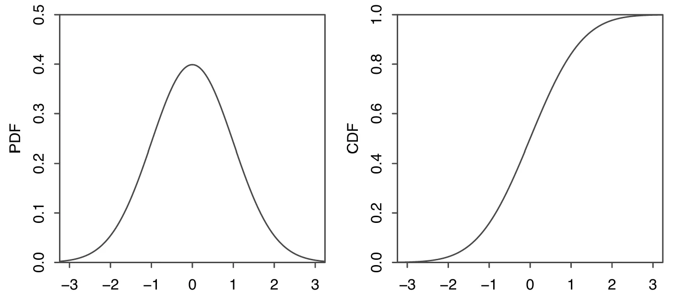
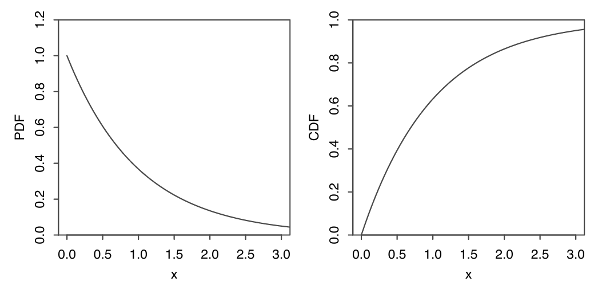

## Probability Density Function

如果一个随机变量的 CDF 是可导的，那么这个随机变量服从一个连续的分布。**连续随机变量**(continuous random variable)是有着连续分布的随机变量。

> 上面可导的定义允许有有限个不可导但连续的端点

对于一个 CDF 为$F$的连续随机变量$X$,它的**概率密度函数**(probability density function, PDF) $f$是 CDF 的导数，即
$$
f(x)=F'(x)
$$
$X$的支撑是所有满足$f(x) > 0$ 的$x$的集合。

**定理：合法的 CDF**  
连续随机变量的 CDF $f$ 必须满足下面两条性质

1. **非负**:$f(x)\ge0$
2. **积分为1**:$\int_{-\infty}^{\infty}f(x)dx=1$

!!! note ""
    对于连续随机变量$X$的支撑集中所有的元素 $x, P(X=x)=0$。因为$P(X=x)=F(x)-\lim_{t\to x^-}F(t)$，而连续随机变量的 CDF 是连续的，所以 $\lim_{t\to x^-}F(t)=F(x)$。

PDF 的值$f(x)$不是一个概率，对于某些$x$可能会出现$f(x)>1$的情况。为了得到对应的概率，需要对 PDF 做**积分**。下面是将 PDF 转换为 CDF 的方法

**命题：将 PDF 转换为 CDF**  
如果$X$是 PDF 为$f$的连续随机变量，那么$X$的 CDF 为
$$
F(X)=\int_{-\infty}^{x}f(t)dt
$$

??? tip "证明"
    通过 CDF 的定义和积分的基本性质，可以得到
    $$
    P(a<x\le b)=F(b)-F(a)=\int_{a}^{b}f(x)dx
    $$

端点处的值不影响概率，即
$$
P(a\le X\le b)=P(a<X\le b)=P(a\le X<b)=P(a<X<b)
$$

!!! danger ""
    离散随机变量没有这样的性质，需要特别注意端点处的情况

!!! info "总结"
    **对 PDF 的适当区域进行积分便可以得到想要的概率**, 积分的上下限可以根据区域调整，其结果就是对应的概率

连续随机变量的期望与离散随机变量的定义类似，只需要将对 CDF 进行求和替换为对 PDF 进行积分即可
 PDF 为$f$的连续随机变量$X$的期望为
$$
E(X)=\int_{-\infty}^{\infty}xf(x)dx
$$
连续随机变量的期望同样满足**线性**(linearity)

**定理：LOTUS**  
 $X$是PDF 为$f$的连续随机变量，$g$是一个$\mathbb{R}\to\mathbb{R}$的函数，那么
 $$
E(X)=\int_{-\infty}^{\infty}g(x)f(x)dx
$$
## Uniform

一个在区间$(a,b)$上服从**均匀分布**(uniform distribution)的连续随机变量$U$的 PDF 为
$$
f(x)=
\begin{cases}
\dfrac{1}{b-a} &\text{if }a<x<b  \\\\
0 &\text{  otehrwise}
\end{cases}
$$
记为$U\sim\text{Unif}(a,b)$

均匀分布的 CDF 是将其 PDF 的面积累加起来
$$
F(X)=
\begin{cases}
0 &\text{if }x\le a\\\\
\dfrac{x-a}{b-a}&\text{if }a<x<b\\\\
1&\text{if }x\ge b
\end{cases}
$$

**命题：对于均匀分布，概率与长度成比例**  
令$U\sim\text{Unif}(a, b)$,$(c,d)$是$(a,b)$的一个子区间，其长度为$l=d-c$.那么$U$的值在区间$(c,d)$的概率与$l$成比例

???+ tip "证明"
    因为 U 的 PDF 是常数$\frac{1}{b-a}$,而从$c$的$d$的区域是$\frac{l}{b-a}$

**命题**  
令$U\sim\text{Unif}(a, b)$,$(c,d)$是$(a,b)$的一个子区间，其长度为$l=d-c$.那么在$U\in(c,d)$的条件下，$U$的条件分布为$U\sim\text{Unif}(c, d)$

??? tip "证明"
    根据条件概率的定义，得到
    $$
    P(U\le u|U\in(c,d))=\frac{P(U\le u, c<U<d)}{P(U\in(c,d))}=\frac{P(U\in(c,u])}{P(U\in(c,d))}=\frac{u-c}{d-c}
    $$

---

$\text{Unif}(0,1)$是最常用的均匀分布，被称为**标准均匀分布**(standard Uniform).它的 PDF 为$f(x)=1,0<x<1$;CDF 为$F(x)=x,0<x<1$,如下图所示

标准均匀分布的期望为$\dfrac{1}{2}$,方差为$\dfrac{1}{12}$

可以使用 **位置-尺度变换**(location-scale transformation)从原来的均匀分布中产生新的均匀分布。令$X$为随机变量，$Y=\sigma X+\mu, \sigma>0$,那么称$Y$为$X$的一个位置-尺度变换。
这里$\mu$控制位置如何改变，而$\sigma$控制尺度如何改变

位置-尺度变换适用于所有经过变换之后分布类型保持不变的分布。不能将其用于离散随机变量

> 对于均匀分布的连续随机变量$X$,如果$Y$不是$X$的线性变换，那么$Y$通常不服从均匀分布

均匀分布的期望为
$$
E(U)=\int_{a}^{b}x\cdot\frac{1}{b-a}dx=\frac1{b-a}\left(\frac{b^2}{2}-\frac{a^2}{2} \right)=\frac{a+b}{2}
$$
而它的方差为$\dfrac{(b-a)^2}{12}$

???+ tip "证明"
    === "定义"
        首先用 LOTUS 算出 $E(U^2)$为
        $$
        E(U^2)=\int_{a}^{b}x^2\frac{1}{b-a}=\frac{1}{3}\frac{b^3-a^3}{b-a}
        $$
        然后带入方差的公式得到
        $$
        \begin{aligned}
        Var(U)&=E(U^2)-(EU)^2\\\\
        &=\frac{1}{3}\frac{b^3-a^3}{b-a}-\left(\frac{a+b}{2}\right)^2 \\\\
        &=\frac{1}{3}\frac{(b-a)(a^2+ab+b^2)}{b-a}-\left(\frac{a+b}{2}\right)^2\\\\
        &=\dfrac{(b-a)^2}{12}
        \end{aligned}
        $$

    === "位置-尺度变换"
        假设$U\sim\text{Unif}(0,1)$,根据 Location-scale transformation 得到
        $$
        \tilde{U}=a+(b-a)U
        $$
        即$\tilde{U}\sim\text{Unif}(a,b)$
        那么
        $$
        \begin{aligned}
        E(\tilde{U})=E(a+(b-a)U)=a+(b-a)E(U)=a+\frac{b-a}{2}=\frac{a+b}{2}\\\\
        Var(\tilde{U})=Var(a+(b-a)U)=(b-a)^2Var(U)=\frac{(b-a)^2}{12}
        \end{aligned}
        $$

## Universality of the Uniform

**定理：均匀分布的通用性**  
令$F$是一个连续随机变量的 CDF，它是严格递增且连续的函数。如果$U\sim\text{Unif}(0,1)$，那么随机变量$F^{-1}(U)$的 CDF 为$F$。即
$$
P(F^{-1}(U)\le x)=F(x)
$$

??? tip "证明"
    因为$F$是严格递增的，所以$F^{-1}$也是严格递增的，于是事件$\{F^{-1}(U)\le x\}$等价于事件$\{U\le F(x)\}$
    $$
    P(F^{-1}(U)\le x)=P(U\le F(x))
    $$
    由于$U\sim\text{Unif}(0,1)$，其 CDF 为$P(U\le u)=u,0<u<1$，因此
    $$
    P(U\le F(x))=F(x)
    $$
    即$F^{-1}(U)$的 CDF 恰好是$F$

**推论**：对于任何连续分布，可以通过将标准均匀随机变量逆变换为其对应的分位数函数（CDF 的反函数）来生成该分布的随机变量

这一结论在计算机模拟中非常重要：只需要一个能够生成标准均匀分布的程序，就可以通过逆变换法生成服从任意连续分布的随机数

> 即使$F$不是严格递增的，定义广义反函数$F^{-1}(u)=\inf\{x:F(x)\ge u\}$，上述结论依然成立

---

利用逆CDF方法也可以从一种已知分布出发推导出另一种相关分布的参数统计量，这是逆CDF技巧的另一层含义

!!! info "总结"
    **标准均匀分布是概率论中最基础的工具之一**。所有连续分布都可以看作是通过某个单调递增的变换作用于标准均匀分布而得到的

## Normal

如果连续随机变量$X$服从参数为$\mu\in\mathbb{R}$和$\sigma^2>0$的**正态分布**(normal distribution)，记为$X\sim N(\mu,\sigma^2)$，其 PDF 为
$$
f(x)=\frac{1}{\sqrt{2\pi}\sigma}e^{-\frac{(x-\mu)^2}{2\sigma^2}}
$$
其中$\mu$为期望，$\sigma$为标准差

当$\mu=0,\sigma=1$时，称为**标准正态分布**(standard normal distribution)，记为$Z\sim N(0,1)$，其 PDF 为
$$
\varphi(z)=\frac{1}{\sqrt{2\pi}}e^{-\frac{z^2}{2}}
$$
相应的 CDF 通常记为大写的$\Phi$
$$
\Phi(z)=\int_{-\infty}^{z}\frac{1}{\sqrt{2\pi}}e^{-\frac{t^2}{2}}dt
$$
只能将标准正态分布的 CDF 写成这样一个积分式，因为无法找到一个公式来描述$\varphi$的不定积分

> $\varphi$是小写希腊字母 phi，对应标准正态的 PDF；$\Phi$是大写 Phi，对应标准正态的 CDF。普通正态分布没有单独的特殊符号

下图给出了标准正态分布的 CDF 和 PDF 的图像

从图中可以看出，标准正态分布满足几个重要的对称性

1. PDF $\varphi$是一个**偶函数**，即$\varphi(z)=\varphi(-z)$
2. 尾区域对称
$$
\Phi(z)=1-\Phi(-z)
$$
1. 如果$Z\sim\mathcal{N}(0,1)$,那么$-Z\sim\mathcal{N}(0,1)$

正态分布有两个参数：**期望**$\mu$和**方差**$\sigma^2$,可以利用位置-尺度变换得到一般的正态分布
如果$Z\sim\mathcal{N}(0,1)$,那么令
$$
X=\mu+\sigma Z
$$
$X$服从期望为$\mu$方差为$\sigma^2$的正态分布，即 $X\sim\mathcal{N}(\mu,\sigma^2)$

也可以将正态分布变换得到标准正态分布，这个过程被称为**标准化** (standardization).如果$X\sim\mathcal{N}(\mu,\sigma^2)$,那么
$$
\frac{X-\mu}{\sigma}\sim\mathcal{N}(0,1)
$$

**定理**  
如果$X\sim\mathcal{N}(\mu,\sigma^2)$,那么
$$
\begin{aligned}
P(|X-\mu|<\sigma)&\approx0.68 \\\\
P(|X-\mu|<2\sigma)&\approx0.95 \\\\
P(|X-\mu|<3\sigma)&\approx0.997
\end{aligned}
$$

## Exponential

**指数分布**(exponential distribution)可以看作几何分布在连续随机变量中的对应分布，只是改为在连续的时间内成功的次数，其中单位时间内成功的概率为$\lambda$

如果一个连续随机变量服从参数为$\lambda>0$的指数分布，那么它的 PDF 为
$$
f(x)=\lambda e^{-\lambda x},\quad x>0
$$
记为$X\sim\text{Expo}(\lambda)$
对应的 CDF 为
$$
F(x)=1-e^{-\lambda x},\quad x>0
$$

下图为$\text{Expo}(1)$的 PDF 与 CDF

指数分布的支撑集为$(0, \infty)$,在使用**位置-尺度变换**时，平移会改变左端点；但是缩放是可以使用的，可以通过缩放从$\text{Expo}(1)$得到更一般的$\text{Expo}(\lambda)$:
如果$X\sim\text{Expo}(1)$，那么
$$
Y=\frac{X}{\lambda}\sim\text{Expo}(\lambda)
$$
因为
$$
P(Y\le y)=P(X\le\lambda y)=1-e^{-\lambda y},\quad y>0
$$
反过来，如果$Y\sim\text{Expo}(\lambda)$，那么$\lambda Y\sim\text{Expo}(1)$

$X\sim\text{Expo}(1)$的期望和方差为
$$
\begin{aligned}
E(X)=\int_{0}^{\infty}xe^{-x}dx=1 \\\\
E(X^2)=\int_{0}^{\infty}x^2e^{-x}dx=2 \\\\
Var(X)=E(X^2)-(EX)^2=1
\end{aligned}
$$
使用位置-尺度变换，可以得到$Y\sim\text{Expo}(\lambda)$的期望和方差为
$$
\begin{aligned}
E(Y)=\frac{1}{\lambda}E(X)=\frac{1}{\lambda} \\\\
Var(Y)=\frac{1}{\lambda^2}Var(X)=\frac{1}{\lambda^2}
\end{aligned}
$$
---
如果连续随机变量变量$X$满足
$$
P(X\ge s+t|X\ge s)=P(X\ge t)
$$
那么称$X$满足**无记忆性**(memoryless).这里的 $s$表示已经等待的时间。这个定义说明，在已经等了 $s$ 分钟之后，还需要再等 $t$ 分钟的概率，和之前没有等待时需要等 t 分钟的概率完全一样。

而指数分布就满足这个性质，可以使用上面的定义进行验证：  
假设$X\sim\text{Expo}(\lambda)$,那么
$$
P(X\ge s+t|X\ge s)=\frac{P(X\ge s+t)}{P(X\ge s)}=\frac{e^{-\lambda(s+t)}}{e^{-\lambda s}}=e^{-\lambda t}=P(X\ge t)
$$

**定理**  
如果 $X$ 是一个具有无记忆性质的正连续随机变量，那么 $X$ 服从指数分布

## Poisson Processes

**泊松过程**(Poisson process)是描述随机事件在连续时间中发生的数学模型。它是最基本的计数过程之一

在一段连续的时间内，一系列事件以$\lambda$的概率发生，那么在这个过程中，如果满足以下条件：

1. 在任意长度为 $t$ 的区间内发生的事件数量服从泊松分布，即$N(t) \sim \text{Pois}(\lambda t)$
2. 在不相交区间内事件发生的数量彼此独立

那么，这个过程被称为参数为 $\lambda$($\lambda > 0$)**泊松过程**，
$$
P(N(t) = k) = \frac{e^{-\lambda t}(\lambda t)^k}{k!}, \quad k = 0, 1, 2, \dots
$$
其中 $\lambda$ 称为**发生率**(rate)，表示单位时间内事件的平均发生次数。

**泊松过程与指数分布的关系（计数-时间对偶）**

- **到达间隔时间**：第 $j$ 个事件与第 $j-1$ 个事件之间的间隔时间 $T_j-S_{j-1}$（定义 $S_0=0$）是独立同分布的 $\text{Expo}(\lambda)$ 随机变量
- **第 $n$ 次到达时间**：$S_n=T_1+T_2+\cdots+T_n\sim\text{Gamma}(n,\lambda)$

**泊松过程的叠加**  
若 $(N_1(t))$ 和 $(N_2(t))$ 是相互独立的泊松过程，速率分别为 $\lambda_1$ 和 $\lambda_2$，则 $N(t)=N_1(t)+N_2(t)$ 也是泊松过程，速率为 $\lambda_1+\lambda_2$

!!! info ""
    泊松过程中的计数服从泊松分布，间隔时间服从指数分布。这两者之间存在内在的联系，反映了同一过程的不同视角

## Symmetry of i.i.d Continuous r.v.s

独立同分布的连续随机变量具有一系列基于对称性的重要结论，这些结论可以不借助具体分布的形式直接得出

**定理：排序的等可能性**  
令$X_1,X_2,\cdots,X_n$为独立同分布的连续随机变量。那么在所有可能的全排列中，每一种排列顺序出现的概率相等：
$$
P(X_{i_1}<X_{i_2}<\cdots<X_{i_n})=\frac{1}{n!}
$$
其中$(i_1,i_2,\cdots,i_n)$是$\{1,2,\cdots,n\}$的一个排列

> 因为$X_i$是连续的，所以不存在取到相同值的概率（$P(X_i=X_j)=0$）。又因为它们独立同分布，没有任何一个索引比另一个更有优势排在前面

**推论：最大值和最小值的位置**  
对于$n$个独立同分布的连续随机变量$X_1,\cdots,X_n$，每一个$X_i$等可能是最大值或最小值：
$$
P(X_i=\max\{X_1,\cdots,X_n\})=\frac{1}{n}
$$
$$
P(X_i=\min\{X_1,\cdots,X_n\})=\frac{1}{n}
$$

**定理：次序统计量的排名**  
对于$n$个独立同分布的连续随机变量，按照从小到大排列为次序统计量$X_{(1)}<X_{(2)}<\cdots<X_{(n)}$，每一个原始观测$X_i$都有相同的概率成为第$j$小的次序统计量：
$$
P(X_i=X_{(j)})=\frac{1}{n}
$$

**定理：独立同分布指数变量的比例**  
令$T_1,\cdots,T_n$为独立同分布于$\text{Exp}(\lambda)$的随机变量，并记$S=T_1+\cdots+T_n$。那么对于每一个$i$，比值$T_i/S$的分布与$\lambda$无关，且
$$
\frac{T_i}{S}\sim\text{Beta}(1,n-1)
$$
更一般地，向量$\left(\frac{T_1}{S},\frac{T_2}{S},\cdots,\frac{T_n}{S}\right)$在$n$维单纯形上均匀分布

**推论**：由于对称性，对于任意$i,j\neq i$
$$
E\left(\frac{T_i}{S}\right)=\frac{1}{n}
$$

> 指数分布的比例性质在无记忆性和泊松过程中扮演着核心角色，是推导许多结果的关键工具

